# 架构扫描

文档状态：DRAFT / Round 1 Deep Scan
语言：zh-CN
迁移阶段：BMAD 扫描素材，未进入 canonical docs

## 总体架构

项目是一个本地优先的 AI GM 引擎内核。外部入口并不是全部先进入同一条链，而是按权限和用途分成玩家安全链、低层 runtime 链、平台 sidecar 链和平台预热链。

```mermaid
flowchart TD
  Player["玩家输入"] --> PlayerEntry["CLI/MCP player-safe / PlatformSidecar"]
  PlayerEntry --> SaveManager["SaveManager.player_turn"]
  SaveManager --> Act["GMRuntime.act"]
  Act --> Intent["intent_router + AIIntentRouter"]
  Intent --> PreviewAction["GMRuntime.preview_action + ActionResolverSpec"]
  PreviewAction --> Proposal["pending TurnProposal"]
  Proposal --> Confirm["SaveManager.player_confirm"]
  Confirm --> Commit["GMRuntime.commit_turn"]
  Commit --> CommitService["Commit Service / UnitOfWork / WriteGuard"]
  CommitService --> DB["SQLite Save DB + Events"]

  Dev["Developer/trusted MCP 或 Python API"] --> Runtime["GMRuntime low-level methods"]
  Runtime --> Context["Context Builder / Query / Preview / Validate"]

  Platform["平台消息"] --> Sidecar["PlatformSidecar entry gate"]
  Sidecar --> PlayerEntry

  Platform --> Prewarm["PlatformPrewarm worker"]
  Prewarm --> Preflight["GMRuntime.preflight_intent"]
  Preflight --> Cache["intent_preflight_cache advisory review"]
  Cache -. "正式入口重新校验后才可消费" .-> Intent
```

## 运行时调用链

### 玩家安全链

玩家正式动作的主链是：

1. `SaveManager.player_turn` 接收玩家输入，解析 campaign/save/session。
2. `GMRuntime.act` 调用 `preview_from_text`，进入 `route_intent`。
3. `intent_router.py` 准备规则候选、外部候选、兼容候选和 AI 配置。
4. `ai_intent/router.py` 的 `AIIntentRouter` 编排 AI candidate collection、内部复核、共识仲裁、槽位绑定和 trace。
5. `GMRuntime.preview_intent` / `GMRuntime.preview_action` 基于动作解析器生成可确认预览。
6. ready 结果写成 pending `TurnProposal`，此时还没有提交状态变化。
7. `SaveManager.player_confirm` 校验 pending proposal、平台 session hash、确认状态和来源。
8. `GMRuntime.commit_turn` 接收 approved `TurnProposal`，再进入 validation / commit。
9. `commit_service.py`、`unit_of_work.py`、`write_guard.py` 写入 SQLite、事件和投影材料。

`GMRuntime.start_turn` 主要用于构建当前回合上下文和可见信息，不是玩家动作提交主入口。

### 低层 runtime 链

开发者或受信 MCP profile 可以直接调用 `GMRuntime.start_turn`、`query`、`preview_action`、`validate_delta`、`commit_turn` 等低层能力。MCP adapter 通过 profile gate 控制这些能力：默认 profile 只暴露 player-safe 工具，developer/trusted/maintenance/admin 才能看到低层工具。

### 平台 sidecar 链

`platform_sidecar.py` 负责平台入口门禁、冲突处理和指标。正式玩家动作最终仍应走 player-safe path，并由 `SaveManager` 与 `GMRuntime` 处理 pending proposal 和确认。

### 平台预热链

`platform_prewarm.py` 的 worker 可以提前调用 `GMRuntime.preflight_intent`，把 advisory internal intent review 写入 `intent_preflight_cache`。正式入口消费缓存时必须重新验证 user text、save/base turn、context、provider/model/schema/task、platform/session/message 等身份。

## AI 意图边界

AI 意图识别层已经在引擎内部形成独立链路，但它不是最终状态权威。

关键模块：

- `intent_router.py`：外层兼容/规则候选/ActionIntent facade，负责候选准备、配置和请求元数据。
- `intent_manifest.py`：声明可用意图/动作能力。
- `ai_intent/router.py`：`AIIntentRouter`，实际 AI 意图链协调者，负责 AI 候选收集、preflight 消费、内部复核、仲裁、绑定和 trace 组装。
- `ai_intent/adapters.py`：外部候选适配。
- `ai_intent/arbiter.py`：候选裁决。
- `ai_intent/binder.py`：槽位绑定。
- `ai_intent/internal_review.py`：内部复核。
- `ai_intent/risk.py`：风险判断。
- `preflight_cache.py`：advisory internal intent review cache；不保存最终状态，只缓存可复核的 review、身份、状态和审计材料。

设计约束：

- AI 可以提供候选和解释，不能直接提交状态。
- preflight cache 只能作为 advisory 候选来源，不是稳定可复用的最终结果。
- `candidate_bound` profile 绑定候选身份；平台预热常用 `message_only` profile，安全性依赖正式入口重新构建候选并验证上下文身份。
- 预热生命周期需要覆盖 pending/wait、ready、failed、bypassed、late_ready_unused、ambiguous、expired/rejected/used 等状态或结局。
- 规则候选、AI 候选和外部候选需要保留来源信息，便于审计与回放。
- 澄清循环要防止无限循环和错误提交。
- preflight cache 可能包含 `user_text`、platform、session/message 标识、internal review 和 helper audit，属于敏感运行数据，不能当作公开诊断材料提交。

## 预览、提案与写入链

预览边界不是单个 `preview.py` 文件。核心边界是：

- `actions/base.py` 的 `ActionResolverSpec` 合约。
- `GMRuntime.preview_action` 的编排。
- 各 `actions/*` 模块对具体动作的解析和 delta 构造。
- `preview.py` 提供部分动作复用的渲染/delta helper。
- `proposal.py` 的 `TurnProposal` 承载 pending/approved 状态、确认、来源和 intent contract。

写入链由以下模块共同组成：

- `proposal.py`：确认边界和提案状态。
- `delta_schema.py`：turn delta 结构。
- `validation_pipeline.py`：多阶段校验报告。
- `commit_service.py`：提交 turn proposal / turn delta。
- `unit_of_work.py`：事务边界。
- `write_guard.py`：写入保护。
- `db.py` / `migrations.py`：SQLite 连接与迁移。

架构原则：

- 玩家动作先生成 pending proposal，确认后才提交。
- 所有状态写入必须先通过预览、提案确认和校验。
- 事件流和当前事实表共同支持审计与查询。
- 写入错误应尽可能在提交前暴露。

## 上下文链路

上下文链路负责把 Save DB 中的事实转换为 AI/玩家可见材料：

- `context_builder.py` 提供主构建入口。
- `context/collectors.py` 收集候选事实。
- `context/resolution.py` 解析引用和冲突。
- `context/budget.py` 控制上下文预算。
- `context/semantic.py` 生成语义建议。
- `context/rendering.py` 和 `render.py` 负责可读输出。
- `visibility.py` 和 `context_audit.py` 保护隐藏信息边界。

后续真正的协调层应放在意图、上下文、预览/提案和提交之间，作为编排者，而不是把这些职责揉进 AI provider、platform sidecar 或单个 runtime 方法。

## 数据与包边界

- Campaign Package：世界、规则、内容、capabilities、smoke tests 和作者材料。
- Save Package：当前存档、SQLite、事件、投影、snapshots、cards/memory 等存档材料；不包含 workspace 级平台绑定。
- Workspace/runtime state：`.aigm/game-session-bindings.json`、`.aigm/save-registry.json`、`.aigm/pending-*` 等平台绑定和运行索引。
- Packaged resources：迁移、schema、示例、evals。
- Root `rp/`：剧情包/剧本材料，后续公开仓库只应推当前剧情包本体，不推存档。

## 已知架构风险

- 旧文档中的设计版本较多，容易和当前代码事实混淆。
- AI 意图链、平台预热链、旧规则路由之间存在兼容逻辑，需要保持分层清晰。
- `docs/` 迁移前不应作为唯一事实来源。
- `.aigm/`、`saves/`、Save Package、玩家 SQLite、platform session 和 preflight cache 内容都属于运行数据，公开仓库默认不提交。
- 后续增加真正协调层时，要避免让 `GMRuntime` 继续膨胀为所有职责的集合。
