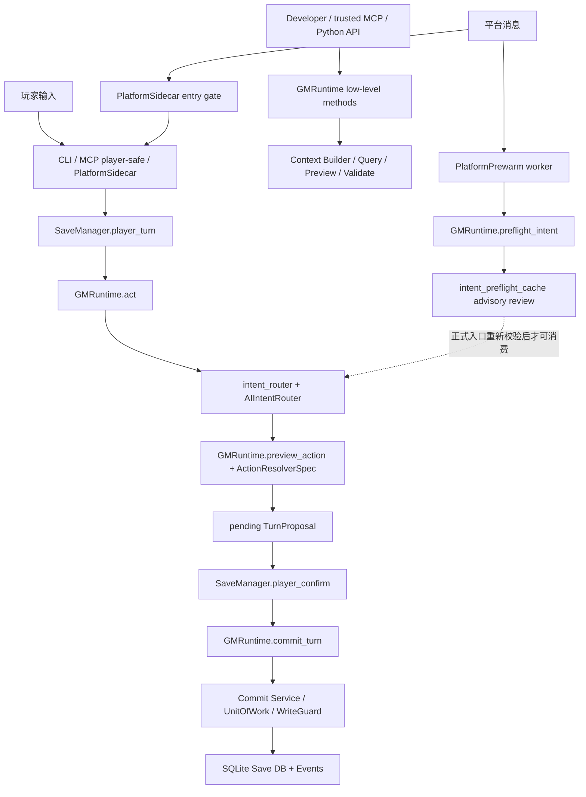

# 架构扫描

文档状态：DRAFT / GDS full_rescan exhaustive architecture scan
语言：zh-CN
工作流：`gds-document-project`
生成时间：2026-07-04
迁移阶段：BMAD 扫描输出，供 brownfield PRD / 后续 story 使用；长期规范入口仍是 [`docs/architecture.md`](../docs/architecture.md)。

## BMAD Provenance

- 用户触发：`gds-document-project`
- Skill：`.agents/skills/gds-document-project/SKILL.md`
- Customization resolver：
  `python3 _bmad/scripts/resolve_customization.py --skill .agents/skills/gds-document-project --key workflow`
- Config：`_bmad/gds/config.yaml`
- Workflow instructions：
  `.agents/skills/gds-document-project/instructions.md`,
  `.agents/skills/gds-document-project/workflows/full-scan-instructions.md`
- 支撑文件：
  `.agents/skills/gds-document-project/checklist.md`,
  `.agents/skills/gds-document-project/documentation-requirements.csv`
- 模式：`full_rescan`
- 扫描深度：`exhaustive`
- Step 7 状态：跳过。项目已确认为 single-part monolith，不需要 multi-part integration architecture。

## 总体架构

RPG Engine 是 local-first AI GM engine kernel，包名为 `aigm-kernel`。仓库不是 Unity、
Godot 或 Unreal 图形客户端项目，而是 Python backend / CLI / library 型内核，带 MCP
adapter、平台 sidecar、SQLite Save Package、Campaign Package、AI intent orchestration
和验证/提交链。

核心架构原则仍是：

```text
AI proposes. Kernel verifies. Player confirms. Engine commits.
```



## 架构模式

当前代码体现的是 layered local-first kernel with thin adapters：

- CLI、MCP 和 platform sidecar 是薄入口，负责参数、权限、展示和入口门禁。
- `SaveManager` 管 campaign/save 生命周期、普通玩家 pending proposal、确认和平台身份绑定。
- `GMRuntime` 是回合 runtime facade，编排 context、query、preview、validate、commit 和 health。
- AI intent 链只产生低信任候选、解释、内部复核和 trace。
- `ActionResolverSpec`、`TurnProposal`、validation pipeline、commit service、unit of work、
  write guard 和 SQLite 共同形成写入边界。
- Campaign Package 提供内容权威；Save Package 内 SQLite、事件和投影材料提供状态权威。
- 打包 migrations / schemas 是运行时资源权威；根目录镜像是开发便利面，不能覆盖打包资源。

## 主要入口边界

| 入口 | 文件 | 架构角色 | 权限边界 |
| --- | --- | --- | --- |
| CLI | `rpg_engine/cli.py`, `rpg_engine/cli_v1.py`, `rpg_engine/__main__.py` | 命令行与参考 user-facing surface | 不应复制业务逻辑；应调用 kernel service |
| Player-safe flow | `rpg_engine/save_manager.py` | 普通玩家回合门 | `player_turn()` 只创建 pending；`player_confirm()` 是 commit gate |
| Runtime API | `rpg_engine/runtime.py` | 低层 runtime facade | 直接调用者必须清楚 preview / validate / commit 边界 |
| MCP Adapter | `rpg_engine/mcp_adapter.py` | profile-gated tool surface | 默认只暴露 player-safe 工具；低层工具仅 developer/trusted/maintenance/admin |
| Platform Sidecar | `rpg_engine/platform_sidecar.py` | 平台入口门禁和指标 | 只 gate / forward / record passive identity，不提交事实 |
| Platform Prewarm | `rpg_engine/platform_prewarm.py` | 异步 advisory 预热 | 只能写入可复核 preflight cache，正式入口必须重校验 |

## 玩家安全链

普通玩家动作主链是：

1. `SaveManager.player_turn()` 接收玩家输入，解析 campaign、save、session 和 platform identity。
2. `GMRuntime.act()` 调用 `preview_from_text()`，进入 `route_intent()`。
3. `intent_router.py` 准备规则候选、外部候选、兼容候选和 AI 配置。
4. `ai_intent/router.py` 编排 AI candidate collection、内部复核、仲裁、槽位绑定和 trace。
5. `GMRuntime.preview_intent()` / `GMRuntime.preview_action()` 生成可确认预览。
6. ready 结果写成 pending `TurnProposal`，此时不提交游戏事实。
7. `SaveManager.player_confirm()` 校验 pending proposal、过期、save binding、平台身份和 session。
8. `GMRuntime.commit_turn()` 接收 approved proposal，再进入 validation / commit。
9. `commit_service.py`、`unit_of_work.py`、`write_guard.py` 写入 SQLite、事件和投影材料。

`GMRuntime.start_turn()` 主要用于构建当前回合上下文和可见信息，不是普通玩家动作提交主入口。

## AI Intent 边界

AI intent 层已经是独立链路，但不是状态权威。

| 模块 | 当前责任 |
| --- | --- |
| `intent_router.py` | 外层兼容/规则候选/`ActionIntent` facade，准备候选、配置和请求元数据 |
| `intent_manifest.py` | 声明可用 intent 和动作能力 |
| `ai_intent/router.py` | AI 候选收集、preflight 消费、内部复核、仲裁、绑定和 trace 组装 |
| `ai_intent/adapters.py` | 外部候选适配 |
| `ai_intent/arbiter.py` | 候选裁决 |
| `ai_intent/binder.py` | 槽位绑定 |
| `ai_intent/internal_review.py` | 内部复核 |
| `ai_intent/risk.py` | 风险判断 |
| `preflight_cache.py` | advisory internal intent review cache |

约束：

- External AI 可以提出候选，不能成为最终 intent 权威。
- Internal AI review 可以帮助分类和复核，不能 preview、validate、confirm 或 commit。
- `candidate_bound` profile 绑定候选身份；平台预热常用 `message_only` profile。
- preflight cache 只能作为候选来源，不能替代正式 preview、validation、confirm 或 commit。
- cache 消费必须重校验 `user_text`、save / base turn、context hash、provider / model / backend、
  schema / task / profile、platform / session / message 身份。
- preflight cache 可能包含原始玩家输入、platform/session/message 标识、internal review
  和 helper audit，不能当作公开诊断材料提交。

## 预览、提案与写入

预览边界不是单个 `preview.py` 文件；当前边界由这些组件共同形成：

- `actions/base.py` 的 `ActionResolverSpec` 合约。
- `GMRuntime.preview_action()` 的动作预览编排。
- `actions/*` 中各动作解析器的 delta 构造。
- `preview.py` 中部分动作复用的渲染 / delta helper。
- `proposal.py` 的 `TurnProposal`，承载 pending/approved 状态、确认、来源和 intent contract。

写入链：

- `proposal.py`
- `delta_schema.py`
- `validation_pipeline.py`
- `commit_service.py`
- `unit_of_work.py`
- `write_guard.py`
- `db.py`
- `migrations.py`

架构原则：

- 普通玩家动作必须先 pending，再确认，再提交。
- 所有状态写入必须先通过 preview、proposal confirmation 和 validation。
- 事件流和当前事实表共同支持审计与查询。
- 写入错误应尽量在提交前暴露。

## 上下文链路

上下文链路负责把 Save DB 中的事实转换为 AI / 玩家可见材料：

- `context_builder.py`：主构建入口。
- `context/collectors.py`：事实收集。
- `context/resolution.py`：引用和冲突解析。
- `context/budget.py`：上下文预算。
- `context/semantic.py`：语义建议。
- `context/rendering.py` 与 `render.py`：可读输出。
- `visibility.py` 与 `context_audit.py`：隐藏信息边界和审计。

任何新增上下文来源都必须标明 visibility，不能把 hidden / GM-only 内容泄露到玩家视图、
FTS、scene output 或普通 query。

## 数据和资源架构

| 边界 | 当前权威 |
| --- | --- |
| Campaign Package | campaign YAML/JSON/Markdown、capabilities、content、smoke tests、作者材料 |
| Save Package | SQLite、events、projection、snapshots、cards/memory、save metadata |
| Workspace/runtime state | `.aigm/game-session-bindings.json`, `.aigm/save-registry.json`, `.aigm/pending-*` |
| Packaged migrations | `rpg_engine/resources/migrations/0001` 到 `0008` |
| Packaged schemas | `rpg_engine/resources/schemas/*.schema.json` |
| Root mirrors | `migrations/`, `schemas/`，开发便利面；发现与打包资源存在差异 |

本轮复核发现打包 migrations 到 `0008`，而根目录 `migrations/` 镜像停在 `0005`。
如果后续开发者误读根目录镜像，可能低估 preflight / platform hardening 后的当前 schema。

## 测试与运维架构

- CI：`.github/workflows/ci.yml`
- Python matrix：3.11 / 3.12
- 安装：`python -m pip install -e '.[dev,mcp]'`
- 主要门禁：`pytest -q`、`ruff check`、`coverage run`、installed CLI smoke、`python -m build`、
  `twine check`
- 本轮未发现 Docker / Kubernetes / Terraform / cloud deployment config；CI 是当前自动化运维面。

## 文档架构

长期入口：

- `docs/index.md`
- `docs/project-overview.md`
- `docs/source-tree-analysis.md`
- `docs/architecture.md`
- `docs/component-inventory.md`
- `docs/ai-intent-chain.md`
- `docs/save-and-campaign-packages.md`
- `docs/authoring-guide.md`
- `docs/data-models.md`
- `docs/cli-contracts.md`
- `docs/mcp-contracts.md`
- `docs/prompt-contracts.md`
- `docs/development-guide.md`
- `docs/testing-and-quality-gates.md`
- `docs/project-context.md`
- `docs/governance/bmad-workflow.md`

旧 `docs/architecture/`、`docs/specs/` 和 `docs/guides/` 现在只保留 compatibility stubs。
归档原文位于 `docs/archive/pre-bmad-docs-2026-07-03/`，只能作为历史证据；若与代码事实或
canonical docs 冲突，以当前代码事实和 canonical docs 为准。

## 本轮架构复核结论

- 当前 canonical `docs/architecture.md` 与本轮代码扫描的大方向一致。
- `_bmad-output/architecture.md` 原先仍是 Round 1 草稿状态；本文件已改为本轮严格
  `gds-document-project` provenance 版本。
- 核心架构风险没有变成新 blocker：AI intent、preflight、platform sidecar、SaveManager
  和 commit 链仍必须保持分层清晰。
- 需要后续治理关注：根目录 migrations mirror 落后于 packaged migrations；旧 BMAD-style
  输出若未记录 skill provenance，只能作为 working artifact，不能作为严格 BMAD 执行证明。
