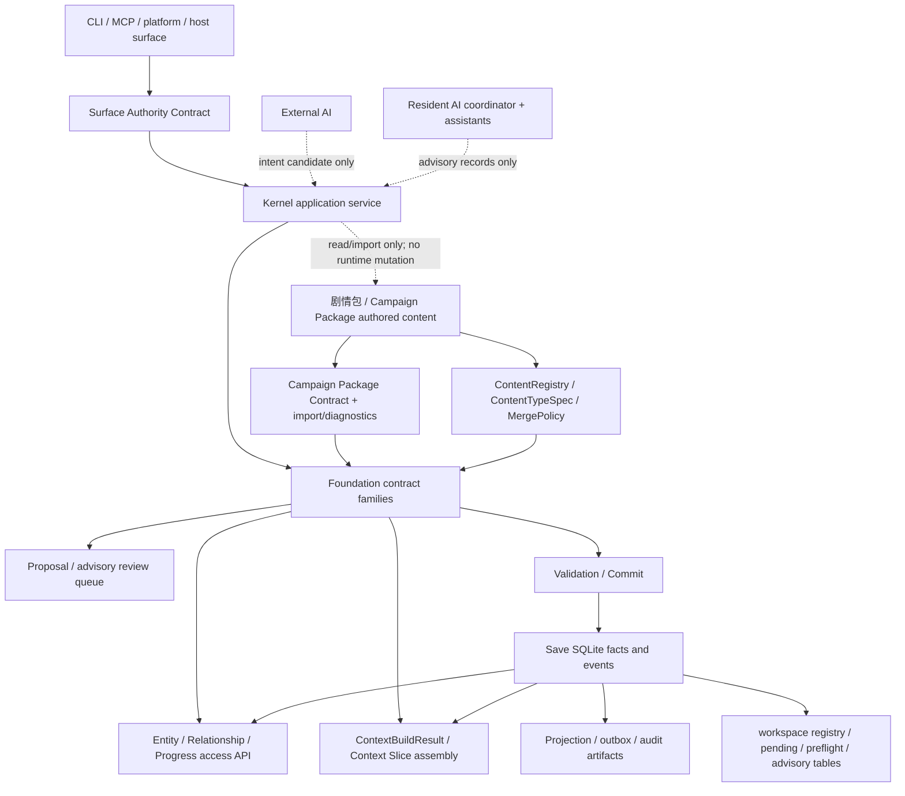
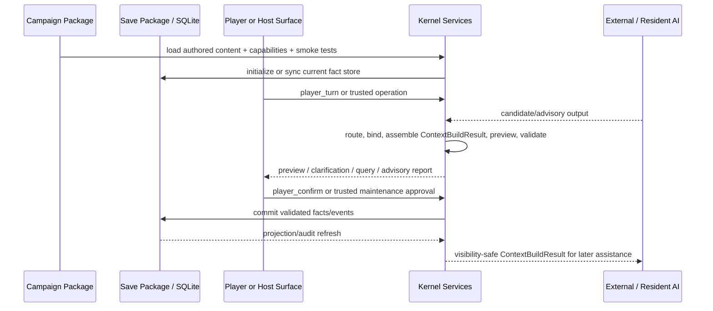
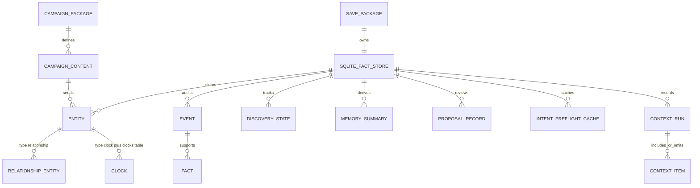

# Architecture Spine - AIGM Kernel 基础架构

## Design Paradigm

AIGM Kernel 是一个本地优先、契约中心的游戏基座。剧情包拥有作者写下的内容，Save Package 拥有运行态事实，Kernel service 拥有校验、查询、上下文、可见性和提交机制，AI 系统只提供候选或建议。

术语边界：本文中的“剧情包”对应当前代码和 canonical docs 里的 `Campaign Package` / `Campaign`，也对应 PRD 里的 `Scenario Package` 产品概念。后续实现层优先沿用当前代码名 `Campaign Package`，避免为了术语切换制造无意义重命名。

代码核对原则：已经有实现名的边界，本文使用当前代码名；尚未实现的目标能力，本文保留产品/架构名，并明确它是目标形态而不是现成模块。

层级映射：

- Surface：CLI、`AIGMMCPAdapter`、`PlatformSidecar` / `PlatformPrewarmService`、Python/runtime caller。
- Application service：`SaveManager`、`GMRuntime`、`save_service.py`、`packages/service.py`、`AIIntentRouter`、`build_context()`、`ProjectionService`、campaign validate/test/doctor/outline、未来的 resident AI coordinator。
- Contract family：Campaign Package（PRD 中的 Scenario Package）、Save Fact、Content Type / Merge、Intent Candidate / `TurnContract`、`ContextBuildResult` / Context Slice、Resident AI Advisory、Entity/Relationship/Progress Access、Proposal/Review Queue、Validation/Commit、Surface Authority。
- Persistence/package：Campaign Package 文件、Save Package manifest、Save SQLite fact store、workspace registry / pending files、projection/outbox/audit artifacts、`intent_preflight_cache`、`discovery_states`、`proposal_queue`、`archivist_suggestions`。
- AI advisor：external AI、`InternalAIService`、`AIIntentRouter`、semantic/context helper、archivist/reflection/memory/state audit、response/delta assistant。

允许的依赖方向：



## Inherited Invariants

| Inherited | From parent | Binds here |
| --- | --- | --- |
| AD-1 | `architecture-rpg-engine-execution-chain-2026-07-04` | 普通玩家事实写入仍必须经过 pending action、玩家确认、validation 和 commit。 |
| AD-2 | `architecture-rpg-engine-execution-chain-2026-07-04` | Intent coordination、internal AI review、preflight、resident AI 都不能成为 gameplay authority。 |
| AD-3 | `architecture-rpg-engine-execution-chain-2026-07-04` | 每个 public / semi-public surface 都必须声明 category 和 write authority。 |
| AD-4 | `architecture-rpg-engine-execution-chain-2026-07-04` | SQLite commit 是 gameplay fact；projection/outbox artifact 只是可修复证据。 |
| AD-5 | `architecture-rpg-engine-execution-chain-2026-07-04` | 下游 story 必须带 boundary tests，覆盖写入、AI 信任、hidden data 和 surface 权限。 |

## Invariants & Rules

### AD-1 - 剧情包/Campaign 拥有作者内容；Save 拥有运行事实；Kernel 拥有机制 [ADOPTED]

- **Binds:** FR-13, FR-14, FR-15, FR-17
- **Prevents:** world setting、relationship、progress、prompt、运行态状态和 kernel 机制混成一个可随意改写的 package 模型。
- **Rule:** 剧情包，也就是当前代码里的 `Campaign Package`，只包含作者内容和作者测试：world settings、初始 entities、初始 relationships、progress definitions、rules、prompts、templates、capabilities、smoke tests。Save Package 包含运行事实和证据：SQLite facts/events、relationship/progress changes、projections、snapshots、cards、memory、save metadata。`.aigm/save-registry.json`、pending action/clarification、`intent_preflight_cache`、`proposal_queue`、`archivist_suggestions` 是入口状态、缓存、review/advisory state 或派生证据，不是另一套 gameplay facts。Kernel 负责 import、validation、storage、query、context assembly、visibility enforcement 和 commit。普通 play 不能把运行事实写回 Campaign Package。

### AD-2 - AI 只能是 advisory/candidate，不能是事实权威 [ADOPTED]

- **Binds:** FR-4, FR-5, FR-6, FR-9, FR-12
- **Prevents:** external AI、internal intent AI、resident AI、semantic helper 或 preflight cache 变成隐藏的第二套引擎。
- **Rule:** AI 输出可以提供 `IntentCandidate`、future `ResidentAIAdvisory`、summary draft、entity/progress suggestion、plot progression advice 和 trace evidence。当前已有输出/证据形态优先复用 `AIHelperResult`、`AIIntentRouteResult`、`SemanticSuggestion`、`ArchivistSuggestion`、`ArchivistWorkflowResult`、`ReflectionDraft`、`MemoryBuildResult`、`StateAuditResult`、`DeltaDraftResult`、`AcceptanceResult` 等实现。AI 或 assistant 输出不能确认玩家意图、授权 hidden access、批准 proposal、注入 trusted delta、绕过 resolver/validation、修改 Save facts、修改 Campaign Package 或提交 gameplay state。

### AD-3 - Contract family 是 foundation interface [ADOPTED]

- **Binds:** FR-2, FR-4, FR-5, FR-7, FR-8, FR-10, FR-13, FR-14, FR-16, FR-17
- **Prevents:** CLI、MCP、runtime helper、AI caller、package tool 和测试各自发明不兼容的 input、error、permission 或 write semantic。
- **Rule:** foundation 在大规模 refactor 依赖这些边界前，必须暴露并测试这些 contract family：Campaign Package Contract（对应 PRD 的 Scenario Package Contract）、Save Fact Contract、Content Type / Merge Contract、Intent Candidate Contract、Context Slice Contract、Resident AI Advisory Contract、Response / Delta Assistant Contract、Entity/Relationship/Progress Access Contract、Proposal/Review Queue Contract、Validation/Commit Contract、Surface Authority Contract。每个 contract 必须有 canonical artifact 可被 story 引用，并说明 input shape、output shape、error shape、permission、visibility rule、fact authority 和 required boundary tests。

### AD-4 - Entity 是身份锚点；Relationship 和 Progress 是 first-class access contract [ADOPTED]

- **Binds:** FR-7, FR-8, FR-9, FR-10, FR-13, FR-17
- **Prevents:** 出现并行身份系统、relationship fact 藏在任意文本字段里、progress logic 分裂在 clocks/projects/details JSON/prompt 中。
- **Rule:** 持久游戏对象使用 `entities.id` 作为共享身份锚点。Relationship 与 Progress Track/Clock 在 service/API/schema contract 层必须是一等概念；当前实现先沿用 `relationship` content type、`type: relationship` entity、规范化 `details`、`clock` content type、`clocks` 表和 `tick_clocks` delta。`ContentRegistry` / `ContentTypeSpec` 负责把 Campaign YAML、delta key、runtime table、merge policy 和 presentation registry 对齐。调用方必须通过命名 access contract 读取或更新 relationship/progress，不能依赖临时 `details_json` 约定或直接表结构细节。

### AD-5 - `ContextBuildResult` / Context Slice 是 AI/host 的上下文契约 [ADOPTED]

- **Binds:** FR-10, FR-11, FR-12, FR-13, FR-17
- **Prevents:** prompt fragment、query output、resident AI input 和 external host context 在相关性、visibility 或 provenance 上分叉。
- **Rule:** Context assembly 必须先产出可检查的 `ContextBuildResult`，作为当前实现中的 Context Slice，再渲染 prompt 或玩家可见文本。它包含 scoped request metadata、included entities、relationships、progress tracks/clocks、world settings、rules、routes、palettes、recent events、`memory_summaries`、`discovery_states`、semantic hints、plot progression signals、visibility mode、source/provenance、inclusion reason、budget evidence、omitted/missing signals。player-safe context 在进入任何 AI prompt 或 player-visible rendering 前，必须排除 hidden/GM-only facts，并可通过 `context_runs` / `context_items` 审计。

### AD-6 - Resident AI 是被协调的窄职责 advisory work [ADOPTED]

- **Binds:** FR-5, FR-6, FR-9, FR-12
- **Prevents:** 一个不透明后台 agent 直接管理状态，或五类 helper path 写出互不兼容的 advisory artifact。
- **Rule:** Resident AI v1 的目标形态是 `ResidentAICoordinator` 加窄助手，至少覆盖 intent recognition、context summarization、entity maintenance advice、progress management advice、plot progression advice。当前实现不要求先新建这个类或目录；story 应优先复用 `ai/`、`ai_intent/`、`context/`、`context/semantic.py`、`archivist.py`、`reflection.py`、`memory.py`、`ai/state_audit.py`、`delta_draft.py`、`response_acceptance.py`、`turn_assistant.py`、`proposal_queue.py`。Coordinator 只负责任务调度、visibility-safe 输入、provenance/freshness 记录、advisory 输出规范化，并把建议交给 Kernel workflow；它不拥有 confirmation、validation、hidden permission、proposal approval 或 commit。

### AD-7 - 通用玩法差异放在 Campaign capability 和 extension hook 中 [ADOPTED]

- **Binds:** FR-13, FR-15, FR-17
- **Prevents:** 把每种题材、Campaign type 或剧情结构都写进 Kernel core，或者每换一个游戏就 fork Kernel。
- **Rule:** 不同游戏通过 Campaign Package 声明 capabilities、content types、rules、initial state、prompts、author smoke tests 和轻量 hooks。当前实现层优先通过 `capabilities.py`、`ContentRegistry`、`ContentTypeSpec`、`MergePolicy`、`ActionResolverSpec`、context collectors、package validation / doctor / smoke tests 承载差异。Kernel core 提供通用 primitives 和 extension points：entity、relationship、progress、visibility、intent、context、validation、commit、diagnostics、action/context hooks、package merge/upgrade hooks。新的 genre-specific mechanic 只有在被提升成通用 primitive 或明确 extension contract 后，才能通过后续 architecture/story 进入 Kernel。

### AD-8 - 延迟策略只能安全降级，不能转移权威 [ADOPTED]

- **Binds:** FR-4, FR-5, FR-6, NFR-6, NFR-7
- **Prevents:** 为了速度把 preflight/background AI 变成 commit authority，或慢 AI 让玩家 turn 无限等待。
- **Rule:** player-facing AI assistance 使用可配置 latency policy，种子目标是约 8 秒 soft wait、约 15 秒 hard timeout candidate。当前实现里已有 `AIHelperSettings` / `AIHelperPolicy`、`intent_preflight_cache`、`PlatformPrewarmService`、`PrewarmQueue`、`PlatformSidecar` 作为预热和降级基础。AI 超时或不可用时，引擎返回 fallback、clarification、blocked 或 non-AI safe path。Resident/background advisory 可以异步完成，目标窗口 30-60 秒；它不能阻塞 fact commit，也不能削弱继承的 execution-chain gates。

### AD-9 - V1 operation envelope 保持 local-first、single-campaign [ADOPTED]

- **Binds:** NFR-5, MVP scope, FR-14, FR-15
- **Prevents:** foundation 工作意外设计出 cloud、public server、multiplayer、distributed job 或 complex UI architecture。
- **Rule:** V1 假设本地 filesystem packages、一个 active player workspace、每次 play session 一个 active Save Package、SQLite 作为 fact boundary、workspace registry 只选择入口、starter save 只是新档起点、`.aigmsave` 是归档格式、maintenance/admin tools 受 gate 和 audit 约束。本 spine 不绑定 cloud provider、distributed lock、multiplayer identity、public server 或 rich UI architecture。

### AD-10 - Foundation story 必须用 package/boundary tests 证明基座成立 [ADOPTED]

- **Binds:** all FRs, SM-1 through SM-8
- **Prevents:** 看起来干净的 refactor 只对当前 example 有效、泄露 hidden data、修改 Campaign Package、或绕过 service contracts。
- **Rule:** 下游 story 只要触碰这些 foundation boundary，就必须为对应 contract 增加最小有意义测试。feature-level gate 至少包含：两个不同 Campaign Packages 复用同一 init/save/context/validation/basic play loop；player-safe context 排除 hidden data；普通 play 不修改 Campaign Package；advisory AI 不能 commit；relationship/progress 通过公开 contract 访问而不是通过 storage internals；MCP player profile 不暴露低层 commit/preview/validate；platform prewarm 和 preflight cache 仍是 single-use/advisory。

## Consistency Conventions

| Concern | Convention |
| --- | --- |
| Naming | 产品概念保持稳定，但实现命名优先尊重现有代码：剧情包契约在产品层可解释为 `Scenario Package`，实现层沿用 `Campaign Package` / `Campaign`；Context Slice 当前实现名是 `ContextBuildResult`；intent 相关沿用 `IntentCandidate`、`ActionIntent`、`TurnContract`、`AIIntentRouter`；内容扩展沿用 `ContentRegistry`、`ContentTypeSpec`、`MergePolicy`；写入链沿用 `TurnProposal`、`ValidationReport`、`CommitService`；进度实现沿用 `clock` / `clocks`。不要为了 PRD 术语重命名现有类、表或 CLI 命令。 |
| IDs | Entity id 继续使用带类型前缀的稳定 string id。Relationship 使用 `rel:` id。Progress track/clock 使用 `clock:` 或未来明确映射的 progress id prefix。Context/advisory/proposal/commit 的 runtime id 用于 trace，不能替代 entity id。 |
| Data envelopes | Contract output 使用结构化 `ok`/`status`、`data`、`warnings`、`errors`、`provenance`、`visibility`。Player-safe output 不暴露 raw delta、proposal internals、hidden facts 或 AI private reasoning。 |
| State ownership | Campaign Package 文件是 author source。Save SQLite 是 current fact authority。Workspace registry、pending files、projection、card、snapshot、memory、audit report、preflight cache、proposal queue、archivist suggestions、resident AI advisory 都是 entry state、derived state 或 advisory/review state。 |
| Visibility | 每条 context/advisory/read-model path 必须先选择 visibility mode，再收集内容。Hidden material 必须在 collection/query 阶段就排除出 player-safe prompt/render/search/card output，而不是渲染后再遮盖。 |
| Extension | 剧情包特定行为优先使用 capabilities、`ContentTypeSpec`、rules、action resolvers、context collectors、package diagnostics、package merge/upgrade policy 和 smoke tests。Kernel primitive 只有在有明确 contract 和 boundary tests 时才新增。 |

## Stack

| Name | Version |
| --- | --- |
| Python | >=3.11 |
| SQLite | stdlib `sqlite3` |
| PyYAML | >=6.0 |
| jsonschema | >=4.20 |
| MCP optional dependency | >=1.28,<2 |
| pytest | >=8.2 |
| Ruff | >=0.5 |
| setuptools | >=68 |

## Structural Seed

本 spine 依赖的最小模块形状如下；这不是完整 source tree，也不要求一次性搬目录。没有现成目录的项先表示职责边界，可先落在现有模块里，等 story 证明需要时再抽目录：

```text
rpg_engine/
  campaign.py, campaign_validation.py, save_service.py
  packages/service.py, packages/lock.py, packages/merge.py, packages/archive.py
  save_manager.py, game_session.py  # player-safe workspace, pending/confirm gate, platform identity
  runtime.py                        # kernel runtime facade and low-level trusted orchestration
  intent_router.py, intent_manifest.py, ai_intent/, preflight_cache.py
  context_builder.py, context/, context_audit.py, visibility.py
  ai/, archivist.py, reflection.py, memory.py, ai/state_audit.py
  delta_draft.py, response_lint.py, response_acceptance.py, turn_assistant.py
  proposal_queue.py, discovery.py   # review/advisory queues and plot/progress signals
  content_types/, capabilities.py   # ContentRegistry, ContentTypeSpec, MergePolicy, capability gates
  actions/                          # ActionResolverSpec and extension hooks
  proposal.py, delta_schema.py      # TurnProposal and write payload contracts
  validation_pipeline.py            # pre-commit validation profiles and reports
  commit_service.py, unit_of_work.py, write_guard.py
  db.py, resources/migrations/      # SQLite fact authority and migrations
  projections.py, projection_service.py, cards.py, card_registry.py
  surface_inventory.py, cli*.py, mcp_adapter.py, platform_sidecar.py, platform_prewarm.py
```

Foundation flow:



First-class state model:



Contract family seeds:

| Contract | Primary owner | Must expose |
| --- | --- | --- |
| Campaign Package | `campaign.py`, `campaign_validation.py`, `authoring/*`, `packages/service.py` | manifest、content roots、capabilities、content records、diagnostics、smoke tests、source visibility。对应 PRD 的 Scenario Package 产品概念。 |
| Save Fact | `save_service.py`, `save_manager.py`, `runtime.py`, `save_validation.py`, `save_patch.py`, `save_archive.py` | current facts、events、pending state、projection health、import/export health、no Campaign Package mutation evidence。 |
| Content Type / Merge | `content_types/`, `capabilities.py`, `packages/merge.py`, `packages/lock.py`, `content_sync.py` | Campaign key、YAML key、delta key、runtime table、record validation、merge policy、sync safety、package-lock evidence。 |
| Intent Candidate | intent router / AI adapters | action/mode/slots/confidence/missing/reason/provenance；不得包含 confirmation、hidden permission、proposal approval 或 save authorization。 |
| ContextBuildResult / Context Slice | `context_builder.py`, `context/`, `context_audit.py` | scoped included/omitted items、visibility、provenance、budget、relationship/progress/world/event/memory/discovery sections、renderable outputs、`context_runs` / `context_items` audit。 |
| Resident AI Advisory | current `ai/`, `ai_intent/`, `context/semantic.py`, `archivist.py`, `reflection.py`, `memory.py`, `ai/state_audit.py`, `delta_draft.py`, `response_acceptance.py`, `turn_assistant.py`; optional coordinator by story | advisory type、target ids、evidence、confidence、freshness、visibility mode、proposed next workflow；不能 direct write。 |
| Response / Delta Assistant | `delta_draft.py`, `response_lint.py`, `response_acceptance.py`, `turn_assistant.py` | draft delta、response lint、consistency report、validation profile、explicit save decision；默认玩家路径不能使用它绕过 `player_turn` / `player_confirm`。 |
| Entity/Relationship/Progress Access | current `entities`, side tables, `relationship` content type, `clocks`, future state access service | stable reads、validated mutation requests、reference checks、visibility filters、storage abstraction。 |
| Proposal/Review Queue | `proposal_queue.py`, `archivist.py`, `content_delta.py` | proposal id、kind、risk、validation、review status、rollback hint、applied evidence；review approval 不是 gameplay commit。 |
| Validation/Commit | validation pipeline / commit service | proposal/delta validation、profiles、errors/warnings、commit result、projection/outbox status。 |
| Surface Authority | surface inventory / adapters | category、profile、write authority、exposed fields、allowed operations、forbidden bypasses。 |

## Capability -> Architecture Map

| Capability / Area | Lives in | Governed by |
| --- | --- | --- |
| Stable player-safe execution chain | `save_manager.py`, `runtime.py`, `proposal.py`, validation/commit services | Inherited AD-1, AD-1, AD-3, AD-10 |
| Surface taxonomy and authority | `surface_inventory.py`, CLI/MCP/platform adapters | Inherited AD-3, AD-3 |
| AI-first intent candidates | `intent_router.py`, `intent_manifest.py`, `ai_intent/`, `preflight_cache.py` | Inherited AD-2, AD-2, AD-8 |
| Resident AI coordinator and assistants | current `ai/`, `ai_intent/`, `context/semantic.py`, `archivist.py`, `reflection.py`, `memory.py`, `ai/state_audit.py`, `delta_draft.py`, `response_acceptance.py`, `turn_assistant.py` foundations first; optional coordinator extraction by story | AD-2, AD-6, AD-8 |
| Entity / Relationship / Progress access | existing `entities`, side tables, relationship content type, `clocks`, `content_types/`, package service; access contract adapters by story | AD-4, AD-5, AD-10 |
| Context assembly and visibility | `context_builder.py`, `context/`, `visibility.py`, `context_audit.py`, `ContextBuildResult` | AD-5, AD-2, AD-10 |
| Campaign / Save foundation | `campaign.py`, `campaign_validation.py`, `save_service.py`, `save_manager.py`, `save_validation.py`, `save_patch.py`, `save_archive.py` | AD-1, AD-7, AD-10 |
| Content type and package evolution | `ContentRegistry`, `ContentTypeSpec`, `MergePolicy`, `PackageSource`, `PackageLock`, package diff/adopt/install/upgrade | AD-1, AD-4, AD-7, AD-10 |
| Plot/progress signals without storylets | `clocks`, `discovery_states`, recent events, `memory_summaries`, `archivist_suggestions`, `proposal_queue` | AD-2, AD-5, AD-6 |
| Platform latency and identity gates | `game_session.py`, `platform_prewarm.py`, `platform_sidecar.py`, `intent_preflight_cache` | AD-2, AD-8, AD-9, AD-10 |
| Diagnostics and author/host operations | campaign validate/test/doctor/outline, save inspect/validate, MCP/CLI maintenance | AD-1, AD-3, AD-7, AD-9, AD-10 |
| Projection/outbox integrity | `projections.py`, `projection_service.py`, outbox tables | Inherited AD-4, AD-1, AD-10 |

## Deferred

- Relationship 专用 SQL 表：AD-4 要求 first-class access contract；v1 可以继续使用 relationship entity + normalized details，直到 query、validation 或 migration story 证明需要专用表。
- `clocks` 之外的 Progress Track 专用 SQL 表：AD-4 要求 first-class progress contract；复杂 quest/project ontology 仍在 MVP 外。
- 正式 Storylet / Plot Beat package：现在要求的是 plot progression signals；storylet schema、scheduler、director、authoring UX 需要后续 game-design architecture。
- `ResidentAICoordinator` 正式类/目录：当前先复用现有 helper path；是否抽 coordinator 由后续 story 在边界测试通过后决定。
- Resident AI 质量调优：AD-6 固定角色和权限；prompt strategy、model selection、scheduling heuristic、storage detail 属于 implementation story。
- 成熟 no-code authoring UI：现在要求 diagnostics 和 package contracts；视觉编辑器或工作台是后续 product/UX track。
- Cloud、public server、multiplayer、distributed jobs、commercial operations：AD-9 保持 v1 local-first；只有产品 scope 改变时才重开。
- 穷尽式 source-tree reshaping：本 spine 定义 dependency 和 contract direction；具体 module extraction 顺序进入 epics/stories。
