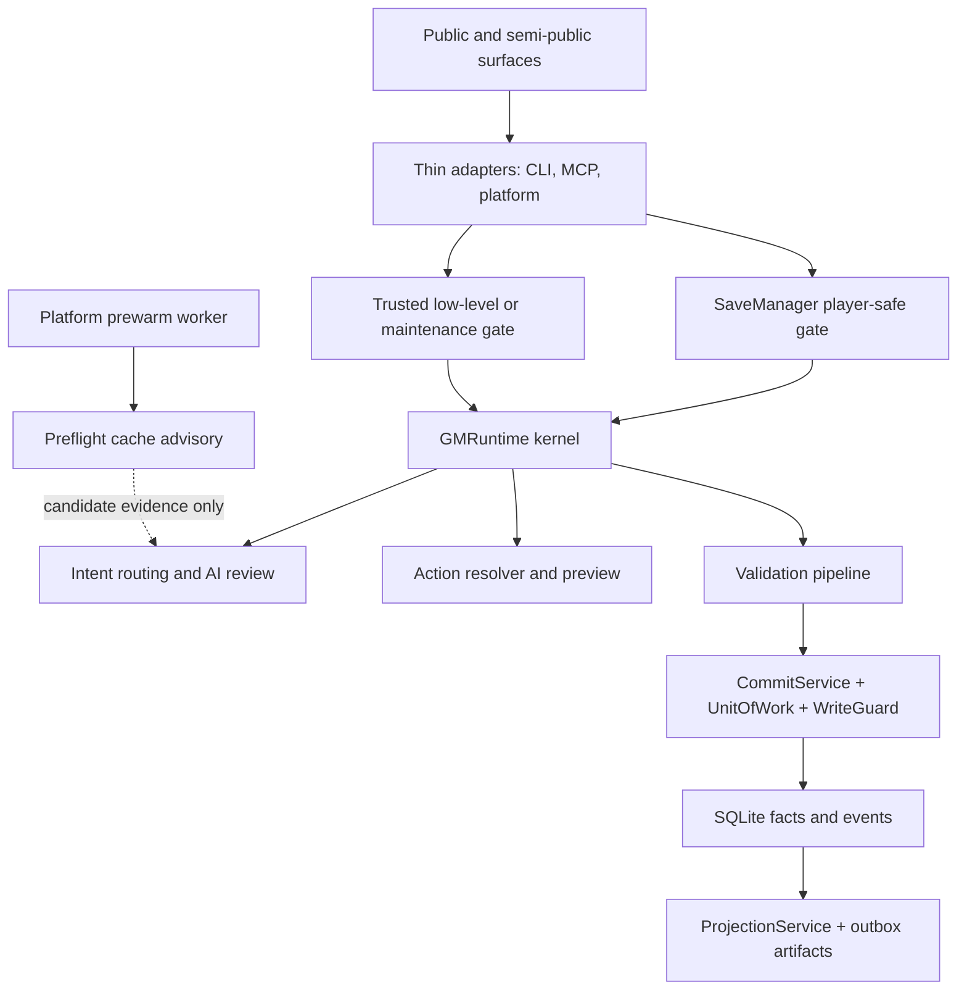
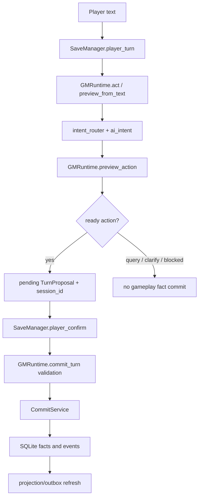

# Architecture Spine - RPG Engine Execution-Chain Architecture

## Design Paradigm

RPG Engine uses a layered local-first kernel: thin adapters enter at the edge, the kernel owns intent/preview/validation/commit rules, SQLite is the gameplay fact authority, and projections/outbox artifacts are post-commit read models and evidence.

Layer mapping:

- Edge adapters: `rpg_engine/cli_v1.py`, `rpg_engine/cli.py`, `rpg_engine/mcp_adapter.py`, `rpg_engine/platform_sidecar.py`, `rpg_engine/platform_prewarm.py`.
- Player-safe gate: `rpg_engine/save_manager.py`.
- Runtime kernel: `rpg_engine/runtime.py`, `rpg_engine/intent_router.py`, `rpg_engine/ai_intent/`.
- Write chain: `rpg_engine/validation_pipeline.py`, `rpg_engine/commit_service.py`, `rpg_engine/unit_of_work.py`, `rpg_engine/write_guard.py`.
- State and artifacts: SQLite via `rpg_engine/db.py`, migrations, `rpg_engine/projections.py`, `rpg_engine/projection_service.py`, and advisory `rpg_engine/preflight_cache.py`.

## Invariants & Rules

### AD-1 - Ordinary player fact writes pass through the player confirmation gate [ADOPTED]

- **Binds:** CAP-1, CAP-2, CAP-5
- **Prevents:** Treating `player_turn`, query, platform message handling, or a low-level preview as if gameplay facts were already committed.
- **Rule:** Ordinary player-safe writes must flow through `SaveManager.player_turn()` to a pending action, then `SaveManager.player_confirm(session_id)` with matching save/session/platform identity, then `GMRuntime.commit_turn()` with validation and approved `TurnProposal`. `player_turn`, `player_query`, `start_or_continue`, save switching/creation, platform message receipt, and preflight may not commit gameplay facts.

### AD-2 - Intent coordination may select a route proposal but owns no gameplay fact or write authority [ADOPTED]

- **Binds:** CAP-3, CAP-5
- **Prevents:** A future `IntentCoordinator` or current AI intent path becoming a second gameplay fact, player-confirmation, or write authority.
- **Rule:** `IntentCoordinator` or equivalent may prepare candidates, carry passive preflight identity, call rules/AI review, select a route proposal, bind slots, and emit trace/provenance under an explicit mode policy. When internal intent AI is off and a valid external candidate is present, external is the proposal authority and rules are trace-only: rules may not override, veto, or force clarification solely because of mismatch. When internal intent AI is enabled, external and internal candidates keep the existing arbitration path; external is not unconditionally authoritative. When internal intent AI is off and no external candidate is present, the current rules fallback remains. The coordinator may not preview, validate, confirm, commit, bypass hidden-read gates, construct deltas outside action resolvers, or turn preflight cache into proposal or permission cache.

### AD-3 - Every public or semi-public entry surface declares category and write authority [ADOPTED]

- **Binds:** CAP-2, CAP-5
- **Prevents:** Maintenance/admin commands, trusted low-level tools, platform wrappers, or runtime helpers being mistaken for ordinary player play.
- **Rule:** Each CLI command, MCP tool, platform endpoint, Python/runtime helper, and future public surface must be classified as exactly one of: player-safe, trusted low-level, maintenance/admin, platform sidecar, platform prewarm, or projection/outbox. If a surface spans categories, split it or document the explicit gate/profile/session check that changes authority.

### AD-4 - SQLite commits are facts; projection/outbox is repairable evidence [ADOPTED]

- **Binds:** CAP-4, CAP-5
- **Prevents:** Projections, snapshots, cards, JSONL export, audit evidence, or repair tools becoming hidden fact sources or accidental rollback policy.
- **Rule:** `CommitService`/`UnitOfWork`/`WriteGuard` write validated gameplay facts and events to SQLite. `ProjectionService`, projection tables, search, snapshots, cards, memory, and event outbox refresh after commit and remain visible, reportable, and repairable. Projection/outbox state may not substitute for pre-commit validation, proposal approval, or fact authority.

### AD-5 - Implementation stories carry boundary tests [ADOPTED]

- **Binds:** CAP-5, all execution-chain changes
- **Prevents:** Local refactors weakening player confirmation, AI trust, hidden visibility, profile gates, preflight identity, or projection repair behavior without evidence.
- **Rule:** Every downstream story touching SaveManager, Runtime, intent/preflight, CLI, MCP, platform, validation, commit, projection, or visibility must name its surface category and run the smallest meaningful boundary gates. Cross-module changes must also update canonical docs when the public contract changes.

Allowed dependency direction:



## Consistency Conventions

| Concern | Convention |
| --- | --- |
| Naming | Player-safe entry names use `player_*` or equivalent player language; low-level names may expose `preview`, `validate`, `commit`, or `preflight` only behind explicit profile/trust gates; future coordinators use `Coordinator` only for orchestration/trace roles. |
| Data & formats | Public results keep structured `ok`, `status`, `warnings`, and `errors`; pending player actions carry `session_id`, `save_id`, `save_path`, delta, proposal, expiry, and optional platform/session/actor identity; preflight identity includes text hash and message/session/provider/schema identity where applicable. |
| State & cross-cutting | `.aigm/`, saves, pending actions/clarifications, platform bindings, preflight cache, audit logs, and projection artifacts are runtime state, not public source truth; hidden/GM-only material must remain visibility-gated; gameplay fact writes go through validation/proposal/commit gates or explicitly trusted maintenance workflows. |

## Stack

| Name | Version |
| --- | --- |
| Python | >=3.11 |
| PyYAML | >=6.0 |
| jsonschema | >=4.20 |
| MCP optional dependency | >=1.28,<2 |
| setuptools | >=68 |
| pytest | >=8.2 |
| Ruff | >=0.5 |
| SQLite | stdlib `sqlite3` |

## Structural Seed

This is the minimum structure the spine relies on. It is not an exhaustive module inventory.

```text
rpg_engine/
  cli_v1.py                 # V1 public CLI groups and player-safe command shape
  cli.py                    # installed command tree and legacy/admin surface
  mcp_adapter.py            # MCP profile gate and thin adapter
  platform_sidecar.py       # platform session/actor gate and SaveManager forwarding
  platform_prewarm.py       # asynchronous advisory preflight path
  save_manager.py           # player-safe pending/confirm gate
  runtime.py                # GMRuntime preview, query, validate, commit facade
  intent_router.py          # rules/external candidate preparation and facade
  ai_intent/                # internal review, arbiter, binder, risk, trace pieces
  preflight_cache.py        # advisory identity-bound preflight cache
  actions/                  # action resolvers and delta construction
  proposal.py               # TurnProposal approval/provenance contract
  validation_pipeline.py    # commit validation and state-audit gate
  commit_service.py         # approved TurnProposal commit service
  unit_of_work.py           # transactional write guard and projection dirtiness
  write_guard.py            # idempotency and expected-turn guards
  db.py                     # SQLite connection and fact tables
  projections.py            # projection state, event export, outbox helpers
  projection_service.py     # repairable post-commit read model refresh
```

Player-safe execution chain:



Surface categories:

| Category | Examples | Write authority |
| --- | --- | --- |
| Player-safe | `player_turn`, `player_confirm`, player CLI/MCP tools, platform `act/confirm` forwarding | Pending action creation and confirmed gameplay commit through SaveManager only |
| Trusted low-level | `preview_from_text`, `preview_action`, `validate_delta`, `commit_turn`, developer/trusted MCP tools | Approved/validated low-level commit behind profile/trust gates |
| Maintenance/admin | package, migration, projection repair, save patch, content/proposal ops | Explicit maintenance writes with backup/validation/path/projection evidence where required |
| Platform sidecar | platform message/start/act/confirm wrappers | Session/actor gate and forwarding; no direct gameplay fact writes |
| Platform prewarm | prewarm worker and `intent_preflight` cache production | Advisory candidate evidence only |
| Projection/outbox | projection refresh, search/cards/snapshots/event export | Post-commit read models/evidence and repair status only |

## Capability -> Architecture Map

| Capability / Area | Lives in | Governed by |
| --- | --- | --- |
| CAP-1 player-safe commit chain | `save_manager.py`, `runtime.py`, `commit_service.py`, `proposal.py` | AD-1, AD-5 |
| CAP-2 surface taxonomy | CLI/MCP/platform adapters, runtime helpers, `surface-taxonomy.md` | AD-3 |
| CAP-3 intent/preflight coordination boundary | `intent_router.py`, `ai_intent/`, `preflight_cache.py`, future coordinator extraction | AD-2 |
| CAP-4 projection/outbox consistency | `commit_service.py`, `unit_of_work.py`, `write_guard.py`, `projections.py`, `projection_service.py` | AD-4 |
| CAP-5 verification gates | tests for SaveManager, MCP, runtime, preflight, platform, projection, CLI, visibility | AD-5 and all ADs |

## Deferred

- Exact `IntentCoordinator` class/module split: the authority boundary is fixed by AD-2; extraction can wait for an implementation story with tests.
- Exhaustive legacy/admin CLI command inventory: AD-3 fixes the taxonomy and gate rule; full command-by-command classification should be a follow-up story.
- Whole-repo caller graph and broad refactor plan: this spine governs execution-chain boundaries, not an implementation migration.
- Projection repair UX, dashboards, and operator workflows: AD-4 fixes authority and failure semantics; detailed UX belongs in a projection/ops story.
- New deployment or hosted service topology: current project is a local-first Python package/kernel; no new infrastructure decision is required for this spine.
