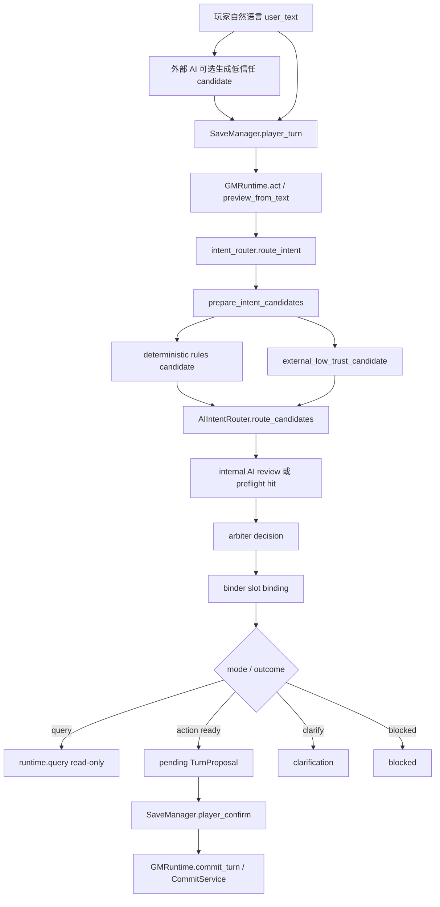

# AI 意图链

文档状态：**CURRENT：BMAD canonical AI intent authority**

本文件是 RPG Engine 当前 AI intent、internal review、advisory preflight、platform
prewarm 和玩家自然语言入口的 canonical 文档。旧路径已在 BMAD Round 4C 转为
compatibility stubs；日常开发应先读本文件。

## 核心结论

```text
AI proposes. Kernel verifies. Player confirms. Engine commits.
```

普通玩家自然语言应进入一条标准链：

```text
玩家原文
  -> 可选 external_intent_candidate
  -> player_turn
  -> rules candidate + optional internal AI review
  -> arbiter
  -> binder
  -> query result / action preview / clarification / blocked
  -> player_confirm if action is ready
  -> validation + commit
```

AI 可以帮助理解玩家语言，但不能拥有事实、合法性、预览、确认或保存权限。

## 当前标准链路



`GMRuntime.start_turn()` 是上下文构建和诊断入口，不是普通玩家动作提交主入口。
`preview_from_text()` 是低层自然语言 preview primitive，不是普通玩家应直接感知的入口名。

## 权限边界

| 组件 | 权限 |
| --- | --- |
| External AI | 可以提供低信任 `external_intent_candidate`；internal intent AI 显式 `off` 时，合法候选可成为 selected route proposal，但不能成为事实、确认、approval 或 commit authority。 |
| Internal AI | 可以看见 external candidate 并复核玩家原文，不能 preview、validate、confirm 或 commit。 |
| Deterministic rules | 提供 fallback、risk、binding 线索和可审计规则候选，不是开放自然语言的唯一裁判。 |
| Arbiter | 比较 external / internal / rules，决定 accept、fallback、clarify 或 block。 |
| Binder | 把 slots 绑定到玩家可见实体、地点、物品或行动参数。 |
| Resolver / preview | 生成尚未发生的预演和 `TurnProposal`。 |
| Validation / commit | 校验并写入事实。普通玩家路径只能由 `player_confirm()` 进入。 |
| Platform sidecar | 只做消息归一化、session gate、prewarm enqueue 和被动身份转发。 |
| Preflight cache | 只缓存 internal review，single-use、identity-bound、advisory。 |

路由提案权由 internal intent AI mode 明确选择：

| Mode / input | Route proposal 结果 | Deterministic rules 的角色 |
| --- | --- | --- |
| internal enabled + external | external/internal 进入既有 arbitration；一致、绑定与安全检查通过后才可采用 | 提供候选、风险与诊断证据 |
| internal `off` + valid external | Kernel 校验 schema、registry、safety、query/binding 后采用 `external_primary` | trace / diagnostic evidence，不得仅因 keyword mismatch override 或 veto |
| internal `off` + no external | 保持当前 deterministic fallback | selected route proposal |

这里改变的只有 route proposal authority。Binder、resolver、preview、validation、pending、玩家确认和
commit authority 全部仍在 Kernel；malformed、unsafe、未知 action、非法 query 或无法绑定的 external
candidate 必须明确 block/clarify，不能静默换成 rules 的另一意图。

### Latency policy

- Player-facing intent helper 默认使用约 8 秒 soft wait target；超过时记录结构化
  `soft_wait_exceeded` evidence，但不会因此改变 authority。
- `intent_timeout` 是默认约 15 秒的 hard total deadline。Direct primary、可选 fallback、parse 和
  normalization 共享同一 budget；fallback 只得到剩余时间。
- Hard deadline 后返回的 valid result 标记为 `late_discarded` 并丢弃，不能成为 selected outcome、
  pending action 或 commit evidence。
- `consensus` 模式中的 timeout/unavailable 继续保持 `mode=consensus`，按既有 risk-aware policy
  fallback、clarify 或 block；它不等于显式 `off`，也不授予 external candidate `external_primary`。
- Background/prewarm 的 30-60 秒目标是 advisory window；timeout、queue full、failed、late-ready
  只产生 evidence/drop reason，不阻塞事实提交。Platform prewarm 默认使用 60 秒 deadline，并与
  player-facing helper 的 bounded worker capacity 分离；background evidence 使用独立 target status，
  不把 8 秒 player soft target 误报为 background failure。
- Player/public helper trace 与 prewarm result 只返回稳定的 timeout/unavailable class；provider body、
  exception detail、raw output 与 audit output summary 必须脱敏。

硬边界：

- `player_turn()` 可以写 pending action 或 pending clarification，但不能提交游戏事实。
- `player_confirm()` 是普通玩家路径的提交门。
- Query 不保存、不推进时间、不生成 delta，也不需要 `player_confirm()`。
- `ready_to_save=false` 或 `ready_to_confirm=false` 绝不能叙述成事实已经发生。
- `preview` 不是事实，validation 通过也不是玩家确认。
- Hidden / GM-only 内容不得进入玩家视图、普通 query、FTS、scene output 或普通 AI prompt。

## External Candidate

`external_intent_candidate` 是外部 AI / GM 层生成的后台低信任意图草稿。普通玩家不应看到、
填写或编辑它。

它可以表达：

- `kind`
- `mode`
- `action`
- `slots`
- `plan`
- `confidence`
- `missing_slots`
- `needs_confirmation`
- `safety_flags`
- `reason`
- optional `contract` provenance：`manifest_schema_version`、`manifest_digest`、
  `safety_vocabulary_version`、`safety_vocabulary_digest`

它不能表达：

- 玩家确认。
- preview approval。
- delta / proposal 注入。
- 保存授权。
- hidden 信息豁免。
- MCP/CLI/profile 权限提升。
- per-call AI override 给默认 player profile。

Contract provenance 只能说明 caller 针对哪一版 provider contract 生成候选，不能表达 route authority。
当前 compatibility window 允许整体省略 `contract`，并记录 `legacy_unversioned` evidence；partial contract
不是 legacy omission。提供 contract 时四个字段必须 all-or-nothing 且精确匹配当前 provider。

校验顺序固定为：contract exact shape/bounds → 完整 identity mismatch → raw safety flags → JSON Schema / plan
action registry → tolerant domain normalization。外部 token 必须精确、区分大小写且无前后空白或重复；internal、
rules 与历史 domain compatibility normalizer 仍可保持 bounded tolerant filtering。

代码边界：

- `rpg_engine.ai_intent.external.validate_external_intent_candidate()` 是 strict owner，返回 frozen candidate +
  `matched | legacy_unversioned` bounded evidence。
- `normalize_external_intent_candidate()` 复用 strict validator，但为 direct compatibility caller 只返回 domain candidate。
- `rpg_engine.intent_router.ExternalCandidateInput` 保持 external input 与 passive request meta 分离。
- `PreparedIntentCandidates` 用相邻字段携带 low-trust candidate 与 frozen contract evidence，不把 envelope
  混入 `IntentCandidate`。
- `AIIntentRouter` trace 记录 `mode`、`route_authority`、external/rules candidates、rules outcome、
  decision、`adopted_outcome`、selected outcome 与 bounded contract evidence；兼容字段 `consensus_outcome`
  继续只表示 consensus adoption。

失败合同：

- Unknown safety：`UNKNOWN_INTENT_SAFETY_FLAG` / `unknown_safety_flag`，不可重试，caller 必须
  `regenerate_candidate`。
- Explicit identity mismatch：`INTENT_CONTRACT_VERSION_MISMATCH` / `contract_version_mismatch`，可重试，
  caller 必须 `refresh_manifest_and_regenerate_candidate`。
- Direct Python、Runtime 与 SaveManager 传播同一个 `ExternalIntentContractError(ValueError)`；MCP、V1 CLI
  和 legacy `context build` 只在顶层边界投影固定 `errors + error_details`，不得回显 raw flag、candidate、
  slots、reason、player text、session key 或 provider body。

## Internal Review

Internal AI 的模型是 **visible-external independent review**，不是 blind review。

也就是说，internal AI 可以看见 external candidate，但必须基于玩家原文和 player-visible
context 重新复核，并输出 agreement、disagreement 和 external candidate quality。它可以帮助
判断外部候选是否 wrong action、wrong mode、missing slots、unsafe、incomplete 或 partial
agreement。

Internal AI 的输出仍只是 review。它不能：

- 跳过 arbiter。
- 跳过 binder。
- 跳过 resolver / preview。
- 跳过 validation。
- 创建 pending action。
- 确认玩家选择。
- 提交事实。

## Query Path

Query 是 `player_turn` 的一种结果，不是外部 AI 手工分流到另一个工具。

正确链路：

```text
player_turn("查看周围")
  -> kernel 判断 mode=query, kind=scene
  -> runtime.query("scene")
  -> 返回玩家可见查询结果
  -> ready_to_confirm=false
  -> saved=false
```

普通 query kind：

- `scene`
- `entity`
- `context`

`query` / `player_query` 可以作为结构化只读、UI 或 trusted/dev 调试能力保留，但不应成为普通
自然语言玩法主流程。外部 AI 判断“这是查询”后仍应把玩家原文交给 `player_turn`。

## Action Path

Action 是会或可能改变状态的玩家行动。正确链路：

1. 玩家原文进入 `player_turn`。
2. 可选 external candidate 被归一化为低信任候选。
3. Kernel 生成 deterministic rules candidate。
4. Kernel 根据风险、请求类型、AI 可用性和绑定完整度决定是否调用 internal review。
5. Arbiter 按三分支 mode matrix 接受、fallback、澄清或阻断。
6. Binder 绑定 slots 到真实游戏对象。
7. Resolver / `GMRuntime.preview_action()` 生成尚未发生的 preview。
8. Validation 检查 delta / proposal。
9. `SaveManager.player_turn()` 只写 pending action。
10. 玩家明确确认后，`SaveManager.player_confirm(session_id)` 才提交。

如果 action 被澄清或阻断，客户端必须按 kernel 结果处理：

- `clarify` / `needs_confirmation`：问玩家缺的信息或确认问题。
- `blocked`：说明当前不能执行，并给可行替代。
- `ready_to_confirm=false`：不得调用 `player_confirm()`。

## Risk And Fast Paths

不是每句玩家话都必须 external AI + internal AI 双模型识别。准确规则是：

```text
普通玩家自然语言都从统一 kernel 入口进入；
internal AI 是否调用，由 kernel 风险和快捷策略决定。
```

当前策略：

- External + internal 一致且 binding 无实质分歧时，arbiter 可接受 `ai_consensus`。
- 没有 external candidate 时，低风险 internal + rules 一致可走 `ai_single_source_internal_fast`。
- Internal AI 显式 `off` 且有合法 external candidate 时，采用 `external_primary`；rules 只保留诊断证据。
- Internal AI 显式 `off` 且无 external candidate 时，本阶段保持当前 deterministic fallback。
- Internal AI 已启用但运行时不可用不等同显式 `off`，继续使用既有安全降级策略。
- Consensus-only 或高风险 action 不能被普通 rules fallback 随意推进。

当前低风险 fast path action：

- `routine`
- `rest`
- `travel`
- `explore`

当前 consensus-only action：

- `gather`
- `craft`
- `social`
- `random_table`

严格 action / mode：

- `combat`：高风险，需要更严格 review 和 missing-slot 处理。
- `maintenance`：不是普通玩家 action，必须进入 trusted/dev 或 maintenance surface。
- `composite`：需要计划/步骤确认，不是直接 saveable action。
- safety flags：`prompt_injection`、`out_of_world`、`forced_save`、`hidden_info`、
  `maintenance_request`、`unsafe_command` 必须 block 或 clarify。

Routed `ActionIntent` 进入 `GMRuntime.preview_intent()` 后，keyword/action mismatch 只记录 bounded
diagnostic，不得推翻已经完成的 route selection。直接调用低层
`preview_action(..., source_user_text=...)` 仍保留 mismatch hard guard；caller 不能靠伪造 context 或
source 字段绕过它。

## Intent Manifest

`intent_manifest` 是 kernel 生成的只读 action/query/slot 合同，不是玩法入口。

当前实现入口：

- Python：`rpg_engine.intent_manifest.build_intent_manifest()`
- MCP tool：`intent_manifest`

manifest 提供：

- `schema_version="4"` 与对不含自身字段的完整 canonical manifest 计算出的 `manifest_digest`。
- `action_taxonomy={version:"1", digest, normalization, actions}`；taxonomy digest 覆盖除自身 digest 外的
  完整 projection，actions/labels/terms/roles 均按 canonical 顺序发布。
- `safety_vocabulary={version:"1", digest, values}`；digest 对 version + sorted unique values 做 canonical JSON
  SHA-256。
- `candidate_shape.contract` 的 all-or-nothing envelope 和 `legacy_unversioned_allowed=true` compatibility policy。
- 可用 action 名称。
- query kinds。
- action risk。
- required slots / optional slots。
- slot aliases。
- `ai_fillable`。
- `player_confirmation_required`。
- requirement groups，包括 `cardinality` 与 `binding_rule`；例如 `random_table` 的 `table xor dice`。
- resolver contract 信息。

Deterministic lexical route 从 `ActionResolverRegistry.taxonomy_projection()` 派生；binder、manifest per-action
slots/groups 与 internal review prompt 则消费同一 `ActionResolverSpec.slot_contract` resolved projection。
`GMRuntime.action_registry` 的注入值贯通 route preparation、AI router、binder、prompt、manifest 与 active
external-contract validation；custom 或 falsey registry 不得在链路中回退到 default registry。Taxonomy 与 slot
contract 都只包含注册 resolver 的 player-safe static metadata，不从 SQLite facts、hidden/GM-only 内容或外部 AI 生成。

Canonical slot contract 位于 `rpg_engine/actions/slot_contract.py`：九个 builtin resolver 持有 required、aliases、
binding/allowed entity types、AI-fillable、confirmation 与 requirement-group rule。`random_table` 的
`table|dice` exactly-one 和 `routine` 的 source-user-text completeness fallback 均在该 group contract 中；binder
不再按 action 名维护特例。`rpg_engine/ai_intent/slot_contract.py` 只保留派生只读 compatibility view。

Story 6.3 关闭的是 resolver/binder/manifest/prompt 间的 slot ownership/parity design debt；没有证明迁移前已发生
玩家可见 runtime defect，也没有提前实现 Stories 6.4–6.8。为让公开合同精确表达 exactly-one 与 source-text
fallback，manifest v4 在 requirement group 中新增 `cardinality` / `binding_rule`，AI client prompt version 同步更新；
canonical slot/group metadata 的任何变化都会旋转完整 manifest digest。RPG Engine 是 manifest/provider validation
owner；Hermes 是 consumer，负责读取
当前 manifest、填充四字段 contract，并在 mismatch 后 refresh + regenerate。Hermes 的 reconnect、
next-model-turn barrier 与完整跨仓 E2E 属于 Hermes H2/H4，不回写为 route 或 commit authority。

## Preflight And Platform Prewarm

Preflight 是 advisory internal-review cache。它可以让正式入口少等一次 internal AI review，
但不能改变权限或确认规则。

### `candidate_bound`

用于 trusted/developer caller 在 preflight 时已经有 external candidate 的情况。

必须绑定：

- `preflight_id`
- text hash
- external candidate hash
- rule candidate hash
- save / base turn
- context identity
- provider / model / backend / fallback
- schema / task

Helper identity 必须使用 SQLite 已有的 `provider`、`model`、`backend`、`fallback_backend`
逐字段对账；组合 `model_version` 只保留兼容 evidence，不能作为唯一命中权威，避免带分隔符的字段值
形成拼接碰撞。`preflight_id` 使用 `preflight:<32 lowercase hex>` 的唯一随机形状。

Preflight context identity 同时绑定 active action taxonomy digest 与 action slot projection digest。
default/custom registry 的 taxonomy 或 slot metadata 不同时，即使消息、Save、turn、helper 与
`message_only` platform identity 完全相同，也不得复用对方的 cached internal review；两个 digest 都进入
canonical context seed，low-level create/consume 缺少 slot digest 时 fail closed，不新增 Campaign 或 Save schema字段。

### `message_only`

用于平台消息先到、external AI 尚未产出 candidate 的情况。

必须包含：

- `platform`
- `session_key`
- `message_id`
- `source_user_text_hash`

`message_only` 创建 preflight 时必须隔离 external candidate。当前实现中
`GMRuntime.preflight_intent()` 会在 `preflight_identity_profile == "message_only"` 时把
`helper_external` 设为 `None`，`preflight_cache.create_pending_intent_preflight()` 也会对
`message_only` 清空 stored external candidate。Runtime 和最内层 cache service 都会在写 pending row 或
调用 helper 前要求非空 `platform`、`session_key`、`message_id`；`source_user_text_hash` 由 NFKC/trim 后的
玩家原文生成，调用方声明 hash 时必须精确匹配。失败不得留下 cache row 或启动 internal review。

### Cache hit 规则

Preflight hit 只能替代 live internal AI review call。命中后仍必须进入：

```text
arbiter -> binder -> resolver / preview -> validation -> pending action -> player_confirm
```

Miss、pending timeout、queue full、AI timeout、failed、expired、rejected、ambiguous、
late ready 或 already used 都必须降级为正常 live processing 或安全失败。

Ready 消费使用 SQLite 条件更新实现 single-use；并发连接中只有一个 consumer 可以得到 hit，其他 consumer
必须观察 authoritative `used`。`used` 不能被迟到 reject/expire 覆盖，expired 或 bypassed row 也不能被
late-ready 重新激活。公开 trace 只保留 hashed session identity 与 allowlisted helper evidence，不返回 raw
session key、raw prompt、provider body、helper audit、hidden content 或 private reasoning。

Preflight cache 可能包含原始玩家输入、platform/session/message 标识、internal review 和 helper
audit。它是敏感运行数据，不进入公开仓库。

## Public Surface Policy

默认 player surface 应保持窄入口：

- `start_or_continue`
- save / campaign read/check/select 工具
- read-only `intent_manifest`
- `player_turn`
- `player_confirm`
- `health`

默认 player surface 不应暴露：

- `preview_from_text`
- `preview_action`
- `validate_delta`
- `commit_turn`
- `intent_preflight`
- maintenance/admin 工具
- per-call AI backend/model override
- delta / proposal 注入

Developer / trusted / maintenance / admin profile 可以保留低层工具用于诊断和受控操作，但仍应调用
同一套 kernel service，不得复制 intent、preview 或 commit 业务逻辑。

CLI 对齐：

- 普通玩家使用 `aigm player turn ...` 和 `aigm player confirm ...`。
- `aigm player act` 是兼容别名，不接收 `external_intent_candidate`，不作为新普通玩法入口。
- `aigm play *` 是 developer/trusted 低层工具集，不是普通玩家默认入口。

MCP 对齐：

- 默认 `player` profile 只注册玩家标准入口和存档管理工具。
- `developer`、`trusted_gm`、`maintenance`、`admin` 才注册低层运行时工具。
- `player_turn` 可接收后台 `external_intent_candidate`，但输出不暴露 `delta_draft` 或 `turn_proposal`。
- `player_confirm` 必须使用 `player_turn` 返回的 `session_id`，且只在玩家明确确认后调用。
- pending action 会绑定 active save、confirmation session 和可选 platform/session/actor identity；
  过期或身份不匹配时必须重新从 `player_turn` 生成 preview，不能保存旧预演。

Platform sidecar 对齐：

- `platform message` 可以触发 advisory prewarm。
- `platform act` 转发被动 message identity 到 `player_turn`。
- `platform confirm` 转发到 `player_confirm`。
- platform binding 会校验 actor identity，避免同一平台会话中的另一位 actor 确认当前玩家的 pending action。
- sidecar 不接收 external candidate、internal candidate、delta、proposal 或 commit approval。
- sidecar audit 只记录脱敏 request/result evidence、surface category、status 和 identity hash；
  audit 写入失败不能改变 gate、prewarm、pending/confirm 或事实提交结果。

## Future Coordinator Boundary

未来可以引入 `IntentCoordinator` / `TurnCoordinator`，但它只能是编排和 trace 层：

```text
Coordinator = orchestration and trace.
Coordinator != new authority.
```

它可以做：

- 组装 `IntentAIConfig`。
- 组装 passive `IntentRequestMeta`。
- 接收独立的 low-trust `ExternalCandidateInput`。
- 调用 side-effect-limited `prepare_intent_candidates()`。
- 调用 `AIIntentRouter.route_candidates()`。
- 生成版本化 trace。

它不能做：

- 接管 `player_confirm`。
- 接管 MCP profile gate 或 platform session gate。
- 重新实现 arbiter / binder / resolver。
- 构造 delta 绕过 action resolver。
- 跳过 validation。
- commit、backup、projection 或 repair。
- 把 preflight 变成 proposal cache 或 permission cache。

当前已完成的是 intent preparation / preflight reuse / internal parameter bundling 等 paving work。
完整 coordinator 仍是未来设计，不能把它当成当前已实现主路径。

## Trace And Tests

Intent trace 至少应能说明：

- request identity。
- prepared rules / external candidates。
- external contract evidence status 与 validated-against versions/digests；不记录 raw envelope 或 payload。
- preflight status 和 provenance。
- internal review。
- arbitration decision。
- binding result。
- selected outcome。
- preview / validation / save boundary。

高风险 AI intent / platform / SaveManager 改动至少考虑：

```bash
python3 -m pytest -q tests/test_ai_intent.py tests/test_runtime.py tests/test_mcp_adapter.py \
  tests/test_preflight_cache.py tests/test_platform_prewarm.py \
  tests/test_platform_ai_simulation.py tests/test_platform_sidecar.py \
  tests/test_save_manager.py tests/test_v1_cli.py \
  tests/test_current_native_context.py tests/test_context_quality.py
```

重要行为检查：

- external candidate schema rejection。
- off + valid external 采用 `external_primary`，rules 只留 trace；off + no external 保持 fallback。
- AI consensus adoption。
- external / internal mismatch clarification。
- hidden info block。
- rules fallback denial for consensus-only actions。
- preflight cache single-use。
- context/hash/model/candidate mismatch rejection。
- `message_only` preflight 可按消息身份消费。
- pending preflight timeout 和 late-ready handling。
- MCP `player_turn` 隐藏 delta / proposal。
- `player_confirm` 只提交 pending approved action。
- platform prewarm 仍是 advisory。
- platform sidecar act / confirm 只转发到标准入口。

## 旧文档迁移映射

本文件吸收并合并了以下当前有效内容：

- [`specs/standard-intent-chain.md`](specs/standard-intent-chain.md)
- [`specs/ai-intent-prewarm.md`](specs/ai-intent-prewarm.md)
- [`architecture/intent-coordinator-refactor-plan.md`](architecture/intent-coordinator-refactor-plan.md)
- [`architecture/intent-refactor-implementation-log.md`](architecture/intent-refactor-implementation-log.md)
- [`architecture/intent-design-alignment-review.md`](architecture/intent-design-alignment-review.md)
- [`architecture/future-turn-coordinator-design.md`](architecture/future-turn-coordinator-design.md)
- [`architecture/turn-flow-architecture.md`](architecture/turn-flow-architecture.md)
- [`specs/mcp-adapter.md`](specs/mcp-adapter.md)
- [`specs/cli.md`](specs/cli.md)

这些旧路径现在是 compatibility stubs，原文位于
[`archive/pre-bmad-docs-2026-07-03/`](archive/pre-bmad-docs-2026-07-03/)。
归档原文只作历史证据和更细的实施记录。若它们与本文件冲突，应先对照当前代码和测试，
再更新本文件或归档材料说明。
