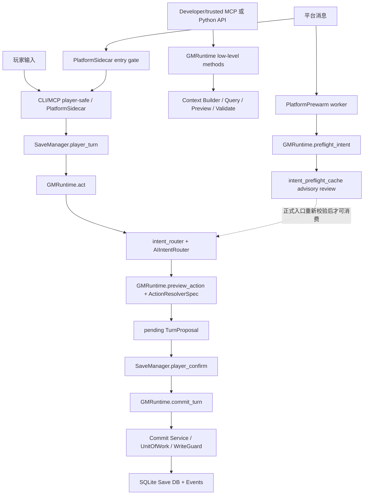

# 架构

文档状态：**CURRENT：BMAD canonical architecture**

## 总体架构

RPG Engine 是本地优先的 AI GM 引擎内核。外部入口按权限和用途分成玩家安全链、低层
runtime 链、平台 sidecar 链和平台预热链。所有链路都必须保持同一个核心原则：

```text
AI proposes. Kernel verifies. Player confirms. Engine commits.
```



`rpg_engine.surface_inventory` 是当前 public / semi-public entry surface 的可测试权限清单。
每个 entry 必须同时声明 domain category、canonical taxonomy、write authority、intended caller、
default exposure、normal-play status、authority gate 和 forbidden bypasses。Canonical taxonomy 只能是
`player-safe`、`trusted low-level`、`maintenance/admin`、`platform sidecar`、`platform prewarm`
或 `projection/outbox`；新增入口缺少这些元数据时，`tests/test_surface_inventory.py` 必须失败。

## 玩家安全链

普通玩家动作的主链是：

1. `SaveManager.player_turn()` 接收玩家输入，解析 campaign、save 和 session。
2. `GMRuntime.act()` 调用 `preview_from_text()`，进入 `route_intent()`。
3. `intent_router.py` 准备规则候选、外部候选、兼容候选和 AI 配置。
4. `ai_intent/router.py` 的 `AIIntentRouter` 按 mode 编排 candidate collection、可选内部复核、
   arbitration、槽位绑定、route adoption 和 trace：enabled + external 保持双候选仲裁；
   `off` + valid external 采用 `external_primary`；`off` + no external 保持 deterministic fallback。
5. `GMRuntime.preview_intent()` / `GMRuntime.preview_action()` 基于动作解析器生成可确认预览。
6. ready 结果写成 pending `TurnProposal`，此时还没有提交状态变化。
7. `SaveManager.player_confirm()` 校验 pending proposal、平台 session hash、确认状态和来源。
8. `GMRuntime.commit_turn()` 接收 approved `TurnProposal`，再进入 validation / commit。
9. `commit_service.py`、`unit_of_work.py`、`write_guard.py` 写入 SQLite、事件和投影材料。

`GMRuntime.start_turn()` 主要用于构建当前回合上下文和可见信息，不是玩家动作提交主入口。

## 低层 Runtime 链

开发者或受信 MCP profile 可以直接调用 `GMRuntime.start_turn()`、`query()`、
`preview_action()`、`validate_delta()`、`commit_turn()` 等低层能力。MCP adapter 必须通过
profile gate 控制这些能力：默认 profile 只暴露 player-safe 工具，developer、trusted、
maintenance、admin 才能看到低层工具。

## 平台 Sidecar 链

`platform_sidecar.py` 负责平台入口门禁、冲突处理和指标。正式玩家动作最终仍应走
player-safe path，由 `SaveManager` 与 `GMRuntime` 处理 pending proposal 和确认。
sidecar 不应复制业务逻辑，也不应成为提交状态的旁路。

## 平台预热链

`platform_prewarm.py` 的 worker 可以提前调用 `GMRuntime.preflight_intent()`，把 advisory
internal intent review 写入 `intent_preflight_cache`。正式入口消费缓存时必须重新验证：

- `user_text`
- save / base turn
- context hash
- provider / model / backend
- schema / task / profile
- platform / session / message 身份

preflight cache 只能作为候选来源，不能替代最终 preview、validation、confirm 或 commit。
`candidate_bound` helper identity 使用 provider/model/backend/fallback 独立字段对账，不依赖可碰撞的拼接
字符串；`message_only` 在 Runtime 与 cache service 双层要求完整 platform/session/message identity，并在
写入前清除 external candidate。Ready row 通过 SQLite 条件更新原子消费一次，TTL、mismatch、并发 replay、
pending bypass 与 late-ready 都只能 miss/reject/fallback，不能恢复任何 authority。

## AI 延迟与降级边界

Player-facing intent helper 的默认 latency policy 是约 8 秒 soft wait target 与 15 秒 hard total
deadline。Soft target 用于结构化 `soft_wait_exceeded` evidence；调用可以继续等待到 hard deadline，
也可以走 clarification、blocked 或 non-AI safe processing。`intent_timeout` 是 caller 配置的 hard
budget，direct primary 与可选 fallback 必须共享该预算，不能各自重新计时。

Hard deadline 后返回的 payload 即使 schema-valid 也必须丢弃并记录 `late_discarded`，不得进入
arbitration、pending 或 commit。Internal intent AI 配置为 `consensus` 时，timeout/unavailable 仍是
enabled-mode helper failure；只能通过 risk-aware fallback/clarification/block 收敛，不能变成显式
`off`，也不能授予 external candidate `external_primary` route proposal authority。

Resident/background 与 platform prewarm 的 30-60 秒目标只描述 advisory scheduling。Timeout、queue
full、failed 或 late-ready 产生 evidence/drop reason，不阻塞 gameplay fact commit。当前 platform
prewarm 默认使用 60 秒 background deadline；player-facing intent 仍是 15 秒 hard deadline。Foreground
与 background helper 使用独立 bounded worker capacity，background 饱和不能占满 player-facing slots。
Background latency 按 `before_target` / `within_target` / `target_exceeded` 记录，不复用 player-facing
`soft_wait_exceeded`。Player/public trace 只暴露稳定 failure class 与脱敏 audit，不回传 provider body、
exception detail 或 output summary。

## Resident AI Advisory Envelope

`rpg_engine.ai.advisory.ResidentAIAdvisory` 是 resident AI 输出的共享 contract，不是 coordinator、
任务队列或存储服务。V1 envelope 使用 `resident_ai_advisory:v1` schema，严格记录五类
`advisory_type`、target ids、结构化 evidence、finite confidence、freshness、visibility mode、
source assistant、proposed next workflow、provenance 与固定 authority。Workflow 字段只是受限 hint；
authority 永远是 advisory-only / no-direct-writes，所有 fact write、proposal approval、player confirmation、
hidden permission、trusted delta、save authorization、profile escalation、validation bypass 和 commit
capability 都固定为 false。

Normalizer 先执行有界 JSON-safe structural preflight，再使用 Draft 2020-12 schema fail closed；它不
静默裁剪未知/越界输入，也不保留 caller 的可变 collection。Maintenance serializer 只输出 canonical、
有界的 debug representation，不保存 private reasoning。Player serializer 使用独立字段 allowlist，要求
精确 `visibility_mode=player` 和有效 SQLite connection，并通过 Entity/Relationship/Progress access
contracts 分别验证 targets/evidence；hidden、archived、missing、unsupported 或查询失败都采用同一个
generic unavailable 结果，最后才调用通用 hidden redactor 作为 defense-in-depth。以上操作只读且保留
caller transaction ownership；本 contract 不写 Save、Campaign、registry、pending、preflight 或 proposal
state，也不改变 30-60 秒 background scheduling target。

公开 dataclass 不是 validation token：maintenance/player serializer 会重新执行 strict normalization。Player
projection 只保留经权威 access contract 证明的 target/evidence、安全 schema version 与固定 authority；不会
回显可能受 hidden evidence 影响的 confidence、freshness（包括 evidence as-of turn）、source assistant 或
workflow metadata。任何最终
hidden redaction 造成的 allowlist shape 变化都会 fail closed 为同一 generic unavailable 结果。
Evidence、freshness event 与 provenance references 必须使用 canonical prefixed IDs；未知 structural keys 不得
进入异常 path。公开 `to_dict()` 与 serializers 都会拒绝伪造 authority state，不把静默重写当成验证。
Structural preflight 只接受 exact built-in `dict/list`，normalized dataclass collections 必须是 tuple；authority
const 与 as-of integer 使用精确 wire types。Defense-in-depth redaction 只扫描已通过 access contract 的动态
references，不让无关 hidden 文本碰撞固定协议 key。
Schema validation 前只接受精确 built-in scalar types；已知 runtime/derived namespace 不能成为 advisory target。
Defense redaction 只扫描 reference leaf values，validator exception 不保留敏感 cause，同一 reference/as-of 也
不能以多个 evidence kind 重复出现。
Mapping keys 与 values 一样只接受 exact built-in JSON scalars。单个 reference read 失败只 omission 该项；
合法的其他公开 reference 仍可投影。`to_dict()` 完成 strict revalidation 后，player serializer 不重复执行
第二轮完整 schema normalization。
Normalizer 在 structural preflight 后复制 bounded exact JSON snapshot，再对 snapshot 复核并完成 schema/semantic
validation。`rel:`/`clock:` prefix 即使遇到 malformed storage type 也必须走 typed access contract；Progress
references 兼容既有 nested-colon clock ids。Redactor 比较保存调用前 wire snapshot，不能被 in-place mutation 绕过。
Redactor 输出还必须保持 exact `list[str]` 形状，JSON 文本相同的 tuple 也会 fail closed。
对已经 access-contract 验证的结构化 reference 只查询 bounded candidate IDs，并以区分大小写的 canonical ID
精确匹配执行 redaction；不加载全库 hidden names/aliases/text，也不执行 hidden-ID 子串匹配，避免无关 hidden
内容改变公开 reference 的可用性并形成 existence oracle。
Player serializer 还拒绝存在 `entities`、`clocks` 或 `world_settings` TEMP shadow table/view 的连接，
并要求 `main` schema 自身包含权威 `entities`/`clocks` tables，防止 SQLite 名称解析 fallback 到 attached
database 绕过 `main` 事实权威。
Maintenance provenance source ids 只接受 `turn/event/context/memory/advisory/trace/candidate` 安全 namespace；
bare authority/approval/confirmation 只允许 canonical 顶层 authority object。Prefix dispatch 优先于冲突的
storage type，structural traversal 的并发 mutation 异常不会保留原始 cause/message。
Clock reference syntax 精确复用 Progress Access Contract 的 `[A-Za-z0-9_.:-]+` 后缀；candidate/prompt/hidden
等控制面 namespace 不能成为 target/entity evidence。Player projection 在 revalidation 后只读取 canonical dict
snapshot，并对 rule/world/setting prefix 执行 storage type 核验。

### Representative Advisory Adapters

`rpg_engine.ai.advisory_adapters` 提供两个 bounded、纯转换的 companion adapter。Internal Intent Review
在 Kernel arbitration/binding 与 route selection 完成后，把最终 `entity_bindings` 映射为
`intent_recognition` advisory；`source_assistant` 只表示 internal helper 是 producer，targets 表示最终
Kernel-selected binding，不表示 AI 独立确认事实。该 optional object 只存在于 `AIIntentRouteResult`，不进入
trace、arbiter、binder、resolver、fallback、preview、pending、confirm、validation 或 commit 输入。

State Audit adapter 只把 maintenance-oriented validation profile 中、已通过 delta-schema stage 的完整
`tick_clocks` id 集合映射为 `progress_management` advisory。提取采用 all-or-none；maintenance dict 只作为
state-audit stage 的 companion artifact，不能出现在 preview/player-turn/response-acceptance profile，也不能
改变 audit risk/status/issues、report ok 或 commit eligibility。

两个 adapter 都只读取 exact helper flags、安全枚举与 canonical access-contract references，最终复用
`normalize_resident_ai_advisory()`。Provenance SHA-256 只覆盖 adapter kind、first-seen targets、confidence/view
等 bounded metadata，不包含 player text、reason、slots、findings、warnings、delta body、provider/model、prompt、
session/message/preflight 或 raw audit。Freshness 固定 unknown，workflow 固定 none；adapter 不接收 connection、
不调用 provider、不写 Save/queue/registry。Semantic/Archivist/reflection/memory/delta/response/turn/plot helpers
保持未迁移，Story 4.6、4.7 与 5.7 的 review/plot/proposal ownership 不变。

### Advisory Review Intake

`rpg_engine.ai.advisory_review` 把一个已经严格 normalization 的 `ResidentAIAdvisory` 与独立、
bounded、明确 kind 的 candidate draft 绑定为 `AdvisoryReviewArtifact`。Envelope 只提供 target、evidence
和 provenance；它本身不是 mutation payload。Artifact 是深度不可变的显式 review evidence，不是 fact、
proposal approval、confirmation、validation proof 或 commit token，也不选择或提升 validation profile。

Intake 只执行只读 preflight：entity/relationship candidate 复用 `validate_content_delta()` 与 access-contract
检查；clock tick 复用 `validate_delta_progress_references()`；alias、memory summary 和 progress definition 在没有
已命名 application owner 时固定不可 application。所有 application owner 都必须在实际写入时从 current facts
重新验证；proposal approval 不能替代 confirmed `TurnProposal`、maintenance validation 或 commit gate。

Review artifact 没有 repository、SQLite table、queue 或 context collector owner。Maintenance/player serializer
只投影 caller 显式传入的 artifact；player projection 复用 Story 4.4 的 SQLite-aware access-contract projection，
对 hidden、missing、archived、TEMP-shadow 或伪造 artifact 统一 fail closed。`rejected`、`stale`、`superseded`
和 `conflict` 只记录 disposition、supersession 与 rollback evidence，永远不是 current facts。Proposal queue 的
create/status/allowed transitions/apply/revert/batch/report 仍完整属于 Story 5.7。

## AI 意图边界

关键模块：

- `intent_router.py`：外层兼容/规则候选/`ActionIntent` facade，负责候选准备、配置和请求元数据。
- `intent_manifest.py`：声明可用意图和动作能力。
- `ai_intent/router.py`：`AIIntentRouter`，实际 AI 意图链协调者。
- `ai_intent/adapters.py`：外部候选适配。
- `ai_intent/arbiter.py`：候选裁决。
- `ai_intent/binder.py`：槽位绑定。
- `ai_intent/internal_review.py`：内部复核。
- `ai_intent/risk.py`：风险判断。
- `preflight_cache.py`：advisory internal intent review cache。

设计约束：

- AI 可以提供候选和解释，不能直接提交状态。
- `external_primary` 只表示 internal intent AI 显式 `off` 时通过 Kernel 校验的 route proposal；它不授予
  fact、hidden、player confirmation、proposal approval、validation 或 commit authority。
- 规则候选、AI 候选和外部候选必须保留来源信息，便于审计与回放。
- Routed `ActionIntent` 的 keyword mismatch 只作诊断；direct low-level `preview_action` 的 mismatch guard
  仍是硬边界，不能由 caller-supplied context/source 绕过。
- `candidate_bound` profile 绑定候选身份。
- 平台预热常用 `message_only` profile，正式入口必须重新构建候选并验证身份。
- 澄清循环要防止无限循环和错误提交。
- timeout 是 execution control，不是 route、fact、permission、confirmation 或 commit authority。
- preflight cache 可能包含原始玩家输入、platform/session/message 标识、internal review 和 helper audit，不能作为公开诊断材料提交。

## 预览、提案与写入链

预览边界不是单个 `preview.py` 文件。核心边界是：

- `actions/base.py` 的 `ActionResolverSpec` 合约。
- `GMRuntime.preview_action()` 的编排。
- 各 `actions/*` 模块对具体动作的解析和 delta 构造。
- `preview.py` 的复用渲染 / delta helper。
- `proposal.py` 的 `TurnProposal`，承载 pending/approved 状态、确认、来源和 intent contract。

写入链由以下模块共同组成：

- `proposal.py`
- `delta_schema.py`
- `validation_pipeline.py`
- `commit_service.py`
- `unit_of_work.py`
- `write_guard.py`
- `db.py`
- `migrations.py`

架构原则：

- 玩家动作先生成 pending proposal，确认后才提交。
- 所有状态写入必须先通过预览、提案确认和校验。
- 事件流和当前事实表共同支持审计与查询。
- 写入错误应尽可能在提交前暴露。

## 上下文链路

上下文链路负责把 Save DB 中的事实转换为 AI/玩家可见材料：

- `context_builder.py`：主构建入口。
- `context/collectors.py`：事实收集，包括 entities、relationships、progress/clocks、routes、
  palettes、discovery states、world settings、recent events、memory summaries 和 advisory-only
  plot progression signals。
- `context/diagnostics.py`：从最终 visibility-safe collection、budget 和 access-contract evidence
  生成有界、确定性、advisory-only 的预算与结构质量诊断。
- `context/resolution.py`：引用和冲突解析。
- `context/budget.py`：上下文预算。
- `context/semantic.py`：语义建议。
- `context/rendering.py` 和 `render.py`：可读输出。
- `visibility.py` 和 `context_audit.py`：隐藏信息边界和审计。

任何新增上下文来源都必须标明 visibility，不能把 hidden / GM-only 内容泄露到玩家视图、
FTS/search、scene output、普通 query、snapshots、cards 或 onboarding。最终 render redaction
只能作为防御层；玩家派生 read model 应在 collection / projection 阶段排除 player-hidden facts。
Relationship / progress context 必须复用 `relationship_access.py` 和 `progress_access.py` 的 access
contract，不直接依赖表结构细节。Plot progression signal 只能作为可见 context evidence / advisory input，
不能要求 storylet、自动导演命令或状态写入。

Context quality diagnostics 只扩展既有 `ContextBuildResult.budget` 与 `completeness`：section 选择决策写入
`budget.decisions`，结构 warning 写入 `completeness.quality_diagnostics`，高价值预算遗漏只追加到
`completeness.missing_signal_evidence`。诊断必须消费当前 view 已过滤且完成 budget reconciliation 的 evidence，
复用 relationship/progress access contracts 与 memory freshness evidence；alias 检查仅对已过滤 entity ids 做一次
canonical `main.aliases` 批量读取。warnings 不评价文笔、剧情或题材品味，也不拥有事实、确认、proposal、clock tick、
save 或 commit authority；诊断失败只能降级为安全的 unavailable evidence，不能改变 `allow_proceed`、confidence、
missing-required 或 confirmation decision。Player hidden-only 与真正 absent 输入必须产生同样的通用有界信号，最终
redaction 仍只是 defense-in-depth。Context audit DDL/DML 必须显式绑定 `main.context_runs` / `main.context_items`，
TEMP 同名表不能劫持最终 result、item token evidence 或 audit upsert。

Memory summary context 只能作为 derived context evidence。`memory_summaries` 记录 source turns/events、
summary type、visibility mode、freshness/staleness metadata 和 derived authority；当它与当前 SQLite
facts 或 access contract 结果不一致时，权威事实优先，summary 只能被标记 stale、从 context 省略或进入
advisory review。memory rebuild、reports 和 projection health 不得阻塞 ordinary gameplay commit；缺失
summary refresh 时，context assembly 应继续使用 recent events、snapshots 或 lower-quality fallback。memory
projection 非 clean、早于 provenance migration、与 current turn 错位或无法验证时，旧 summaries 必须 fail
closed；direct rebuild 只可在同一 turn snapshot 内标 clean。Player lookup/report 只能输出已解析、当前 view
可读的 source ids、allowlisted freshness evidence 和固定 derived-context authority。事实维护入口（包括 save
patch）必须在同一事务中把 memory projection 标 dirty；缺失的 memory projection state 也必须从 dirty 开始，
不能由通用初始化伪装为 clean。Player memory row 必须从字段 allowlist 重建，source turn 的 location refs、
validity window、来源数量上限和返回前 projection snapshot 复核均采用 fail-closed 语义。Context render 必须
在最终返回前对 generation 做 revision-aware gate；若 collection、section、plot signal、budget 或 item evidence
期间 generation 改变，必须统一移除 memory-derived section/signal 并有界重建结果；重新生成的 omission evidence
必须直接绑定检测到的 generation snapshot，不能先查询旧 omission 再把它标成新 generation。Player omitted-item
边界必须把 maintenance/hidden rows 合并为单一 generic signal，不能泄露数量、类型、标题或原始 id。Projection `updated_at`
通常按单调 generation token 分配；refresh 只能以 `refreshing + generation` CAS 到 clean，期间出现的新 dirty
generation 不得覆盖。同一 campaign/projection 的 publication 必须跨线程/进程序列化，失去 ownership 的旧 refresher
不能在新 generation 之后覆盖数据库 rows 或文件 artifacts；最终 report 还必须按最终 effective health 重写 item / refreshed
结论。publication lock 必须有界等待并返回结构化失败；events outbox append 与完整 `events_jsonl` rewrite 使用同一把 target lock。
所有 projection-state/outbox SQL 必须显式绑定 `main`，TEMP 同名表不能劫持 refresh、status 或 queue。`projection_state`
metadata 与 `outbox` availability 独立：缺失 queue 仍必须允许 fact transaction 将 memory 标 dirty，queue health 另行报告 missing。
Generation token 在可解析 UTC timestamp 后携带 opaque nonce，避免时钟回拨或最大值
repair 复用历史 owner token。若损坏的最大 timestamp 已无法递增，allocator 必须产生不同 token、保持
projection non-clean，并且绝不能阻断 authoritative fact commit；事实事务内的 projection metadata 写入使用
savepoint 隔离并保留 caller transaction 语义；helper 自己开启事务时必须自行 commit，普通 Python/SQLite callback
失败统一清理并返回 false。schema/trigger/constraint 失败只能使 projection stale，不得回滚 turn 或 save patch。Direct
memory rebuild 必须先取得 `refreshing + generation` 所有权，table/report 失败或完成 CAS 丢失时不得报告成功。
Direct player report 必须在同一 projection snapshot 上组装并原子发布，snapshot 改变时只留下 generic unavailable report。GM/maintenance
只放宽 hidden-content 权限，
仍必须消费字段 allowlist 与 JSON-safe 动态类型。Subject summary 的 evidence subject 必须与 row subject 一致，
`subject_updated_turn_id` 必须对账 authoritative entity。Validity window 独立于 freshness provenance：未来
`valid_to` 可有效，未来 `valid_from` 表示尚未生效；evidence 中的 bounds 必须与 stored bounds（包括 absence）精确一致，
但 bounds 或与 bound 相同的 scalar turn 本身不能单独证明 freshness。Trusted rebuild authority 必须精确等于 canonical
derived-context object，额外键、非有限 JSON 常量或 numeric pseudo-booleans 均 fail closed。
Memory schema/migration 只操作 `main`，拒绝 TEMP shadow、大小写 trigger 绕过、数字伪 boolean authority defaults、
非 canonical FK action 和缺失的 `(kind, subject_id)` lookup index；`main.schema_migrations` 不能被 TEMP ledger
替代，SQL constraint 检查必须忽略 quoted/comment-only text 并拒绝 executable CHECK/COLLATE。helper backfill 必须先验证
全部现有列，再在同一 savepoint 内原子添加缺列和 canonical index。

## 数据与包边界

- Campaign Package：世界、规则、内容、capabilities、smoke tests 和作者材料。
- Save Package：当前存档、SQLite、事件、投影、snapshots、cards/memory 和存档元数据。
- Workspace/runtime state：`.aigm/game-session-bindings.json`、`.aigm/save-registry.json`、
  `.aigm/pending-*` 等平台绑定和运行索引。
- Packaged resources：迁移、schema、示例、evals。
- `rp/`：剧情包/剧本材料。公开仓库只应推当前剧情包本体，不推存档。

## 已知风险

- 旧文档中的设计版本较多，容易和当前代码事实混淆。
- AI 意图链、平台预热链、旧规则路由之间存在兼容逻辑，需要保持分层清晰。
- `.aigm/`、`saves/`、Save Package、玩家 SQLite、platform session 和 preflight cache 属于敏感运行数据。
- 后续增加真正协调层时，不能让 `GMRuntime` 继续膨胀为所有职责的集合。
