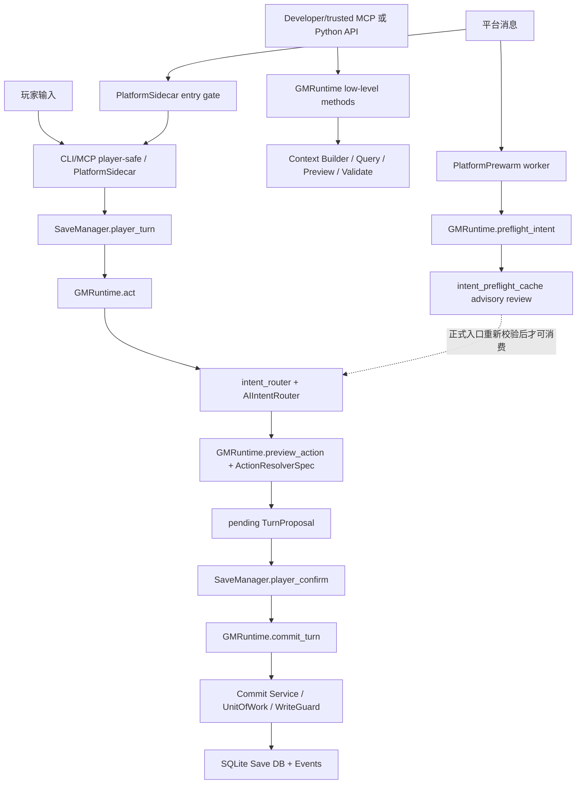

# 架构

文档状态：**CURRENT：BMAD canonical architecture**

## 总体架构

RPG Engine 是本地优先的 AI GM 引擎内核。外部入口按权限和用途分成玩家安全链、低层
runtime 链、平台 sidecar 链和平台预热链。所有链路都必须保持同一个核心原则：

```text
AI proposes. Kernel verifies. Player confirms. Engine commits.
```



`rpg_engine.surface_inventory` 是当前 public / semi-public entry surface 的可测试权限清单。
每个 entry 必须同时声明 domain category、canonical taxonomy、write authority、intended caller、
default exposure、normal-play status、authority gate 和 forbidden bypasses。Canonical taxonomy 只能是
`player-safe`、`trusted low-level`、`maintenance/admin`、`platform sidecar`、`platform prewarm`
或 `projection/outbox`；新增入口缺少这些元数据时，`tests/test_surface_inventory.py` 必须失败。

## 玩家安全链

普通玩家动作的主链是：

1. `SaveManager.player_turn()` 接收玩家输入，解析 campaign、save 和 session。
2. `GMRuntime.act()` 调用 `preview_from_text()`，进入 `route_intent()`。
3. `intent_router.py` 准备规则候选、外部候选、兼容候选和 AI 配置。
4. `ai_intent/router.py` 的 `AIIntentRouter` 编排 AI candidate collection、内部复核、
   共识仲裁、槽位绑定和 trace。
5. `GMRuntime.preview_intent()` / `GMRuntime.preview_action()` 基于动作解析器生成可确认预览。
6. ready 结果写成 pending `TurnProposal`，此时还没有提交状态变化。
7. `SaveManager.player_confirm()` 校验 pending proposal、平台 session hash、确认状态和来源。
8. `GMRuntime.commit_turn()` 接收 approved `TurnProposal`，再进入 validation / commit。
9. `commit_service.py`、`unit_of_work.py`、`write_guard.py` 写入 SQLite、事件和投影材料。

`GMRuntime.start_turn()` 主要用于构建当前回合上下文和可见信息，不是玩家动作提交主入口。

## 低层 Runtime 链

开发者或受信 MCP profile 可以直接调用 `GMRuntime.start_turn()`、`query()`、
`preview_action()`、`validate_delta()`、`commit_turn()` 等低层能力。MCP adapter 必须通过
profile gate 控制这些能力：默认 profile 只暴露 player-safe 工具，developer、trusted、
maintenance、admin 才能看到低层工具。

## 平台 Sidecar 链

`platform_sidecar.py` 负责平台入口门禁、冲突处理和指标。正式玩家动作最终仍应走
player-safe path，由 `SaveManager` 与 `GMRuntime` 处理 pending proposal 和确认。
sidecar 不应复制业务逻辑，也不应成为提交状态的旁路。

## 平台预热链

`platform_prewarm.py` 的 worker 可以提前调用 `GMRuntime.preflight_intent()`，把 advisory
internal intent review 写入 `intent_preflight_cache`。正式入口消费缓存时必须重新验证：

- `user_text`
- save / base turn
- context hash
- provider / model / backend
- schema / task / profile
- platform / session / message 身份

preflight cache 只能作为候选来源，不能替代最终 preview、validation、confirm 或 commit。

## AI 意图边界

关键模块：

- `intent_router.py`：外层兼容/规则候选/`ActionIntent` facade，负责候选准备、配置和请求元数据。
- `intent_manifest.py`：声明可用意图和动作能力。
- `ai_intent/router.py`：`AIIntentRouter`，实际 AI 意图链协调者。
- `ai_intent/adapters.py`：外部候选适配。
- `ai_intent/arbiter.py`：候选裁决。
- `ai_intent/binder.py`：槽位绑定。
- `ai_intent/internal_review.py`：内部复核。
- `ai_intent/risk.py`：风险判断。
- `preflight_cache.py`：advisory internal intent review cache。

设计约束：

- AI 可以提供候选和解释，不能直接提交状态。
- 规则候选、AI 候选和外部候选必须保留来源信息，便于审计与回放。
- `candidate_bound` profile 绑定候选身份。
- 平台预热常用 `message_only` profile，正式入口必须重新构建候选并验证身份。
- 澄清循环要防止无限循环和错误提交。
- preflight cache 可能包含原始玩家输入、platform/session/message 标识、internal review 和 helper audit，不能作为公开诊断材料提交。

## 预览、提案与写入链

预览边界不是单个 `preview.py` 文件。核心边界是：

- `actions/base.py` 的 `ActionResolverSpec` 合约。
- `GMRuntime.preview_action()` 的编排。
- 各 `actions/*` 模块对具体动作的解析和 delta 构造。
- `preview.py` 的复用渲染 / delta helper。
- `proposal.py` 的 `TurnProposal`，承载 pending/approved 状态、确认、来源和 intent contract。

写入链由以下模块共同组成：

- `proposal.py`
- `delta_schema.py`
- `validation_pipeline.py`
- `commit_service.py`
- `unit_of_work.py`
- `write_guard.py`
- `db.py`
- `migrations.py`

架构原则：

- 玩家动作先生成 pending proposal，确认后才提交。
- 所有状态写入必须先通过预览、提案确认和校验。
- 事件流和当前事实表共同支持审计与查询。
- 写入错误应尽可能在提交前暴露。

## 上下文链路

上下文链路负责把 Save DB 中的事实转换为 AI/玩家可见材料：

- `context_builder.py`：主构建入口。
- `context/collectors.py`：事实收集，包括 entities、relationships、progress/clocks、routes、
  palettes、discovery states、world settings、recent events、memory summaries 和 advisory-only
  plot progression signals。
- `context/resolution.py`：引用和冲突解析。
- `context/budget.py`：上下文预算。
- `context/semantic.py`：语义建议。
- `context/rendering.py` 和 `render.py`：可读输出。
- `visibility.py` 和 `context_audit.py`：隐藏信息边界和审计。

任何新增上下文来源都必须标明 visibility，不能把 hidden / GM-only 内容泄露到玩家视图、
FTS/search、scene output、普通 query、snapshots、cards 或 onboarding。最终 render redaction
只能作为防御层；玩家派生 read model 应在 collection / projection 阶段排除 player-hidden facts。
Relationship / progress context 必须复用 `relationship_access.py` 和 `progress_access.py` 的 access
contract，不直接依赖表结构细节。Plot progression signal 只能作为可见 context evidence / advisory input，
不能要求 storylet、自动导演命令或状态写入。

## 数据与包边界

- Campaign Package：世界、规则、内容、capabilities、smoke tests 和作者材料。
- Save Package：当前存档、SQLite、事件、投影、snapshots、cards/memory 和存档元数据。
- Workspace/runtime state：`.aigm/game-session-bindings.json`、`.aigm/save-registry.json`、
  `.aigm/pending-*` 等平台绑定和运行索引。
- Packaged resources：迁移、schema、示例、evals。
- `rp/`：剧情包/剧本材料。公开仓库只应推当前剧情包本体，不推存档。

## 已知风险

- 旧文档中的设计版本较多，容易和当前代码事实混淆。
- AI 意图链、平台预热链、旧规则路由之间存在兼容逻辑，需要保持分层清晰。
- `.aigm/`、`saves/`、Save Package、玩家 SQLite、platform session 和 preflight cache 属于敏感运行数据。
- 后续增加真正协调层时，不能让 `GMRuntime` 继续膨胀为所有职责的集合。
