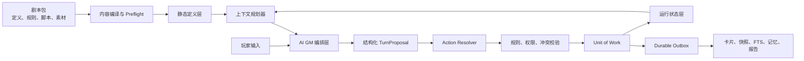

# AI GM 引擎升级改造设计书 V2

文档状态：**HISTORICAL：旧升级目标与实施记录**  
版本：`2.0-draft`  
日期：2026-06-29  
适用范围：`rpg-engine`、现有 `isekai-farm-v2` 游戏包，以及后续可导入的新剧本包  
权威关系：当前 V1 产品边界和交付状态以 [`kernel-requirements.md`](../../../specs/kernel-requirements.md) 与 [`DOCUMENTATION_BASELINE.md`](DOCUMENTATION_BASELINE.md) 为准；本文只保留旧升级设计和实现参考。
文档治理：[`DOCUMENTATION_BASELINE.md`](DOCUMENTATION_BASELINE.md)

> 注意：本文不再定义下一阶段优先级。涉及 V1 主路径、MCP、CLI、Campaign Package、Save Package、官方示例和发布整理时，以当前 V1 文档为准。

---

## 1. 文档目的

本设计书解决以下工程目标：

1. **设定支持性强**：世界设定、种族、文化、势力、能力、遗迹、宗教、任务和场景均能被 AI 正确召回，并能区分叙事说明与可执行规则。
2. **架构清晰**：剧本定义、运行状态、AI 编排、规则结算、持久化和派生投影各自有明确边界。
3. **性能优秀**：当前几百实体保持毫秒级响应，同时为一万实体、一万回合以上的存档预留增量处理能力。
4. **运行稳定**：任何失败都不能产生半写入存档；数据库、事件、快照、卡片和索引之间可以检测并修复不一致。
5. **扩展性强**：新增内容类型或行动类型主要通过注册模块完成，不需要在多个中央文件中增加分支。
6. **可维护性好**：数据契约、版本、迁移、测试、文档和兼容策略可检查，不依赖维护者记忆。
7. **模块化设计**：引擎核心不包含具体游戏角色、物品、规则和世界观名称。
8. **剧本维护方便**：支持剧本校验、构建、差异预览、安装、升级、导出、迁移和冲突处理。

本文不是一次推翻重写方案。现有 SQLite、实体索引、delta、规则、进度钟、世界设定、可见性、上下文管线、卡片和测试基础继续保留，通过渐进式迁移收敛到目标架构。

### 1.1 本设计的 Scope

本文覆盖且仅覆盖以下升级范围：

1. `rpg-engine` 的模块边界、核心接口、数据契约与持久化可靠性。
2. AI GM 从上下文构建、结构化提案、规则批准、叙事输出到保存的回合链路。
3. 剧本包的定义格式、版本、校验、构建、安装、升级、导入、导出与冲突处理。
4. 内容类型、行动类型、上下文 collector 和投影的注册与扩展机制。
5. 定义数据、运行状态、审计事件和派生投影的所有权分离。
6. 单机单用户 SQLite 运行模式下的事务、备份、恢复、迁移、幂等与并发防护。
7. 当前 `isekai-farm-v2` 向目标架构迁移时的兼容要求。
8. 势力、神祇显现、遗迹探索等已经进入世界设计的运行型能力。
9. 与上述改造直接相关的测试、性能基准、文档和发布门禁。

### 1.2 明确不在 Scope 内

以下事项不属于本轮目标，除非后续单独立项并修改本文 scope：

- 联机多人、实时服务器和分布式事务。
- 云端账户、付费、市场、社交和内容审核平台。
- 图形客户端、3D 地图、语音、动画和美术资产流水线。
- 远程插件市场及不受信任代码沙箱。
- 用一个万能 DSL 表达全部 RPG 规则。
- 完整事件溯源重写；本轮继续以 SQLite 当前状态为权威。
- 自动生成完整世界百科、完整国家史或全部长期剧情。
- 无人工监督地让 AI 安装高影响剧本补丁或修改 schema。
- 为所有世界观名词建立专表；只有参与运行和结算的概念结构化。
- 为尚未出现的潜在需求预建复杂微服务架构。

超出 scope 的需求必须记录到 backlog/ADR，不得顺手塞入当前阶段导致验收边界漂移。

### 1.2.1 当前执行反目标

为避免半完成架构继续扩散，当前实现批次显式不做以下事情：

- 不开放公共插件 API；内部 registry 稳定、版本约束和失败语义明确前，不支持外部 module discovery。
- 不引入万能规则 DSL；复杂规则继续使用窄范围 Python resolver 和可测试 policy。
- 不承诺完整 event sourcing；SQLite 当前状态仍是权威源，events/outbox 是审计和投影机制。
- 不把 AI Proposal 设为默认保存路径；必须等 Action Resolver、UnitOfWork 和 response claim guard 稳定后再切换。
- 不让 memory、reflection、summary 或 LLM 输出成为事实源；事实只来自数据库、已批准 delta 和受控内容升级。
- 不把 `preview.py` 继续扩张成规则层；短期兼容 CLI，中期退化为 resolver outcome 的展示层。

### 1.3 实施过程要求

每个阶段都必须依次通过以下门禁：

| 门禁 | 必须完成的工作 | 不通过时 |
|------|----------------|----------|
| Scope Gate | 明确本阶段目标、非目标、受影响模块和兼容范围 | 不得开始实现 |
| Design Gate | 接口、数据模型、失败语义、迁移和回滚方案已评审 | 不得写正式 migration |
| Implementation Gate | 新旧路径有 adapter 或明确切换点，不混入无关重构 | 不得标记完成 |
| Migration Gate | 临时副本演练成功，变更前自动备份，失败可恢复 | 不得接触正式存档 |
| Verification Gate | 单元、合约、集成、回归和本阶段专项测试通过 | 不得切默认路径 |
| Release Gate | 文档、版本、测试证据、已知限制和回滚说明同步 | 不得宣布阶段完成 |

过程约束：

- 先写或更新失败测试，再修改核心行为。
- 数据格式变化必须有 schema version 和 migration。
- 每次只迁移一个可端到端验证的垂直切片。
- 测试写入只能发生在临时副本；正式存档只执行已批准迁移或内容操作。
- 不以“文件已拆分”代替模块解耦；必须通过依赖和合约验收。
- 不以“命令能运行”代替正确性；必须验证失败路径和零副作用。
- 不以“AI 大致理解”代替召回测试；关键自然语言表达必须进入 fixture。

### 1.4 阶段结果要求

每个阶段交付结果必须同时包含：

1. 可运行实现，而不是只有接口或设计占位。
2. 数据 schema、命令或模块接口的明确版本。
3. 正常路径与失败路径测试。
4. 对当前正式游戏临时副本的兼容报告。
5. 性能或规模影响说明；没有影响也要记录测量结果。
6. 升级、回滚和修复办法。
7. 当前实现文档与目标文档的状态同步。
8. 未完成项和已知限制，不得用“基本完成”掩盖阻断能力。

阶段完成的定义是“约定结果可验证且默认路径已经安全切换”，不是代码合并、测试数量增加或文档写完。

### 1.5 测试结果证据要求

任何“通过”“完成”“稳定”的结论必须附带可复核证据：

```text
测试日期与环境
代码/文档基准版本
执行命令
测试集名称与数量
通过/失败/跳过数量
正式 campaign check 结果
临时副本迁移或长跑结果
性能样本规模、平均值和 p95/max
生成报告路径
已知未覆盖范围
```

最低测试要求：

- 本阶段当时的 110 个单元测试和 26 个回归测试不得退化；当前测试基线以 `DOCUMENTATION_BASELINE.md` 为准。
- 新 ContentTypeSpec 必须有内容生命周期合约测试。
- 新 ActionResolverSpec 必须有 request/preview/resolve/delta 合约测试。
- 新 migration 必须测试新建库和旧库升级两条路径。
- 写入功能必须测试校验失败、事务失败和提交后投影失败。
- 上下文变化必须测试召回、预算裁剪、歧义和 hidden 泄露。
- 性能改造必须使用固定数据规模对比改造前后结果。
- 最终报告必须区分测试事实、人工检查和推断，不得混写。

### 1.6 可追踪要求编号

后续计划、提交说明和验收报告必须引用以下稳定编号；修改含义时同步更新本文和文档基准。

#### 目标要求

| ID | 要求 |
|----|------|
| `OBJ-01` | 引擎核心不包含具体游戏名称、ID 和世界规则 |
| `OBJ-02` | 内容类型和行动类型均可通过稳定注册接口扩展 |
| `OBJ-03` | 剧本定义、运行状态和派生投影有明确所有权 |
| `OBJ-04` | AI 只提交结构化提案，正式变化由规则与事务批准 |
| `OBJ-05` | 剧本支持 validate/build/diff/install/upgrade/export/import |
| `OBJ-06` | 所有正式写入满足事务、幂等、并发和可恢复要求 |
| `OBJ-07` | 上下文在预算内保留直接事实、硬规则和必要世界设定 |
| `OBJ-08` | 当前性能不退化，并通过目标规模测试 |

#### 过程要求

| ID | 要求 |
|----|------|
| `PRC-01` | 每阶段通过 Scope/Design/Implementation/Migration/Verification/Release 六道门禁 |
| `PRC-02` | 行为改动先有失败测试，数据改动先有 schema 和 migration |
| `PRC-03` | 正式存档变更前必须在临时副本演练并创建可恢复备份 |
| `PRC-04` | 每次迁移一个垂直切片，保留 adapter 直到新路径验收 |
| `PRC-05` | 同一阶段同步 TARGET、CURRENT、OPERATING 和 CONTENT 文档 |

#### 结果要求

| ID | 要求 |
|----|------|
| `RES-01` | 校验失败对 turn、SQLite、events 和文件均为零副作用 |
| `RES-02` | 提交后投影失败可检测、可重试、可修复 |
| `RES-03` | 包升级不覆盖 runtime-owned 字段，冲突在 dry-run 阶段报告 |
| `RES-04` | 旧 expected turn 和重复 command 不产生状态覆盖或重复扣减 |
| `RES-05` | 第二个最小游戏包无需改核心代码即可完成 init/query/context/save |
| `RES-06` | 新内容类型或行动类型不修改中央分派链即可接入 |
| `RES-07` | 模型不可用或低置信度时安全退化，不误保存行动 |
| `RES-08` | cards/snapshot/FTS/memory/JSONL 可由权威状态重建 |

#### 测试证据要求

| ID | 要求 |
|----|------|
| `TST-01` | 当前 110 单元 + 26 回归测试持续通过 |
| `TST-02` | 新 registry 类型通过统一合约测试 |
| `TST-03` | migration 同时覆盖新建库和旧库升级 |
| `TST-04` | 写入路径通过事务失败、投影失败和崩溃恢复测试 |
| `TST-05` | context 通过召回、预算、歧义和 hidden 泄露测试 |
| `TST-06` | package 通过 schema、引用、diff、冲突和幂等升级测试 |
| `TST-07` | AI proposal 通过 schema、规则批准和回复一致性测试 |
| `TST-08` | 性能报告包含固定规模、环境、平均值、p95/max 和对比基线 |

### 1.7 阶段追踪矩阵

| 阶段 | 主要目标 | 必须结果 | 最低测试证据 |
|------|----------|----------|--------------|
| A 安全写入与版本 | `OBJ-06` | `RES-01`、`RES-04` | `TST-01`、`TST-03`、`TST-04` |
| B Outbox 与投影 | `OBJ-03`、`OBJ-06` | `RES-02`、`RES-08` | `TST-01`、`TST-04` |
| C 解除游戏硬编码 | `OBJ-01` | `RES-05` | `TST-01`、第二 campaign fixture |
| D Action Resolver | `OBJ-02` | `RES-06` | `TST-01`、`TST-02` |
| E 剧本包与编译器 | `OBJ-03`、`OBJ-05` | `RES-03` | `TST-03`、`TST-06` |
| F AI Proposal | `OBJ-04` | `RES-07` | `TST-05`、`TST-07` |
| G 大世界运行类型 | `OBJ-02`、`OBJ-07` | `RES-06` | `TST-02`、`TST-05`、领域专项测试 |
| H 性能与插件 API | `OBJ-02`、`OBJ-08` | 不兼容插件加载期失败 | `TST-02`、`TST-08` |

### 1.8 当前收敛顺序

V2 阶段不是严格按字母全量串行推进；当前 B/C/D/E 的核心闭环已经收敛，后续按以下顺序继续平台化：

1. **E package apply / install**：package lock、build/test/reconcile/install、真实 apply、自动备份、SQLite-backed lock projection、受限显式 migration、同版本 checksum 阻断、migration checksum 追踪和 save export/import 已落地；剩余是 archive 直接安装、复杂脚本 migration 和更大规模 fixture。
2. **C policy adapter 收敛**：主角 ID、样例输入、玩家主资源标签、默认武器和进度钟 ID 已迁到 defaults/policy；旧 v1 importer 作为 campaign adapter 保留。
3. **B 增量投影**：durable outbox、projection status/repair 已稳定；package apply 的 search 投影已有 dirty entity 增量切片，cards/snapshot/memory 仍主要全量刷新。
4. **D/F/G/H 最小默认路径**：Action Resolver 合约、AI proposal guard、`faction_state` runtime entity、plugin manifest validate 已落地；动态插件加载、完整运行态模型和规模优化仍在后续。

### 1.9 三批次收敛计划（2026-06-29）

结论：后续争取压缩为 **3 个批次完成核心平台化收口**。这里的“完成”定义为：package 可安全安装/升级，剩余游戏硬编码有 adapter 边界，投影可验证增量/修复，规则组件可测试注入，AI Proposal 与大世界运行类型有最小默认路径。完整插件市场、所有大世界类型全量实现和 10k 规模优化不纳入三批次硬承诺，只保留接口、门禁和最小验证切片。

如果要 3 批完成，必须接受两个约束：

1. 先做安全提交路径，再做能力扩展；没有 package lock 和 apply 回滚报告，不开放插件和复杂内容迁移。
2. 每批都必须包含测试和文档同步；不能把测试债留到最后一批集中补。

#### 批次 1：Package 安全提交闭环

目标：把当前只读 package dry-run 推进到可安全提交的最小 upgrade/install。

范围：

- **E1 package lock 与 manifest schema**
   - 定义最小 manifest schema：`package_id`、`package_version`、`content_schema_version`、内容文件列表和 checksum。
   - 在 campaign 中写入 `package-lock.json`，记录已安装 package、源文件 checksum、安装时间、应用过的 package migration ID。
   - `package diff/upgrade --dry-run` 读取 lock；没有 lock 时只允许安装/初始化路径，不把“当前源文件目录”误判成已安装基线。
   - 验收：lock 缺失、版本不匹配、checksum 变化和重复 migration 都能被报告，且不修改 SQLite。
- **E2 conflict-free apply 最小闭环**
   - 只开放 dry-run OK 的 create/update；delete、rename、`conflict-only` 必须由显式 migration 授权，未知字段继续阻断。
   - apply 前自动 `create_backup(reason="pre_package_upgrade")`。
   - apply 必须复用 `UnitOfWork`，把 SQLite 变更、canonical maintenance event 和投影刷新纳入同一失败语义。
   - apply 事务内写入 SQLite lock payload，事务后同步外部 `package-lock.json` 投影，运行 `check`，并输出 backup ID、变更摘要、投影状态和失败恢复说明。
   - 验收：校验失败、事务失败、投影失败和重复执行均有测试；外部 lock 写入失败时 SQLite 内仍保留权威 lock payload，可通过 projection repair 恢复。
- **E3 显式 package migration 格式**
   - 为 delete、rename、ID 改名、类型改名和 `conflict-only` 字段定义显式 migration 文件，包含唯一 ID、checksum、from/to package version、precondition、operations。
   - 首期只支持少量高确定性操作：rename entity ID、rename alias、delete package-owned record、`update_conflict_field`；未授权 `details` 合并仍默认阻断。
   - 验收：migration 顺序、重复应用、checksum mismatch、precondition 失败都能阻断。
- **E4 package fixture / test gate**
   - 增加最小可安装 package fixture，覆盖 validate → diff → upgrade --dry-run → upgrade → check → projection status。
   - 增加冲突 fixture：runtime-owned 不覆盖、`details` conflict-only 阻断、缺引用阻断、失败不创建备份外副作用。
   - 更新 `DOCUMENTATION_BASELINE.md`、`README.md`、`SAVE_PROTOCOL.md` 和本文件的测试证据。

完成标志：

- `package upgrade` 能在 conflict-free 场景真实提交。
- delete/rename/conflict-only 必须显式 migration 或阻断。
- 正式包自 diff 中的 9 个 `details` 冲突仍不自动合并。
- package 相关测试、正式 `check`、projection status 和文档证据同步通过。

当前实现状态：已完成 package-lock、build/test/reconcile/install、conflict-free create/update apply、自动备份、SQLite-backed `package_lock` 投影修复、同版本 source checksum 阻断、显式 deterministic migration 格式/执行/checksum 追踪、package apply/new-install/failure-injection fixture 和文档/测试同步。正式包仍未创建 package-lock；reconcile 显示 71 个 drift records 和 9 个 entity `details` conflict-only 分叉，继续阻断 adoption/upgrade，等待显式 migration 或 definition/runtime 拆分。

#### 批次 2：通用化与投影收口

目标：把剩余游戏专属逻辑和投影生命周期收敛到可维护边界。

范围：

- **C policy adapter 收敛**
  - 把 `preview.py` 和旧 importer/fallback 中剩余游戏专属风险词、默认武器、进度钟 relevance、样例输入迁到 campaign adapter / package defaults。
  - 最小第二 campaign fixture 继续覆盖 init/query/context/save/action contract。
- **B 增量投影最小切片**
  - 不追求一次性优化全部性能；先为 cards/search/snapshots 选择一个或两个高价值投影做增量或 dirty-set 更新。
  - 所有 projection 继续可由 `projection repair --all` 全量重建，失败能通过 outbox/status 检测。
- **D 规则组件注入第一层**
  - 将高风险规则、成本、风险评估从 resolver 里抽成可测试 policy 函数或窄接口。
  - 不开放第三方 action module discovery，只确保新增内置规则组件不改中央分派链。

完成标志：

- 核心代码除 importer/game adapter/fixture 外不再直接依赖当前游戏名称、主角 ID、专属武器或专属进度钟。
- 至少一个正式投影具备可验证增量路径；全量 repair 仍可回退。
- 六类既有行动的高风险规则有可单测 policy seam，preview 不再承担唯一规则来源。

当前实现状态：核心代码中的当前游戏专名、主角 ID、专属资源名和专属进度钟已清理到 campaign defaults、policy seam 或旧 importer；package apply 的 FTS/search 投影已具备 dirty entity 增量切片；`actions/policy.py` 提供进度钟匹配策略入口。cards/snapshot/memory 仍主要依赖全量修复路径。

#### 批次 3：最小 F/G/H 默认路径与最终门禁

目标：把完整 V2 的剩余能力做成最小可用默认路径，而不是大而全展开。

范围：

- **F AI Proposal 最小闭环**
  - 定义 TurnProposal schema、ApprovedOutcome、proposal validator 和 response claim guard。
  - 旧 response→delta 保留兼容，但默认行动保存应走 proposal → resolver → approved outcome。
  - 模型不可用或低置信度时查询可退化、行动不误保存。
- **G 大世界运行类型最小切片**
  - 只选一个运行型内容先落地，建议 faction state/relation 或 ruin explore 二选一。
  - 必须包含 storage、content type、collector、card/query、resolver/policy 测试。
  - divine manifestation gate 可先作为 rule/policy gate，不必一次完成完整神祇系统。
- **H 插件/API 与规模门禁最小化**
  - 不做远程插件市场；只定义内部 module discovery 的版本检查和加载失败语义，默认关闭外部插件。
  - 加入 package fixture、规模 smoke test、ruff/typing/coverage 的最小配置或明确跳过原因。

完成标志：

- 新最小游戏包能 validate/install/save/action/context/check。
- AI Proposal 不再允许未批准的数量、位置、关系变化进入正式保存。
- 一个大世界运行类型具备完整端到端路径。
- 文档、测试证据、已知限制和回滚说明全部同步。

当前实现状态：`proposal validate`、TurnProposal/ApprovedOutcome 最小 guard、assistant `--proposal-json`、`faction_state` runtime entity、importer registry、save export/import 和 plugin manifest discovery/validate 门禁已落地。旧 response/delta 兼容路径仍保留；动态插件代码加载、完整 definition/runtime 模型和 10k/100k 规模目标未纳入本批已完成范围。

当前不建议做的事：

- 不把 entity `details` 改成 mergeable 来消除真实包自差异中的 9 个冲突；这些字段已经混入运行态事实，应该等显式 migration 或 definition/runtime 拆分后处理。
- 不开放动态外部插件加载；当前只做 manifest discovery/validate 门禁，不执行第三方代码。
- 不把所有 G 阶段大世界类型一次做完；三批次目标只要求一个运行型类型端到端证明架构成立。
- 不把 10k 实体、100k 事件的完整性能目标塞进三批次；三批次只要求 smoke/基线和不退化证明。

---

## 2. 当前基线与结论

### 2.1 当前规模

截至 2026-06-29：

| 指标 | 当前值 |
|------|--------|
| 活动实体 | 233 |
| 世界设定 | 10 |
| 进度钟 | 6 |
| 路线 | 26 |
| 长期记忆摘要 | 19 |
| 单元测试 | 110 |
| 回归测试 | 26 |
| 测试合计 | 136 |
| 正式数据库检查 | OK |

当前规模下的本机抽样：

| 操作 | 耗时 |
|------|------|
| 上下文构建平均值 | 约 1.2ms |
| 全量 FTS 重建 | 约 9.5ms |
| 234 张卡片全量重建 | 约 39ms |

当前性能不是主要阻塞项。优先问题是边界、可重建性、通用化和写入安全。

### 2.2 已有优势

- SQLite 是权威运行事实源。
- turn delta 与 content delta 已分离。
- `world_setting`、`rule`、`clock`、`palette` 已形成稳定设定、硬边界、动态压力和候选素材四层模型。
- `ContentTypeRegistry` 与 `CardRegistry` 已建立内容生命周期和展示生命周期的初步分离。
- context builder 支持实体解析、按需召回、token 预算、可见性、长期记忆和审计。
- save-turn 有 schema 校验和 SQLite 事务。
- 备份、恢复、迁移、长跑模拟、审计和回归测试已经存在。

### 2.3 设计启动时的主要问题

本节记录 V2 设计启动时的缺口，用于解释改造来源；其中部分问题已经在 2.4 当前实施进度中缓解。判断当前能力时以 2.4、`docs/architecture/game-engine.md`、`DOCUMENTATION_BASELINE.md` 和代码/命令输出为准。

#### 2.3.1 通用引擎仍包含游戏专属逻辑

核心代码中仍直接使用：

- `pc:shenyan`
- 终极复合弩
- 金光
- 菌丝
- 灰藓族
- 特定地点、NPC 和进度钟 ID

这些逻辑目前主要集中在 `preview.py`、旧 importer 和 player ID fallback 中；`context/resolution.py` 的歧义候选以及 ops/simulation 样例输入已改为通用/campaign 配置路径。现状可以稳定运行当前游戏，但不能称为真正可替换游戏包的通用引擎。

#### 2.3.2 行动系统未注册化

设计启动时，`combat/travel/gather/craft/social/rest` 同时硬编码在：

- CLI 参数定义
- 意图分类
- semantic AI prompt
- 完整性校验
- context collector
- preview 分派
- turn assistant
- 回复模板选择

目前 preview 分派、CLI preview 子命令、turn assistant、context/semantic 支持列表已由 Action Resolver Registry 接管，并新增 `explore` 验证行动；`travel/rest/gather/craft/social/combat` 已有核心领域 validate/resolve/delta 校验。新增 `cast_spell` 或 `faction_action` 这类高影响行动仍需要规则组件和合约测试。

#### 2.3.3 作者定义与运行状态混合

当前一个 entity 记录同时可能包含：

- 作者定义：名称、背景、基础特征、规则说明。
- 运行状态：当前位置、所有者、数量、信任、伤势、已发现信息。

如果同步作者内容，可能覆盖玩家运行状态；如果禁止同步，又会使剧本修订困难。`sync_safe` 只能缓解问题，不能解决字段所有权冲突。

#### 2.3.4 内容源不能重建当前运行状态

当前内容源初始化得到 93 个活动实体，而正式存档有 233 个活动实体。140 个实体来自旧档导入、玩家进程或内容维护结果。

这不是运行错误，但必须明确：当前架构是“SQLite 快照为权威”，不是可完整回放的事件溯源系统。现有 events 只保存摘要和部分 payload，不能从初始剧本重放出完整当前状态。

#### 2.3.5 内容维护缺少完整 preflight

设计启动时 turn delta 已有写入前 schema 检查；content delta 缺少：

- 未知顶层字段拒绝。
- 每种内容记录的写入前 schema 校验。
- 跨记录引用预检。
- 删除和改名影响分析。
- 完整 dry-run diff。

目前注册内容类型的未知字段拒绝、record 校验、跨记录/数据库引用预检、sync source preflight、字段所有权 dry-run 内核、package validate/build/test/reconcile/install/diff/upgrade CLI、package-lock adopt/repair、无冲突 package create/update apply、自动备份、受限显式 deterministic migration 执行/checksum 追踪、同版本 checksum 阻断和 save export/import 已落地；archive 直接安装、复杂脚本 migration 和更大规模 package fixture 仍待后续阶段补齐。

#### 2.3.6 AI 输出协议仍以散文为中心

当前可以从 AI 回复草拟 delta，但从自然语言反推库存、关系、时间和状态变化天然低可信。稳定的 AI GM 应先提交结构化提案，经引擎批准后再生成最终叙事。

#### 2.3.7 写入后派生文件不是同一事务

SQLite 提交后才写 `events.jsonl`、snapshot、cards 和 reports。任一文件写入失败都可能形成：

- 数据库已经推进。
- JSONL 未追加。
- 卡片或快照仍是旧版本。

数据库仍可作为权威源恢复。当前 durable JSONL outbox、SQLite-backed `package_lock` 投影、`projection_state`、`projection status/repair`、统一 `UnitOfWork` 和正式 turn/content delta/content sync 生命周期已落地；增量投影仍待阶段 B 后续工作。

#### 2.3.8 当前写入路径包含全量工作

- 每次保存全量重建 FTS。
- 每次正式保存通常全量重写卡片。
- memory rebuild 全量删除重建。
- 备份复制 cards 和 reports 等可重建投影。

当前规模很快；数据扩大后，维护操作会先出现线性退化。

### 2.4 当前实施进度（2026-06-29）

本节覆盖 2.3 的设计启动状态；未在本节声明完成的目标仍按后续阶段要求执行。

| 阶段 | 当前状态 | 已交付 | 剩余范围 |
|------|----------|--------|----------|
| A 安全写入与版本 | 核心完成 | content delta/source preflight、未知字段拒绝、record/reference 校验、`expected_turn_id`、`command_id` 幂等、版本元数据、migration checksum、package merge/apply 安全内核 | 未来新增内容类型合约和更完整 failure injection |
| B Outbox 与投影 | 核心完成 | durable JSONL outbox、package_lock 文件投影、projection state/status/repair、提交后失败重试、SQLite backup API、`UnitOfWork`、正式 turn/content delta/content sync 统一生命周期、package apply 的 FTS dirty entity 增量切片 | cards/snapshot/memory 的细粒度增量投影 |
| C 解除硬编码 | 核心完成 | `player_entity_id` 配置化、最小第二 campaign fixture、核心 query/context 验证、ops/simulation 样例输入 campaign 配置化、context 歧义候选专名清理、player 主资源标签 defaults、核心 preview 默认武器/home-location/进度钟专名清理 | 旧 importer 继续保留为当前游戏 adapter |
| D Action Resolver | 核心闭环完成 | registry、六种既有 preview adapter、`explore` 验证行动、turn assistant/直连 CLI 分派、context/semantic 支持列表、request/resolve/delta 合约入口、`travel/rest/gather/craft/social/combat` 领域 validate/resolve/delta 逻辑、action 模块拆分、`actions/policy.py` 策略 seam | 更完整规则组件注入和动态插件扩展 |
| E 剧本包与编译器 | 安全提交闭环完成 | `MergePolicy` 字段所有权、package source 加载、manifest/schema 校验、package validate/build/test/reconcile/install/diff/upgrade、package-lock adopt/repair、数据库引用预检、冲突报告、runtime-owned 保留、no-op 过滤、带 lock 的 create/update apply、自动备份、显式 deterministic migration 格式/执行/checksum 追踪、同版本 checksum 阻断、save export/import | archive 直接安装、复杂脚本 migration、更大规模 package fixture |
| F AI Proposal | 最小 guard 完成 | `proposal.py`、TurnProposal schema、ApprovedOutcome、delta contract 校验、response claim guard、`proposal validate` CLI、assistant `--proposal-json` | 默认保存路径尚未强制切换到 proposal |
| G 大世界运行类型 | 最小切片完成 | `faction_state` runtime entity 类型、card/query 渲染、delta schema 支持、memory 摘要纳入 | faction definition/relation、quest/scene/lore thread、神祇 gate、遗迹探索仍待后续 |
| H 插件/API 与规模 | 门禁切片完成 | importer registry、plugin manifest discovery/validate、只读版本/能力校验、100-turn smoke 不退化 | 动态插件代码加载、公共插件 API、10k/100k 规模目标 |

当时验证事实：110 个单元测试与 26 个回归测试通过；100 回合临时长跑 avg 0.0014s、max 0.0046s、check_errors 0；正式库 `check OK`，投影含 package_lock 全 clean，outbox 为空；0001/0002/0003 migration checksum ok；package validate OK；package reconcile/test/dry-run 对正式库因缺少 package-lock warning、71 个 drift records 与 9 个 entity `details` conflict-only 分叉阻断；带 package-lock 的 create/update、`update_conflict_field`、`rename_entity`、新库 install、lock projection repair、同版本 checksum 阻断和 migration checksum mismatch 已在临时 fixture 覆盖；正式库未创建 package-lock、剧情回合或推进游戏时间。当前测试基线以 `DOCUMENTATION_BASELINE.md` 为准。

---

## 3. 设计原则

### 3.1 三类数据必须分开

```text
剧本定义（Definition）
  ≠ 运行状态（Runtime State）
  ≠ 派生投影（Projection）
```

#### 剧本定义

由作者和游戏包维护，例如：

- 基础名称和说明。
- 世界规则。
- 物种基础特征。
- 势力初始结构。
- 场景、任务和遭遇模板。
- 可投放素材。

#### 运行状态

由实际游戏产生，例如：

- 当前位置和时间。
- 数量、伤势和耐久。
- NPC 信任与知识。
- 势力态度和进度钟。
- 已发现地点、线索和任务状态。
- 玩家行为造成的世界变化。

#### 派生投影

可以从定义和运行状态重建，例如：

- cards。
- snapshots。
- FTS。
- memory summaries。
- reports。

投影损坏不得等同于存档损坏。

### 3.2 AI 只能提出，不直接决定持久化

AI 的权限边界：

1. 可以解释玩家输入。
2. 可以选择合法候选。
3. 可以提出叙事和状态变化建议。
4. 不得直接绕过 schema、规则解析器和事务写数据库。
5. 不确定时必须返回未知、候选或所需确认，不能用自信散文掩盖缺失事实。

### 3.3 规则分为描述性和可执行性

- **描述性设定**：适合 `world_setting`，用于解释文化、历史和世界边界。
- **硬边界规则**：适合 `rule`，用于禁止或要求。
- **可执行规则**：由 Action Resolver 和窄范围规则组件实现，用于计算成本、验证条件、生成 delta。

不设计一个试图表达所有 RPG 机制的万能规则 DSL。先为明确、高频、可测试的领域提供窄接口。

### 3.4 所有正式变更必须可预览

任何写入命令都应支持：

- validate
- dry-run
- diff
- backup
- apply
- post-check
- repair/rollback

### 3.5 失败必须停在事务边界内

写入前失败：不创建 turn，不写数据库，不追加事件。  
事务内失败：SQLite 回滚。  
提交后投影失败：权威状态保留，outbox 保留未完成任务，并可重试修复。

### 3.6 稳定 ID 优先于名称

- ID 是引用和迁移主键。
- 名称可以修改。
- 改名保留 alias 或显式 rename migration。
- 禁止通过名称猜测同一实体是否已存在。

### 3.7 核心接口先稳定，再做外部插件发现

内部 registry 稳定前，不把当前接口宣传为公共插件 API。先消除中央分支和游戏硬编码，再增加模块发现、版本约束和第三方插件加载。

---

## 4. 目标架构



```text
Player Input
    |
    v
AI Orchestration
    |-- intent / target interpretation
    |-- context planning
    |-- structured TurnProposal
    v
Action Resolver Registry
    |-- validate request
    |-- collect required state
    |-- calculate allowed outcomes
    |-- produce ProposedDelta
    v
Policy / Rule Validation
    |-- player agency
    |-- visibility
    |-- resource and reference checks
    |-- expected turn / conflict checks
    v
Unit of Work
    |-- SQLite transaction
    |-- state mutation
    |-- durable event + outbox
    v
Projection Workers
    |-- FTS
    |-- cards
    |-- snapshots
    |-- memory
    |-- external JSONL if retained
```

### 4.1 建议目录

```text
rpg_engine/
  domain/
    ids.py
    entities.py
    events.py
    deltas.py
    visibility.py
    errors.py

  application/
    commands.py
    queries.py
    unit_of_work.py
    turn_service.py
    content_service.py
    package_service.py

  content/
    registry.py
    schemas.py
    compiler.py
    validator.py
    diff.py
    merge.py
    package.py
    migrations.py
    types/

  actions/
    registry.py
    base.py
    combat.py
    travel.py
    gather.py
    craft.py
    social.py
    rest.py
    explore.py

  ai/
    model_adapter.py
    context_planner.py
    proposal.py
    proposal_validator.py
    response_renderer.py
    claim_guard.py

  context/
    registry.py
    collectors/
    ranking.py
    budget.py
    rendering.py

  infrastructure/
    sqlite/
      connection.py
      repositories.py
      migrations.py
      outbox.py
    filesystem/
      package_store.py
      projection_store.py
      backup_store.py

  projections/
    registry.py
    cards.py
    snapshots.py
    search.py
    memory.py
    reports.py

  presentation/
    card_registry.py
    markdown.py
    json.py

  cli/
    root.py
    context_commands.py
    turn_commands.py
    content_commands.py
    package_commands.py
    save_commands.py
```

目录不是第一阶段必须一次搬完的目标。迁移应以接口和测试为单位，避免只移动文件而不降低耦合。

---

## 5. 剧本包与存档模型

### 5.1 剧本包目录

```text
campaign-package/
  manifest.yaml
  content/
    entities/
    rules/
    world_settings/
    factions/
    abilities/
    encounters/
  scripts/
    arcs/
    quests/
    scenes/
  palettes/
  migrations/
  tests/
  locales/
```

### 5.2 `manifest.yaml`

```yaml
package_id: isekai-farm
name: 万能农具 · 异世界悠闲农家
package_version: 1.0.0
engine_api: ">=0.3,<0.4"
content_schema_version: 2
entry_scene_id: scene:forest-awakening

defaults:
  player_entity_id: pc:shenyan
  initial_location_id: loc:home-treehouse
  context_budget: 3000

modules:
  actions: [combat, travel, gather, craft, social, rest]
  content_types: [entity, rule, clock, world_setting]

dependencies: []
```

### 5.3 版本维度

必须区分：

| 版本 | 含义 |
|------|------|
| `engine_api` | Python/模块接口兼容范围 |
| `save_schema_version` | SQLite 结构版本 |
| `content_schema_version` | YAML/JSON 内容格式版本 |
| `package_version` | 具体剧本包版本 |
| `projection_version` | 卡片、快照、搜索等派生格式版本 |

### 5.4 存档包

存档导出至少包含：

```text
save-bundle/
  manifest.json
  game.sqlite
  package-lock.json
  checksums.json
  optional/
    events.jsonl
    snapshots/
    cards/
```

其中 `game.sqlite + package-lock + checksums` 是恢复所需核心。cards、snapshots、reports 默认可以不打包或标记为可重建缓存。

### 5.5 不采用伪事件溯源

当前系统不保存完整可回放事件，因此短期明确采用：

> SQLite 当前快照是权威状态，events 是审计记录，不承诺仅靠 events 重放全部状态。

如果未来要切换完整事件溯源，必须为每次变更持久化完整 canonical delta，并提供确定性 replay 测试。在此之前不得把摘要事件当作恢复机制。

---

## 6. 定义层与运行状态层

### 6.1 推荐逻辑模型

不强制拆成两个 SQLite 文件；第一阶段可在同一数据库中逻辑分表：

```text
definition tables
  entity_definitions
  rule_definitions
  world_setting_definitions
  faction_definitions
  scene_definitions
  quest_definitions

runtime tables
  entities
  entity_state
  character_state
  item_state
  faction_state
  quest_state
  clocks
  facts
  turns
  events
```

### 6.2 字段所有权

| 字段示例 | 默认所有权 | 更新方式 |
|----------|------------|----------|
| 名称、基础摘要、类型 | package | 包升级或内容迁移 |
| aliases、tags | merge | 去重合并，允许迁移删除 |
| 当前位置、所有者 | runtime | turn delta |
| 数量、耐久、伤势 | runtime | action resolver + turn delta |
| 初始信任 | package initial | 首次创建时复制到 runtime |
| 当前信任 | runtime | turn delta |
| 世界规则文本 | package | 内容升级 |
| 是否已发现 | runtime | discovery delta |
| GM 临时备注 | runtime | maintenance delta |

迁移期最小所有权模型：

| 所有权 | 含义 | 默认处理 |
|--------|------|----------|
| `author-owned` | 剧本作者定义，升级时以 package 为准 | package upgrade 可覆盖，但必须记录 diff |
| `runtime-owned` | 玩家存档运行中产生的事实 | package upgrade 不得覆盖，只能由 turn/maintenance delta 修改 |
| `mergeable` | 作者和运行期都可追加的集合 | 去重合并；删除必须显式 migration |
| `conflict-only` | 改动风险高，不能自动合并 | dry-run 报告冲突，人工确认后应用 migration |

在完整 definition/runtime 拆表前，所有新 content type 和 package diff 都必须至少声明这四类字段；未声明字段默认按 `conflict-only` 处理。

### 6.3 合并策略

每种内容类型必须声明字段策略：

```python
MergePolicy(
    package_authoritative={"name", "base_summary", "definition"},
    runtime_authoritative={"location_id", "owner_id", "state"},
    merge_set={"aliases", "tags"},
    explicit_migration_only={"type", "id"},
)
```

包升级不能隐式覆盖 runtime-authoritative 字段。

### 6.4 兼容当前 `entities` 表

迁移期不立刻删除 `entities.summary/details_json`：

1. 新定义表先作为可选来源。
2. 查询层通过 repository 合成 definition + runtime view。
3. 旧 renderer 继续读取兼容 view。
4. 新内容类型先使用新模型。
5. 全部查询迁移后，再决定是否收缩旧字段。

---

## 7. Content Type Registry V2

### 7.1 目标接口

```python
@dataclass(frozen=True)
class ContentTypeSpec:
    name: str
    schema_version: int
    record_model: type
    id_prefixes: tuple[str, ...]
    dependencies: tuple[str, ...]
    merge_policy: MergePolicy
    compile_record: Callable
    validate_record: Callable
    validate_database: Callable | None
    context_provider: Callable | None
    projection_provider: Callable | None
    migrations: tuple[ContentMigration, ...]
```

### 7.2 注册类型的完整生命周期

```text
read source
→ parse
→ schema validate
→ normalize
→ reference preflight
→ compile
→ diff
→ merge-policy check
→ apply transaction
→ post-check
→ mark projections dirty
```

### 7.3 未知字段策略

- 默认拒绝未知顶层字段。
- `extensions` 是唯一允许自由扩展的命名空间。
- extension key 必须带命名空间，例如 `isekai_farm.golden_light`。
- 核心引擎不得依赖未声明 extension 的内部结构。

### 7.4 应保留通用 JSON 的位置

适合弹性 JSON：

- 世界观解释。
- 展示元数据。
- 低频扩展字段。
- 模组自有、不参与核心结算的信息。

不适合自由 JSON：

- 数量和消耗。
- ID 引用。
- 运行状态。
- 可见性。
- 进度。
- 结算条件与效果。

### 7.5 优先新增的正式内容类型

| 类型 | 是否需要专表 | 理由 |
|------|--------------|------|
| `faction_definition` | 是 | 结构、领域、资产、限制需要查询 |
| `faction_state` | 是 | 关系、资源档位、当前目标会变化 |
| `faction_relation` | 是 | 不能只塞入某个势力 JSON |
| `quest_definition/state` | 是 | 需要阶段、条件和进度 |
| `scene_definition` | 是或编译表 | 需要进入条件与线索投放 |
| `ability/effect` | 是 | 成本与限制需要执行 |
| `encounter` | 可先 JSON schema | 主要作为解析器输入 |
| `lore_thread` | 可先通用实体 | 主要负责线索与揭示阶段 |

文化、神话、历史等仍优先使用 `world_setting`，不为每一种百科概念建立表。

---

## 8. Action Resolver Registry

### 8.1 目标

把行动类型从中央 if/elif 链中移出。每个行动模块独立声明输入、上下文、校验、预演、结算和回复模板。

### 8.2 接口草案

```python
@dataclass(frozen=True)
class ActionResolverSpec:
    name: str
    request_model: type
    proposal_model: type
    keywords: tuple[str, ...]
    semantic_labels: tuple[str, ...]
    required_context: Callable
    validate_request: Callable
    preview: Callable
    resolve: Callable
    validate_delta: Callable
    response_template: str
```

### 8.3 标准返回值

```python
@dataclass
class ResolutionResult:
    status: Literal["ready", "needs_confirmation", "blocked"]
    facts_used: list[str]
    rules_applied: list[str]
    confirmations: list[Confirmation]
    warnings: list[Warning]
    proposed_delta: StateDelta | None
    narrative_constraints: list[str]
```

### 8.4 标准生命周期

每个 action resolver 必须按固定生命周期组织，避免把检查、结算和叙事混在 preview 文案里：

| 阶段 | 职责 | 禁止事项 |
|------|------|----------|
| `parse/request` | 读取玩家输入和显式参数，声明缺失项 | 不访问 hidden 事实，不硬猜目标 |
| `check` | 验证世界状态、目标可见性、资源、位置和硬规则 | 不修改状态，不生成文学文本 |
| `resolve` | 计算 facts、rules、风险、耗时、代价和候选 delta | 不提交数据库，不绕过确认 |
| `report/narrative` | 从 approved outcome 生成玩家可见叙事约束 | 不引入 outcome 之外的新事实 |
| `validate_delta` | 保存前复核 delta 与 resolver outcome、schema 和当前位置一致 | 不修补错误 delta，只报告错误或确认项 |

这个模型对应互动小说成熟做法中的 check/carry out/report 分离，但为 AI GM 增加了 `proposed_delta` 和 `narrative_constraints`。`resolve` 不是“写剧情”，而是把行动变成可校验的世界变化建议。

### 8.5 解析器职责

解析器必须：

- 检查目标实体存在且可见。
- 检查行动所需资源和状态。
- 应用相关硬规则。
- 给出缺失确认，而不是硬猜。
- 产生机器可校验 delta。
- 提供叙事约束，不负责写最终文学文本。

解析器不得：

- 直接提交数据库。
- 读取未授权 hidden 信息后泄露给玩家。
- 使用具体游戏全局常量；游戏专属逻辑由规则组件或游戏适配器注入。

### 8.6 Preview 的未来定位

`preview` 是兼容入口，不是长期规则中心：

1. 短期：继续支持 CLI 和 turn assistant，保证现有工作流不破。
2. 中期：preview 只渲染 resolver 的 request/check/resolve 结果，不再自行决定规则。
3. 长期：行动规则、风险、代价和 delta 生成只存在于 resolver/policy；preview 只负责可读展示。

任何新增行动不得把核心规则只写在 preview 中。已有 preview 中的规则逻辑必须随着对应 action resolver 迁移逐步收缩。

### 8.7 迁移顺序

1. 建立 registry 和兼容 adapter。
2. 已将 `travel/rest/gather/craft/social/combat` 迁入核心 resolver 合约，验证旅行、休息、采集、制作、社交和战斗闭环。
3. `explore` 已作为新增验证行动接入。
4. 下一批重点不再是迁移动作类型，而是把 preview 中剩余高风险启发式规则继续抽成 resolver policy / 规则组件。

---

## 9. AI GM 回合协议 V2

### 9.1 新回合顺序

```text
1. classify request
2. resolve explicit entities
3. build bounded context
4. model produces TurnProposal JSON
5. validate proposal schema
6. action resolver computes/approves outcome
7. model renders narrative from approved outcome
8. validate response claims against approved outcome
9. commit canonical delta
10. process projections
```

### 9.2 `TurnProposal`

```json
{
  "mode": "action",
  "action_type": "social",
  "actor_id": "pc:shenyan",
  "target_ids": ["char:an"],
  "intent": "询问外部宗教",
  "approach": "通过石板交流",
  "requested_outcomes": ["获得信息"],
  "assumptions": [],
  "unknowns": ["An 是否了解外部神学"],
  "candidate_new_clues": [],
  "confidence": "medium"
}
```

### 9.3 `ApprovedOutcome`

```json
{
  "status": "ready",
  "facts_used": ["char:an", "world:divinity"],
  "rules_applied": ["rule:player-agency", "rule:divine-manifestation-limits"],
  "outcome_beats": [
    "An只能表达本族经验，不能代表外部宗教体系",
    "可以获得一条传闻，但不能确认神祇曾在附近直接显现"
  ],
  "state_delta": {
    "events": [],
    "upsert_entities": [],
    "tick_clocks": []
  },
  "forbidden_claims": [
    "宣布某位神已经在附近降临",
    "替玩家决定信仰"
  ]
}
```

### 9.4 回复一致性

最终回复必须只描述：

- ApprovedOutcome 已批准结果。
- 不改变事实的小规模感官细节。
- 明确标注的传闻、推测和未知。

回复 lint 从“只检查 Markdown 标题”升级为两层：

1. 结构 lint。
2. claim/delta consistency：数量、地点、时间、关系、伤势、进度钟、新实体和关键结果必须与批准结果一致。

### 9.5 模型适配器

```python
class ModelAdapter(Protocol):
    def complete_json(self, request: ModelRequest, schema: dict) -> dict: ...
    def complete_text(self, request: ModelRequest) -> str: ...
```

核心引擎只依赖 adapter，不直接写死 Hermes、DeepSeek 或其他供应商。模型失败时：

- 查询可以回退本地结构化结果。
- 行动不应自动保存。
- semantic helper 失败不得阻断本地完整性检查。

---

## 10. 上下文系统升级

### 10.1 上下文合同

每个 section 必须声明：

- key
- priority
- required/optional
- minimum representation
- full representation
- estimated tokens
- visibility
- inclusion reason
- source IDs

### 10.2 预算保留区

不能只按整体优先级贪心装入。建议分配最低预算：

| 区域 | 最低保留 |
|------|----------|
| 玩家与当前场景 | 20% |
| 直接命中实体 | 20% |
| 硬规则与必要世界设定 | 20% |
| 行动解析要求 | 15% |
| 历史与长期记忆 | 15% |
| 模板、候选和辅助说明 | 10% |

如果直接命中的 `world_setting` 或 linked rule 因预算被裁掉，必须保留 compact 摘要，不能整段消失。

### 10.3 Collector Registry

Collector 不再由固定列表装配。内容类型、行动类型和游戏包可以注册 collector，但必须返回统一候选格式并接受全局预算器裁剪。

### 10.4 自然语言召回

召回按以下顺序：

1. ID 精确命中。
2. 名称精确命中。
3. alias 精确命中。
4. 显式短语/关键词命中。
5. FTS 候选。
6. 可选 semantic helper。

需要建立自然语言表达回归集，例如：

- “神会下来吗”应召回神祇显现规则。
- “外面的人用枪吗”应召回科技设定和外部文明边界。
- “那个蘑菇”应要求候选确认。

### 10.5 长期记忆

memory 必须是派生索引，而不是新事实源：

- 每条摘要保存 source event/turn IDs。
- 原始来源失效时摘要必须重建或过期。
- 按 subject/day/arc/faction 增量更新。
- AI 生成摘要只能提出草案；引用 ID 必须存在。

---

## 11. 事务、事件与投影

### 11.1 Unit of Work

所有写入入口统一使用：

```python
with unit_of_work(expected_turn_id=request.expected_turn_id) as uow:
    result = service.execute(request, uow)
    uow.events.add(...)
    uow.outbox.add("projection.refresh", dirty_ids)
    uow.commit()
```

禁止 CLI、resolver、renderer 各自直接管理提交。

### 11.2 乐观并发控制

turn proposal 和 delta 增加：

```json
{
  "expected_turn_id": "turn:000026"
}
```

提交前如果当前 turn 已变化，拒绝写入并重新构建上下文。这样可以防止旧 AI 回复覆盖新存档。

### 11.3 Outbox

新增：

```sql
create table outbox (
  id text primary key,
  topic text not null,
  payload_json text not null,
  status text not null,
  attempts integer not null default 0,
  created_at text not null,
  processed_at text,
  last_error text
);
```

SQLite 状态变更、canonical event 和 outbox 在同一事务提交。提交后处理：

- JSONL 导出。
- snapshot 刷新。
- cards 刷新。
- FTS 更新。
- memory 更新。
- report 更新。

失败则保留 pending/failed outbox，可通过 `projection repair` 重试。

### 11.4 事件策略

- `events` 表是权威审计记录。
- `events.jsonl` 是可选外部投影，不再作为并列事实源。
- 每个 event 有 schema version。
- event payload 应包含足够的审计信息，但短期不承诺完整重放。

### 11.5 投影版本

新增 `projection_state`：

```sql
create table projection_state (
  name text primary key,
  version integer not null,
  last_turn_id text,
  status text not null,
  updated_at text not null,
  last_error text
);
```

启动或检查时可检测：

- 数据库 turn 比卡片投影新。
- FTS 版本过旧。
- memory 尚未处理重要事件。

---

## 12. 稳定性与恢复设计

### 12.1 SQLite 连接策略

单机默认：

```sql
pragma foreign_keys = on;
pragma journal_mode = wal;
pragma synchronous = normal;
pragma busy_timeout = 5000;
```

正式启用 WAL 前必须补充备份、恢复和测试，不能只改 pragma。

### 12.2 备份

- 使用 SQLite backup API 创建一致性数据库副本。
- 备份核心默认只包含 DB、package lock 和 manifest。
- cards、snapshots、reports 按需包含。
- 增加保留策略：最近 N 个、每日、重要里程碑。
- manifest 保存文件 checksum 和 schema/package 版本。

### 12.3 崩溃恢复

启动检查顺序：

1. SQLite `quick_check`。
2. migration status。
3. current turn 引用。
4. pending outbox。
5. projection versions。
6. package lock 是否满足。

### 12.4 幂等性

- 所有 command 有 `command_id`。
- 同一个 command 重试不能重复创建 turn 或扣资源。
- package migration 有唯一 ID 和 checksum。
- outbox handler 必须幂等。

### 12.5 删除策略

- 默认不物理删除已进入存档的实体。
- 使用 retired/archived/tombstone。
- 包升级删除定义前必须检查 runtime 引用。
- ID 改名只能通过 migration，不允许删除后新建造成历史断裂。

---

## 13. 性能设计

### 13.1 性能目标

目标测试规模：

| 指标 | 目标规模 |
|------|----------|
| 实体 | 10,000 |
| aliases | 50,000 |
| turns | 10,000 |
| events | 100,000 |
| 路线 | 20,000 |
| 世界设定 | 500 |

建议本机验收目标：

| 操作 | p95 目标 |
|------|----------|
| 普通上下文构建 | < 50ms |
| 精确实体查询 | < 10ms |
| FTS 候选查询 | < 30ms |
| 不含备份的普通 turn commit | < 200ms |
| dirty cards 增量刷新 | < 100ms |

### 13.2 增量 FTS

当前全量删除重建改为：

- upsert entity 时记录 dirty ID。
- 批量读取 dirty entities 和 aliases。
- 只删除/插入对应 FTS 行。
- 提供显式 full rebuild 修复命令。

### 13.3 增量 cards

- delta 记录 changed entity IDs。
- 只重写相关卡片。
- INDEX 可以增量维护或在变更数量超过阈值时重建。
- entity archive 时删除对应 generated card。

### 13.4 查询优化

- 避免对 `details_json` 大量执行 `%LIKE%`。
- 参与召回的 tags、keywords、links 单独索引。
- aliases 批量 join，避免 N+1。
- 路线、关系、任务等使用结构化表和索引。
- context audit 设置保留策略，避免无限增长。

### 13.5 不提前引入的复杂度

当前不需要：

- 外部搜索服务。
- 分布式数据库。
- 消息队列服务器。
- 多进程 projection worker。

SQLite outbox 和同进程可靠处理足够支持单用户本地 AI GM。

---

## 14. 剧本编写与导入工作流

### 14.1 新剧本构建

```text
package init
→ 编辑 manifest/content/scripts
→ package validate
→ package build --output build/package.rpgpack
→ package test
→ campaign install
→ save create
```

### 14.2 修改现有剧本

```text
编辑源文件
→ package validate
→ package diff --against-save
→ 检查 runtime 冲突
→ 自动备份
→ package upgrade --dry-run
→ package upgrade
→ post-check
→ projection refresh
```

### 14.3 Diff 分类

| 类型 | 示例 | 默认行为 |
|------|------|----------|
| safe add | 新世界设定、新未发现 NPC | 自动允许 |
| safe author update | 修正文案、补 alias | 自动允许并报告 |
| runtime conflict | 修改当前库存/位置/信任 | 阻止，要求 migration |
| reference impact | 删除被任务引用地点 | 阻止 |
| visibility risk | hidden 改 known | 警告或阻止 |
| ID/type change | faction 改 species | 只允许 migration |

### 14.4 通用导入器接口

```python
class CampaignImporter(Protocol):
    name: str
    source_versions: tuple[str, ...]

    def inspect(self, source: Path) -> ImportPlan: ...
    def parse(self, source: Path) -> PackageDraft: ...
    def validate(self, draft: PackageDraft) -> list[Finding]: ...
    def render_report(self, plan: ImportPlan) -> str: ...
```

现有 `isekai_farm_v1.py` 保留为一个 importer adapter，不再由 CLI 直接写死。

### 14.5 剧本脚本模型

建议场景结构：

```yaml
scenes:
  - id: scene:first-border-contact
    title: 第一次边境接触
    visibility: hidden
    entry_conditions:
      all:
        - clock_at_least: [clock:civilization-rumor, 6]
        - player_discovered: loc:l10-river
    participants:
      required: [faction:outer-scouts]
    known_facts: []
    clue_pool:
      - clue:fresh-boot-print
      - clue:worked-metal-button
    beats:
      - establish_distance
      - exchange_signals
      - choose_contact_or_withdraw
    forbidden_reveals:
      - 外部国家完整版图
      - 对方最高权力结构
    completion_effects:
      - create_contact_fact: faction:outer-scouts
```

脚本用于约束和组织剧情，不强制玩家按线性选项推进。

---

## 15. 势力、神祇与遗迹的运行支持

### 15.1 势力

定义表：

```text
faction_definition
  id, tier, reach, domains, structure, assets, constraints

faction_state
  faction_id, hold, current_goal, resource_state, public_stance

faction_relation
  source_id, target_id, relation_type, value, visibility, updated_turn_id
```

每个故事阶段只向 AI 上下文加载：

- 一个前台势力。
- 一个主要利益相关方。
- 一个潜在压力源。

世界可以存在更多势力，但不应同时让 AI 模拟全部组织。

### 15.2 神祇显现

不建立自由“召唤神”指令。使用显式 gate：

```text
domain_match
faith_or_contract_anchor
medium_or_cost
lasting_consequence
```

`divine_manifestation` resolver 只能在全部必要条件有结构化证据时生成候选结果；否则只能产生预兆、宗教解释或失败反馈。

### 15.3 遗迹探索

遗迹采用模块化 zone，而不是让 AI 一次生成整座地下城：

```text
ruin
  entrance clue
  zones 3..N
  hazards
  knowledge gates
  recoverable assets
  contamination/attention clocks
  exit and collapse conditions
```

`explore` resolver 每回合只结算一个明确目标：进入、观察、取样、解锁、拆取、撤退或跨 zone 移动。

---

## 16. CLI 与工具设计

### 16.1 命令分组

```text
rpg_engine campaign init|inspect
rpg_engine package init|validate|build|test|diff|install|upgrade
rpg_engine save create|export|import|check|repair
rpg_engine turn propose|preview|resolve|commit
rpg_engine content inspect|validate|diff|apply
rpg_engine projection status|refresh|rebuild|repair
rpg_engine migrate status|plan|apply
rpg_engine backup create|list|restore|prune
rpg_engine query entity|scene|rule|world
```

### 16.2 CLI 只做适配

CLI 函数负责：

- 解析参数。
- 构造 request object。
- 调用 application service。
- 格式化结果和 exit code。

CLI 不应：

- 直接写数据库。
- 自己创建事务。
- 包含游戏规则。
- 复制 service 的校验逻辑。

### 16.3 统一结果协议

```python
CommandResult(
    ok: bool,
    code: str,
    summary: str,
    findings: list[Finding],
    changes: list[Change],
    artifacts: list[Path],
)
```

CLI、桌面应用和未来 API 可以复用同一 application service。

---

## 17. 测试与质量门槛

### 17.1 测试层级

#### 单元测试

- schema 和 normalizer。
- merge policy。
- action resolver。
- visibility。
- budget ranking。
- ID/alias 解析。

#### 合约测试

- 每个 ContentTypeSpec 必须通过统一生命周期测试。
- 每个 ActionResolverSpec 必须通过 request/preview/resolve/delta 合约。
- 每个 projection 必须可从同一状态重复生成相同结果。

#### 集成测试

- package build → install → save create。
- content diff → dry-run → apply。
- turn proposal → resolve → commit。
- migration N-1 → N。
- backup → mutate → restore。

#### 故障注入测试

- 事务中断。
- DB commit 后 projection 失败。
- JSONL 写失败。
- 卡片目录不可写。
- 旧 expected_turn_id。
- migration 执行一半失败。

#### AI 上下文测试

- 关键设定自然语言召回。
- hidden 内容不泄露。
- token 紧张时硬规则保留。
- 多实体歧义要求确认。
- semantic helper 失败安全回退。

#### 规模测试

- 1k/10k 实体。
- 10k 回合。
- 100k 事件。
- 大量 aliases 和路线。

### 17.2 工程工具

增加：

- `pyproject.toml`
- 固定 Python 版本范围。
- `ruff` 格式与 lint。
- `mypy` 或 `pyright` 类型检查。
- coverage 报告。
- CI：unit、contract、integration、migration、package fixture。

### 17.3 合并门槛

任何架构迁移 PR 必须满足：

- 当前 136 项测试不退化。
- 新接口有合约测试。
- 正式存档临时副本迁移后 `check` 为 OK。
- 对关键 context fixture 进行输出语义比较。
- 不修改正式存档完成测试。

### 17.4 能力矩阵

测试数量是基线，不是完成度定义。每次阶段收口必须更新并满足以下能力矩阵：

| 能力 | 最低覆盖 | 失败风险 |
|------|----------|----------|
| Action Resolver Contract | 每个 action 至少覆盖 request、preview、resolve、validate_delta 和缺参路径 | AI 可生成不可保存或越权保存的行动 |
| Write Reliability | schema 失败、stale turn、command id 冲突、事务失败、提交后 projection 失败 | 半写入、重复扣减、投影不一致 |
| Visibility Safety | query/context/preview/card/search 对 hidden 的默认过滤和 GM 显式读取 | 剧透或隐藏真相泄露 |
| Package Merge | author-owned、runtime-owned、mergeable、conflict-only 字段 dry-run；package validate/build/test/reconcile/install/diff/upgrade；package-lock adopt/repair；带 lock 的 create/update apply；显式 deterministic migration 格式校验、执行与 checksum 追踪 | 内容升级覆盖玩家存档 |
| Second Campaign | 最小 campaign 的 init/query/context/save/action contract | 引擎核心仍绑定当前游戏 |
| Projection Repair | cards/snapshot/FTS/memory/events_jsonl 可检测 dirty 并修复 | 派生文件与数据库长期漂移 |
| Context Budget | 低预算下保留当前场景、玩家状态、硬规则和直接命中实体 | AI 缺关键事实后胡编 |
| AI Proposal Guard | proposal schema、approved outcome、response claim guard 和模型失败回退 | 自由散文反推状态导致不可审计 |

---

## 18. 分阶段实施计划

### 阶段 A：安全写入与版本基线

目标：在继续扩展内容前补齐不可妥协的写入边界。

交付：

- content delta 独立 schema 和 preflight。
- 未知字段拒绝。
- 记录级校验和跨引用预检。
- `expected_turn_id`。
- command ID 幂等保护。
- engine/save/content/package/projection 版本字段。
- 文档状态同步。

验收：

- 坏 content delta 不创建 turn、不写 events、不改变 SQLite。
- 旧 turn delta 无法覆盖新 turn。
- 重复 command 不产生重复扣减。

### 阶段 B：Outbox 与可修复投影

目标：消除数据库提交和文件写入之间的半完成状态。

核心交付已完成：

- UnitOfWork。
- canonical events + outbox。
- projection state。
- `projection status/repair/rebuild`。
- JSONL 降级为投影。
- SQLite backup API。

剩余范围：

- cards/snapshot/FTS/memory 的细粒度增量投影。

验收：

- 人为让 cards 写入失败，数据库仍正常且 outbox 可重试。
- repair 后 cards/snapshot/FTS 与当前 turn 一致。

### 阶段 C：解除当前游戏硬编码

目标：核心引擎不再知道当前游戏专属名称和 ID。

交付：

- `player_entity_id` 等进入 package defaults。
- 游戏专属规则移入游戏包 adapter。
- ops/simulation 使用 campaign `sample_texts` 或通用默认样例，不使用正式游戏常量。
- importer 通过 importer registry 加载。

验收：

- 除 importer/fixture/game adapter 外，核心代码搜索不到金光、灰藓族、终极复合弩、`pc:shenyan`。
- 使用最小第二游戏包完成 init/query/context/save。

### 阶段 D：Action Resolver Registry

目标：新增行动不修改中央分派链。

核心交付已完成：

- resolver contract。
- parse/request、check、resolve、report/narrative、validate_delta 生命周期。
- registry。
- 现有六种行动已具备核心领域 resolver；`travel/rest/gather/craft/social/combat` 都有 request/resolve/delta 合约测试。
- CLI 和 semantic prompt 从 registry 生成支持列表。
- `explore` 新行动验证接口。

剩余范围：

- 规则组件注入。
- 插件发现和第三方 action module 加载。

验收：

- 新增测试行动类型只增加一个模块和一次注册。
- 现有行动回归语义保持一致。
- 每个已迁移行动都有 request/preview/resolve/validate_delta 合约测试。
- preview 不再是已迁移行动的唯一规则来源。

### 阶段 E：剧本包与内容编译器

目标：实现可安装、可检查、可升级的正式剧本格式。

已完成内核：

- definition/runtime ownership；已支持 `author-owned`、`runtime-owned`、`mergeable`、`conflict-only` 四类字段策略。
- package source 加载、validate、build、test、reconcile、install、diff、upgrade 和数据库引用预检。
- dry-run 报告保留 runtime-owned 字段，忽略运行期输入，no-op 字段不计为真实变化；conflict-only 字段在 dry-run 阶段阻断。
- 带 package-lock 的 create/update 可以真实 apply；受限显式 deterministic migration 已支持 `rename_entity`、`rename_alias`、`delete_record` 和 `update_conflict_field`，并记录 migration checksum。
- `package_lock` 已由 SQLite meta 作为权威 payload，外部 `package-lock.json` 可通过 projection repair 恢复。
- 同版本 package source checksum 变化、已应用 migration checksum mismatch 和 legacy adoption drift 会阻断正式写入。
- save export/import 已覆盖恢复所需核心文件与 checksum 校验。

剩余交付：

- content compiler。
- archive 直接安装。
- 复杂脚本 migration。
- 更大规模 package fixture、回滚报告和失败注入。

验收：

- 新剧本包能从空目录构建并安装。
- 包升级不会覆盖运行中的信任、位置和库存。
- 冲突升级在 dry-run 阶段阻止。

### 阶段 F：AI Proposal 协议

目标：停止从自由散文反推正式状态。

交付：

- TurnProposal schema。已完成最小 schema。
- ApprovedOutcome。已完成。
- model adapter。
- proposal validator。已完成最小 CLI 和 assistant `--proposal-json` 入口。
- response claim guard。已完成基础一致性检查。
- 旧 response→delta 流程降级为兼容模式。

验收：

- AI 宣称但未批准的数量/位置/关系变化不能保存。
- 模型不可用时查询可退化、行动不误保存。

### 阶段 G：大世界运行类型

目标：为已经确定的世界观提供结构化运行支持。

交付：

- faction definition/state/relation。当前只完成 `faction_state` runtime entity 最小切片。
- quest/scene/lore thread。
- divine manifestation gate。
- ruin/explore 模块。
- 对应 collector、cards、tests。

验收：

- 势力关系变化有明确事件和状态，不只存在散文。
- 神祇不能绕过 gate 直接显现。
- 遗迹探索按 zone 和风险逐步推进。

### 阶段 H：增量性能与插件 API

目标：在接口稳定后实现规模化和外部扩展。

交付：

- 增量 FTS/cards/memory。当前只完成 package apply 的 FTS dirty entity 切片。
- 规模基准。当前完成 100-turn smoke，不代表 10k/100k 目标。
- module discovery。当前只完成 plugin manifest discovery/validate 门禁，不加载代码。
- API 版本与兼容错误。
- 插件合约测试套件。

验收：

- 达到第 13 节规模指标。
- 不兼容插件在加载期清晰失败，不影响存档。

---

## 19. 迁移策略

### 19.1 不进行大爆炸重写

每一阶段遵循：

```text
建立新接口
→ 用 adapter 包装旧实现
→ 迁移一个垂直切片
→ 双路径测试
→ 切换默认路径
→ 删除旧路径
```

### 19.2 数据库迁移

- 只追加 migration，不修改已应用 migration 文件。
- 迁移前自动备份。
- 迁移文件记录 checksum。
- 复杂迁移先生成 plan 和受影响行数。
- 正式存档先在临时副本演练。

### 19.3 当前内容兼容

- `campaign.yaml` 继续可读。
- `content/*.yaml` 通过 legacy package adapter 转换。
- 已有 content delta 保持可审计，不要求全部重写。
- cards 路径和 query 输出在迁移期保持兼容。
- v1 importer 暂时保留，但移入 importer registry。

### 19.4 回滚

代码回滚和数据回滚分开：

- schema 未变化：恢复代码即可。
- schema 追加且向后兼容：旧代码不得启动，需明确版本错误。
- 数据迁移改变运行状态：使用自动备份恢复，不依赖 down migration。

---

## 20. 风险与取舍

| 风险 | 处理 |
|------|------|
| 过度抽象拖慢当前游戏 | 每个新接口必须用一个真实垂直切片验证 |
| 定义/状态拆分导致查询复杂 | repository 提供合成 view，renderer 不直接 join 全部表 |
| 规则 DSL 失控 | 只实现窄 resolver，不构建万能语言 |
| 插件接口过早固化 | 外部 discovery 放在最后阶段 |
| AI schema 过重影响叙事 | proposal 只结构化事实与意图，文学表达仍由 renderer/model 完成 |
| 包升级破坏存档 | 字段所有权、dry-run diff、显式 migration、自动备份 |
| 投影异步导致短暂陈旧 | status 可见、同进程立即尝试、失败可 repair |
| 新旧双路径长期并存 | 每阶段设删除条件和截止验收，不保留永久兼容分支 |

---

## 21. 架构决策记录

### ADR-001：SQLite 继续作为权威运行状态

决定：保留。  
理由：单用户本地游戏足够稳定、事务清晰、部署简单。当前问题不需要分布式数据库解决。

### ADR-002：短期不采用完整事件溯源

决定：SQLite 快照权威，events 用于审计。  
理由：现有事件 payload 不足以重放；强行宣称 event sourcing 会产生虚假恢复保证。

### ADR-003：作者定义和运行状态逻辑分离

决定：必须执行。  
理由：这是安全同步、剧本升级和多剧本复用的基础。

### ADR-004：AI 先输出提案，后生成批准叙事

决定：作为 V2 默认流程。  
理由：避免从散文反推状态，降低幻觉和存档不一致。

### ADR-005：行动解析使用 registry，不建立万能 DSL

决定：使用窄接口和模块。  
理由：Python resolver 更易测试、调试和渐进迁移；通用 DSL 成本和风险过高。

### ADR-006：投影可丢弃、可重建

决定：cards、snapshots、FTS、memory、JSONL 均视为投影。  
理由：减少多事实源冲突，简化恢复模型。

---

## 22. 首批具体改造清单

以下是实施时建议的第一个工作批次：

1. [x] 新增 content delta preflight 模块和测试。
2. [x] 为写入请求增加 `expected_turn_id` 与 `command_id`，旧 migration 兼容路径除外。
3. [x] 把 `world_settings_core` 加入显式 section order，并保证直接命中时 compact 内容不可被整体裁掉。
4. [x] 定义 Action Resolver Registry 并包装全部六种既有 preview；已新增 `explore` 验证行动、request/resolve/delta 合约入口，`travel/rest/gather/craft/social/combat` 均已有核心领域 resolve/delta 校验。
5. [x] 将 `pc:shenyan` 改为 campaign defaults 的 `player_entity_id`；游戏 importer/fallback 保留兼容常量。
6. [x] 建立最小第二 campaign fixture，验证 init/query/context 不依赖当前游戏。
7. [x] 新增 projection state/outbox migration，同进程同步处理，不引入后台进程。
8. [x] 实现 `projection status` 和 `projection repair`。
9. [~] 增加 `pyproject.toml`、ruff/coverage 配置和 CI；本地环境未安装 ruff/mypy，类型检查门禁仍待落地。
10. [x] 更新实现状态文档和验收报告。

完成这批工作后，再开始 definition/runtime 拆分和剧本包编译器。原因是：先把写入边界、通用行动入口和修复机制稳定下来，后续数据迁移才有可靠落点。

---

## 23. 最终验收定义

升级完成不能只以“文件已经拆开”判断，必须满足以下结果：

### 通用性

- 引擎核心不包含任何当前游戏专属名称和 ID。
- 第二个最小游戏包无需修改核心代码即可运行。
- 新内容类型和新行动类型通过注册模块增加。

### 剧本维护

- 剧本包有 manifest、schema、版本和测试。
- 修改剧本可以 validate、diff、dry-run 和 upgrade。
- 包升级不会覆盖 runtime-owned 字段。
- 存档可以导出、校验并导入另一工作目录。

### AI 安全

- AI 不能直接写数据库。
- 未批准的叙事变化不能进入存档。
- hidden 设定在玩家上下文和回复中不泄露。
- 关键规则在紧张 token 预算下仍保留 compact 表达。

### 稳定性

- 所有写入前校验失败均为零副作用。
- DB 提交后投影失败可以自动检测和修复。
- 并发旧回合不能覆盖新回合。
- 迁移、备份和恢复有故障测试。

### 性能

- 当前游戏性能不明显退化。
- 规模测试达到第 13 节目标。
- 普通回合不再全量重建所有派生数据。

### 可维护性

- `preview.py` 和 CLI 中央分派被拆除。
- 内容类型、行动类型、投影都有合约测试。
- CI 自动运行 lint、类型、单元、集成、迁移和 package fixture 测试。

---

## 24. 结论

当前引擎不需要重写；需要把已经有效的能力收敛成稳定契约。

升级主线只有三条：

1. **剧本定义、运行状态和派生投影彻底分层。**
2. **内容与行动都通过注册接口扩展，核心移除游戏专属逻辑。**
3. **AI 从自由状态修改者变成结构化提案者，最终变化由规则与事务批准。**

沿此顺序实施，既能保住当前游戏的稳定性，也能逐步获得强设定支持、清晰架构、可靠运行、高性能和可维护的剧本导入升级能力。
