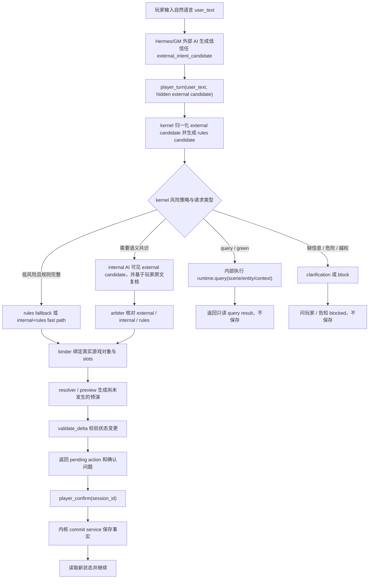

# AIGM 标准意图识别链路

文档状态：**架构收敛决议，阶段实现中**
日期：2026-07-03

本文记录 AIGM Kernel 正常游戏时的标准玩家链路。它不是测试报告，也不是低层工具说明。

核心结论：

```text
正常玩家自然语言 -> 外部 AI 先生成低信任 candidate -> player_turn -> kernel 复核/分派/执行
```

当前代码已经完成三段入口收敛：`player_turn` 已成为默认 MCP player profile 的自然语言入口，低层工具只在 developer/trusted/maintenance/admin profile 注册；只读 `intent_manifest` 已成为 kernel 生成的 action/query/slot 合同；binder 与 manifest 已共享 slot contract，internal prompt 已从 manifest 摘录 action/query/slot/risk。剩余主要缺口是 skill、MCP description 和 CLI 还没有完全从 manifest 自动摘录。

```text
标准玩家入口已落地 + 只读参数 manifest 已落地 + prompt/binder 第一段消费已收敛
```

收敛目标是把普通玩法入口压成一条清晰链路，把低层工具移到 trusted/dev surface，把 action/query 参数合同收进 kernel 生成的 manifest。

## 架构裁决

标准玩家入口目标名为 `player_turn`。

不继续把 `player_act` 当最终标准名，因为它处理的不只是 action，还包括 query、clarification 和 blocked。`player_act` 可以保留为兼容 wrapper，但文档和 skill 不应继续把它描述为最终主入口。

`preview_from_text` 保留为低层 primitive。它表达的是“把自然语言转成 query result 或 action preview”的内核能力，不是普通玩家应该直接感知的入口名称。

`player_query` / `query` 保留为结构化只读能力、UI 按钮能力或 trusted/dev 调试能力。普通自然语言玩法不应由外部 AI 自己判断后直接分流到这些工具。玩家说“我看看四周”时，应该仍然进入 `player_turn`，再由 kernel 内部识别为 query 并执行查询。

`player_confirm` 保留为标准确认入口。它不是另一个意图识别入口，而是保存边界：只有 kernel 已经生成 pending action 且玩家明确确认后，才允许 commit。

## 设计目标

正常游戏中，玩家自然语言不应该散落到多个可随意选择的入口。统一目标是：

1. 玩家只说自然语言。
2. Hermes/GM 外部 AI 先基于玩家原文和 player-visible context 生成低信任 `external_intent_candidate`。
3. 外部 AI 不执行行动、不直接查询、不推进剧情、不保存状态。
4. AI client 把 `user_text` 和后台 candidate 交给 `player_turn`。
5. Kernel 内部归一化 external candidate，同时生成 deterministic rules candidate。
6. Kernel 根据请求类型、风险、规则可绑定程度和 AI 可用性决定后续策略。
7. Query 可以走绿色只读快捷分支，不生成 delta，也不要求 internal AI 每次复核。
8. 低风险、规则完整且可绑定的 action 可以按策略走 deterministic rules fallback 或 internal+rules fast path。
9. 需要语义共识的 action 才进入 internal AI review + arbiter。
10. 只有通过 binder、resolver、preview、validation、玩家确认和 commit guard 后，状态变化才会保存。

因此，准确说法不是“每一句话都必须 external AI + internal AI 双模型识别”。准确说法是：

```text
正常玩家自然语言都从 external candidate 进入统一 kernel 入口；
internal AI 是否调用，由 kernel 的风险和快捷策略决定。
```

快捷策略必须发生在 kernel 内部，不能变成外部 AI 绕开标准入口的理由。

## 标准链路



图中的 `external_intent_candidate` 是 AI client 与 kernel 之间的后台结构。普通玩家不应该看见、填写或编辑它。

## 关键术语

`user_text`：玩家原文。它是整个链路的根输入，internal AI 和 arbiter 都必须能回到这句话。

`external_intent_candidate`：Hermes/GM 层生成的低信任意图草稿。它可以表达外部 AI 对 mode、action、query kind 和 slots 的判断，但不能成为最终裁决。

`player_turn`：已落地的标准入口。它接收玩家原文和后台 external candidate，由 kernel 统一产出 query result、action preview、clarification 或 blocked。

`player_act`：现有兼容入口。它内部调用 `player_turn`，但不接收 per-call external candidate，不再作为主文档推荐入口。

`preview_from_text`：低层自然语言 preview primitive。它可以被 `player_turn` 内部调用，但普通玩法 skill 不应指导 GM 直接使用它。

`internal AI review`：kernel 内部 AI 的复核。它不是 blind judge；它可以看见 external candidate，但必须基于玩家原文和 player-visible context 独立复核。

`arbiter`：kernel 内的仲裁层。它比较 external candidate、internal review 和 deterministic rules，决定 accepted、fallback、clarification 或 blocked。

`binder`：把意图 slots 绑定成真实游戏对象、位置、NPC、物品或行动参数的层。binder 不负责保存状态。

`resolver`：把已绑定 action 预演成 `delta_draft` 和 `turn_proposal` 的层。resolver 生成的是“尚未发生”的预演，不是事实。

`rules_fallback`：internal AI 不可用或策略允许时，kernel 在低风险、可绑定、规则完整的情况下采用 deterministic rules 的快捷结果。它不能跳过 preview、validation、confirmation 或 commit guard。

`ai_single_source_internal_fast`：没有 external candidate 时，如果 internal AI 和 deterministic rules 对低风险单步意图一致，且绑定没有冲突，kernel 可以接受该 fast path。它是降级/兼容策略，不是目标普通玩法主路径。

## Internal AI 的独立含义

Internal AI 不是严格 blind 独立判断。它会看见 external candidate。

这里的“独立”不是信息隔离，而是判断权独立：

- internal AI 可以参考 external candidate 做一致性和质量判断。
- internal AI 必须基于玩家原文、player-visible context 和已注册 action 重新复核。
- internal AI 必须能指出 external candidate 的问题，例如 wrong action、wrong mode、missing slots、unsafe、incomplete 或 partial agreement。
- external candidate 不能成为最终答案、玩家确认、preview approval 或 save approval。

准确表述是：

```text
visible-external independent review
可见外部候选的内部独立复核
```

## 玩家视角

玩家只说人话，例如：

```text
我休息到早上
```

玩家不应该看见、填写或编辑：

```json
{
  "kind": "single",
  "mode": "action",
  "action": "rest",
  "slots": {"until": "morning"}
}
```

这份 JSON 只是后台 external AI 交给 kernel 的低信任意图草稿。玩家需要看到的是游戏叙事、可见风险、确认问题和行动结果，不是内部结构。

## Mode 和分类

普通玩家自然语言的目标分类应收敛为：

- `query`：只读问题，不保存、不推进时间、不生成 delta。
- `action`：可能改变状态的行动，需要 binder/resolver/preview/validation/confirmation。
- `clarify` / `needs_confirmation`：缺少必要信息或需要玩家明确确认。
- `blocked` / `unknown`：危险、越权、不可执行或无法可靠理解。

`maintenance` 不属于普通玩家 intent mode。维护、修档、验证、调试和低层控制属于 trusted/dev surface。

当前普通 query kind 只保留：

- `scene`
- `entity`
- `context`

不保留 `query:rule` 作为普通输出。规则类玩家问题如果仍属于玩家可见查询，应映射到 `context` 或 `entity`；无法映射时返回 clarification / blocked。

当前 action registry 有九类普通行动：

- `combat`
- `rest`
- `routine`
- `social`
- `craft`
- `gather`
- `explore`
- `travel`
- `random_table`

## Query 链路决议

Query 是普通玩家自然语言链路的一种结果，不是外部 AI 手动分流出来的另一个入口。

正确行为：

```text
player_turn("查看周围", external candidate)
  -> kernel 判断 mode=query, kind=scene
  -> kernel 内部调用 runtime.query("scene")
  -> 返回当前场景文本
  -> ready_to_save=false
  -> 不创建 pending action
  -> 不要求 player_confirm
```

错误行为：

```text
外部 AI 判断这是 query
  -> 绕过 player_turn
  -> 直接调用 query/player_query
```

`query` / `player_query` 可以保留，但它们是结构化只读能力、UI 能力或 trusted/dev 调试能力。它们不应出现在正常自然语言玩法 skill 的主流程中。

## Action 链路决议

Action 是会或可能会改变状态的玩家行动。正确行为：

1. 玩家原文进入 external AI，生成低信任 candidate。
2. `player_turn` 把原文和 candidate 交给 kernel。
3. Kernel 根据风险策略决定是否需要 internal AI review。
4. Arbiter 接受、要求 clarification、fallback 或 block。
5. Binder 绑定 slots 到真实游戏对象。
6. Resolver 生成尚未发生的 preview。
7. Validation 检查 delta。
8. 如果 ready，返回 pending action 和确认问题。
9. 只有 `player_confirm(session_id)` 后，才 commit。

如果 action 因缺参、冲突、风险或规则限制被拒绝，外部 AI 不能自己补剧情继续演。必须按 kernel 结果处理：

- `clarify` / `needs_confirmation`：问玩家缺的信息或确认问题。
- `blocked`：告诉玩家此行动现在不能执行，并给可行替代。
- `ready_to_save=false`：绝对不能叙述成已经发生。
- `ready_to_save=true`：只说明这是待确认的预演；确认后才保存。

## 接口 Surface 收敛

当前代码已经有标准玩家入口；剩余工作是让文档、skill、CLI 说明和自动摘录继续围绕这个入口收口：

| 接口 | 当前作用 | 收敛方向 |
|---|---|---|
| `player_turn` | 已落地的标准自然语言入口，接收后台 external candidate | 普通玩法主入口 |
| `player_act` | 兼容 wrapper，内部调用 `player_turn`，不接收 per-call external candidate | 保留给旧客户端，不作为主入口 |
| `player_confirm` | 确认 pending action 后保存 | 保留为标准确认入口 |
| `player_query` | 当前普通只读查询包装 | 降级为 UI/兼容/结构化只读能力，不作为自然语言入口 |
| `query` | 低层只读查询，支持 `scene/entity/context` | 保留为 kernel 内部能力和 trusted/dev 工具 |
| `preview_from_text` | 能接 `external_intent_candidate` 的低层自然语言 preview primitive | `player_turn` 内部可用，普通玩法不直接推荐 |
| `intent_preflight` | 预热 internal AI review/cache，不 preview、不保存 | trusted/dev 或平台后台优化，不是玩法入口 |
| `preview_action` | 已知 action/options 后直接跑 resolver | trusted/dev 或结构化 UI 工具，普通自然语言不可直接用 |
| `validate_delta` | 低层校验 delta | trusted/dev only |
| `commit_turn` | 低层提交事实 | trusted/dev only；普通玩法通过 `player_confirm` |
| `start_turn` | 构建 context/turn contract 的诊断/上下文能力 | trusted/dev 或内部能力，不是普通主入口 |

默认玩家 surface 应只暴露标准玩法能力：

- `start_or_continue`
- `player_turn`
- `player_confirm`
- 必要的 save/session/health 能力

trusted/dev surface 才暴露：

- `intent_preflight`
- `preview_from_text`
- `preview_action`
- `query`
- `validate_delta`
- `commit_turn`
- `start_turn`

不要只依赖“调用后再 gate”。普通 profile 最好根本看不到低层工具。

## `preview_from_text` 的含义

`preview_from_text` 是当前代码里的自然语言转预演函数，不是 commit，也不是玩家确认。

它做的事是：

1. 接收玩家原文 `user_text`。
2. 调用 intent router，把文本判断为 query、action、composite、unknown 或 blocked。
3. 如果是 query，直接执行只读查询路径，返回 query result，`ready_to_save=false`。
4. 如果是 action，继续调用 resolver/preview，生成尚未保存的预演。
5. 如果需要补充信息，返回 clarification。
6. 如果危险、越权或不允许，返回 blocked。

`preview_from_text` 最多产生 `delta_draft` 和 `turn_proposal`；它不保存事实。真正保存仍必须经过 validation、玩家明确确认和 commit guard。

接口整理前，`preview_from_text` 可以表达 `user_text + external_intent_candidate` 的低层能力。但这不等于它应该作为玩家可感知的“游戏入口名称”。从产品语义上看，它只是 `player_turn` 内部可能调用的一段自然语言 preview 能力。

## Manifest 决议

Kernel 已生成机器可读的 action/query manifest，作为唯一参数真源的第一版。

这个 manifest 的目的不是再叠一张新表，而是把当前分裂的合同收口：

- resolver 的 `required_options` 和 `option_specs`
- binder 的 slot binding、slot aliases 和 required slots
- capability 要求
- query kind
- risk 策略
- AI 可填写 slot 和必须玩家确认 slot
- resolver contract

Manifest 至少应包含：

- `schema_version`
- 已注册 action 名称
- 每个 action 的 capability
- 每个 action 的 risk class
- required slots / optional slots
- slot type
- slot aliases
- default
- `ai_fillable`
- `player_confirmation_required`
- exclusive groups，例如 `random_table` 的 `table xor dice`
- query kinds：`scene`、`entity`、`context`
- query 是否 read-only
- unsupported kind 的处理策略
- resolver 是否支持 validate/request/resolve/validate_delta

示意结构：

```json
{
  "schema_version": "1",
  "generated_by": "kernel",
  "actions": [
    {
      "name": "travel",
      "mode": "action",
      "capability": "travel",
      "risk": "yellow_fast",
      "slots": [
        {
          "name": "destination",
          "aliases": ["target", "to", "place"],
          "type": "location",
          "required": true,
          "ai_fillable": true,
          "player_confirmation_required": false,
          "default": null
        }
      ],
      "exclusive_groups": [],
      "resolver_contract": {
        "has_request_contract": true,
        "has_resolve_contract": true,
        "has_delta_contract": true
      }
    }
  ],
  "queries": [
    {
      "kind": "scene",
      "requires_query_text": false,
      "read_only": true
    }
  ]
}
```

长期目标：

- Binder 从 manifest 读 slot type、aliases、required 和 confirmation policy。
- Internal prompt 从 manifest 摘录可用 action/query 合同。
- Skill 从 manifest 摘录简明 slot 指南。
- MCP tool description 和测试从 manifest 对齐。
- 不再让 resolver、binder、capability、query、skill、prompt、CLI 各自维护平行真源。

当前实现入口：

- Python：`rpg_engine.intent_manifest.build_intent_manifest()`
- MCP：`intent_manifest`
- 默认 player profile：可读，read-only，不执行 gameplay。

## Skill 写法要求

Skill 的主流程应写成：

```text
start_or_continue -> player_turn -> player_confirm if needed -> respond with kernel result
```

这里的 kernel result 可以是 query result、clarification、blocked reason 或 pending/confirmed action result。Query result 是 `player_turn` 的内部查询返回，不是另一个普通入口。

Skill 不应该写成：

```text
start_or_continue -> player_query 或 player_act 或 preview_from_text 或 query 或 preview_action
```

Skill 应讲清楚：

1. 外部 AI 先生成低信任 candidate，但不拥有最终裁决权。
2. Candidate 是后台结构，玩家不可见。
3. 所有自然语言正常玩法都进入 `player_turn`。
4. Query 由 kernel 内部执行，不由外部 AI 另选 query 工具。
5. Action 只有 ready 并经玩家确认后才保存。
6. `ready_to_save=false` 不能叙述成事实。
7. `clarify` / `needs_confirmation` 只问玩家需要补的信息。
8. `blocked` 只说明不能执行和可行替代。
9. Skill 可以摘录 manifest 的简明 slot 指南，但不能成为参数真源。

Trusted/dev 附录可以继续说明 `preview_from_text`、`intent_preflight`、`preview_action`、`query`、`validate_delta` 和 `commit_turn`，但必须明确这些不是普通玩法主入口。

## 当前代码状态

已具备的能力：

- 底层 `runtime.act` 已有接收 `external_intent_candidate` 的能力。
- `SaveManager.player_turn()`、`AIGMMCPAdapter.player_turn()` 和 MCP `player_turn` 已落地，默认 player profile 可直接使用。
- `player_act` 已改为兼容 wrapper，内部走 `player_turn`，但不接收 per-call external candidate。
- 默认 player profile 已收窄；`player_query`、`player_act`、`start_turn`、`intent_preflight`、`query`、`preview_from_text`、`preview_action`、`validate_delta`、`commit_turn` 只在 low-level profile 注册。
- `preview_from_text` 可以表达 `user_text + external_intent_candidate` 的低层 preview。
- Internal AI prompt 已经是“可见 external candidate，但基于玩家原文复核”的方向，并已从 `intent_manifest` 摘录 action/query/slot/risk 合同。
- Arbiter 已有 external/internal/rules 的核对思路。
- Query 识别后已能在 preview 链路内部执行 `runtime.query()`。
- Preview、validation、玩家确认和 commit guard 仍是保存事实的边界。

尚未完成的收敛：

- Action/query manifest 已生成；binder 与 manifest 已共享 slot contract，internal prompt 已从 manifest 摘录。skill、MCP description 和 CLI 仍需要进一步改为从 manifest 摘录，参数真源消费链路尚未完全闭合。
- `maintenance` 已从 AI candidate schema、normalizer 和 internal prompt 的普通玩家 mode 中移除；低层 CLI/route 体系仍有兼容残留，需要继续清理到 trusted/dev。
- CLI 已新增 `player turn` 标准命名，并保留 `player act` 兼容命令；CLI `player turn` 可接收 `--external-intent-candidate`，`player act` 不接收。

## 已修复：Query 识别后内部执行

2026-07-03 已完成第一段收敛：玩家自然语言从统一入口语义进入后，kernel 可以自己判断 query/action/clarify/block；识别为 query 时，会在同一条链路里直接执行只读查询。

修复前的旧行为是：

```text
preview_from_text("查看周围")
  -> route_intent()
  -> intent.mode = query
  -> preview_intent()
  -> 返回 action="query"
  -> 返回 ready_to_save=false
  -> 返回 recommended_next_tool="query"
  -> 不调用 runtime.query()
```

这说明 AI / rules 当时已经识别出了“这是只读查询”，但下面的查询模块没有接手干活。真正的场景、实体或上下文文本仍需要外部再调用 `query` / `player_query`。

当前目标行为已经落地：

```text
统一玩家入口收到 "查看周围"
  -> 内部识别为 mode=query, submode=scene
  -> 引擎内部直接调用 runtime.query("scene")
  -> 返回当前场景文本
  -> ready_to_save=false
  -> recommended_next_tool="respond_to_player"
```

也就是说，`mode=query` 不应该把“下一步应该调用 query 工具”推回给外部 AI/GM。识别结果应由引擎内部继续分派，直接复用现有 `runtime.query()` 的底层查询路径。

当前 query 执行能力本身可用：

- `runtime.query("scene")` 返回当前场景。
- `runtime.query("entity", query_text)` 返回实体信息。
- `runtime.query("context", query_text)` 返回上下文包。

`preview_from_text(... mode=query ...)` 现在会执行这些查询，并把结果放在 query result、markdown 和 player_message 中。

## 实施顺序

1. 已完成：新增 `SaveManager.player_turn()`、`AIGMMCPAdapter.player_turn()` 和 MCP tool `player_turn`，并接通 hidden `external_intent_candidate`。
2. 已完成：`player_act` 变成兼容 wrapper，内部调用 `player_turn`，文档和 tool description 标明它不是标准主入口。
3. 已完成：`player_query` 从普通自然语言玩法主流程移除，只保留为结构化只读、UI 或 trusted/dev 能力。
4. 已完成：拆分 player surface 和 low-level surface。普通 profile 不直接暴露 `preview_from_text`、`intent_preflight`、`preview_action`、`query`、`validate_delta`、`commit_turn`、`start_turn`。
5. 已完成：生成只读版 action/query manifest，先不改行为，用测试确认九个 action 和三个 query kind 都存在且合同完整。
6. 已完成第一段：binder 与 manifest 共享 slot contract，internal prompt 从 manifest 摘录 action/query/slot/risk，不再在 prompt 内手写平行 action 合同。
7. 已完成第一版：更新 skill 主文档，只讲 `player_turn -> player_confirm`；trusted/dev 附录再讲低层工具。
8. 已完成：增加全链路测试，确认外部 candidate 进入 `player_turn` 后，九个 action 和三种 query 都能得到预期的 ready、clarify 或 blocked；`ready_to_save=false` 时不创建可提交事实。
9. 已完成：新增 CLI `player turn`，作为 `player_turn` 的命名对齐 fallback；`player act` 保留为兼容 wrapper。

## 不变边界

- External AI 不拥有最终意图裁决权。
- External AI 不直接执行 query/action。
- Internal AI 不拥有保存权。
- Arbiter 不跳过 binder/resolver/validation。
- Query 不保存、不推进时间、不生成 delta。
- 快捷路径不跳过 preview/validation/confirmation/commit guard。
- Preview 不是事实。
- Validation 通过也不是玩家确认。
- 玩家确认前不得 commit。
- Commit 之前不得把状态变化叙述成已经发生。
- Hidden information 仍只能通过 player-visible context 暴露。

## 仍需后续细化

这些问题不影响本文的主链路决议，但还需要后续硬化：

1. Manifest v1 的 schema 版本策略、兼容策略和外部自动摘录格式。
2. 哪些 action 必须走 consensus，哪些 action 可以 rules fallback 或 internal+rules fast path，需要继续用 eval 和 current-save cases 扩展验证。
3. `intent_preflight` 和 platform prewarm 已有标准位置，但真实 Hermes/QQ canary 仍需验证长驻 sidecar 或插件进程。
4. MCP profile 已经让普通玩家看不到低层工具；仍需用 transcript tests 防止 prompt/skill 再把低层工具推荐成普通玩法入口。
5. CLI `play *` 仍保留为 developer/trusted 低层工具；后续应继续收紧 help 文案和测试，避免它与 `player turn` 混层。
