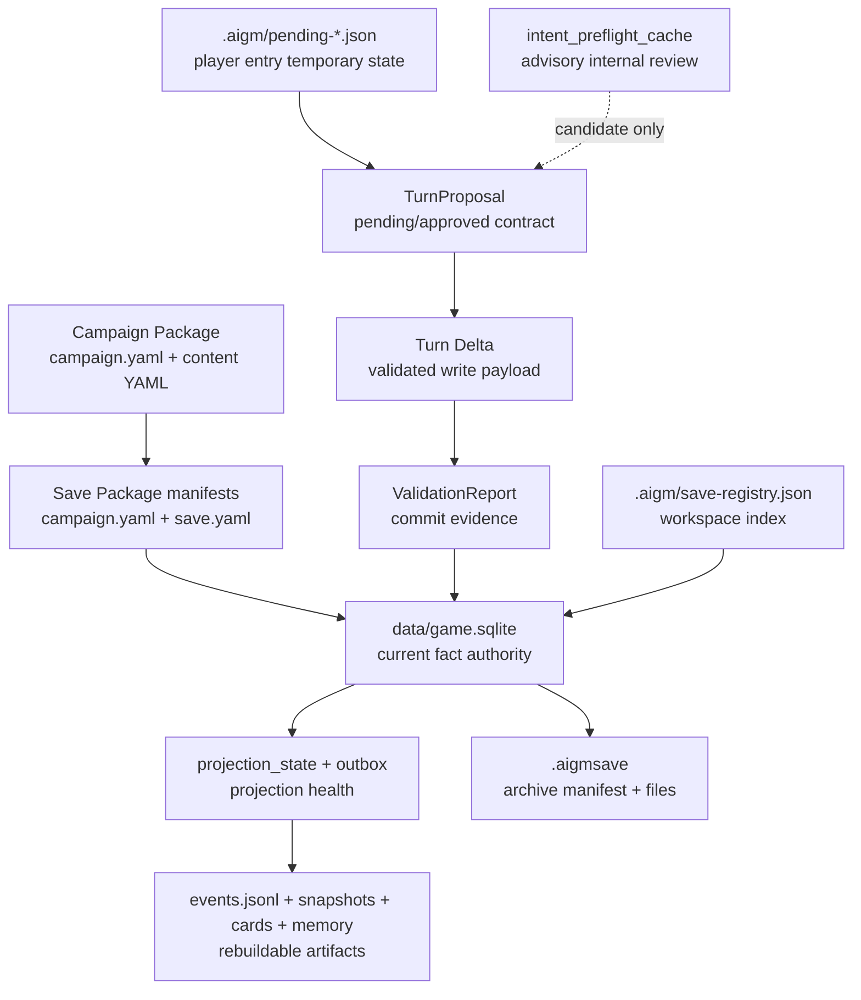

# 数据模型

文档状态：**CURRENT：BMAD canonical data model authority**

本文件是 RPG Engine 当前数据模型的 canonical 文档。它描述持久事实、运行合同、投影、
缓存和包 manifest 的边界。旧 `docs/specs/` 与 `docs/architecture/` 路径现在是
compatibility stubs，原文位于 [`archive/pre-bmad-docs-2026-07-03/`](archive/pre-bmad-docs-2026-07-03/)；
日常开发应先读本文件。

## 核心结论

RPG Engine 的数据模型分成四类。只有 Save Package 中的 SQLite 当前事实库拥有游戏事实权威。

```text
Campaign manifest/content -> 初始化或同步来源
Save SQLite -> 当前事实权威
TurnProposal / delta / reports -> 运行合同和校验证据
Projection / registry / archive / cache -> 派生物、索引或 advisory state
```

硬边界：

- `data/game.sqlite` 是当前事实权威。
- `events` 表是权威审计记录；`data/events.jsonl` 是投影。
- `projection_state` 和 `outbox` 描述投影健康，不是游戏事实。
- `.aigm/save-registry.json` 选择 active save，不保存游戏事实。
- pending action / pending clarification 是玩家入口临时状态，不是已发生事实。
- `intent_preflight_cache` 是 advisory AI intent cache，不能替代 preview、validation、confirm 或 commit。
- `.aigmsave` 是归档格式，不是另一个可写事实源。

## 数据地图



## Package Manifests

### Campaign Manifest

`campaign.yaml` 描述作者包，由 `rpg_engine.campaign.load_campaign()` 读取。

当前核心字段：

| 字段 | 说明 |
| --- | --- |
| `id` | 稳定 campaign id。 |
| `name` | 面向人类的 campaign 名称。 |
| `engine_version` | 需要的引擎版本。 |
| `package_version` | Campaign package 版本。 |
| `content_schema_version` | Campaign content schema 版本。 |
| `capabilities` | 声明支持的玩法能力。 |
| `defaults.player_entity_id` | 默认玩家实体 id。 |
| `defaults.context_budget` | 默认上下文预算。 |
| `defaults.sample_texts` | 作者提供的路由和 smoke 覆盖样例。 |
| `content.*` | 相对 YAML 内容路径。 |

Campaign manifest 和 content 是来源数据，不是当前游玩状态。

### Save Manifest

`save.yaml` 描述某个具体 Save Package。

当前核心字段：

| 字段 | 说明 |
| --- | --- |
| `save_schema_version` | Save manifest schema 版本。 |
| `campaign_id` | 来源 campaign id。 |
| `campaign_version` | 来源 campaign package 版本。 |
| `engine_version` | 当前 save 使用的引擎版本。 |
| `source_campaign_path` | 用作 trusted content root 的来源 campaign 路径。 |
| `created_at` | 创建时间戳。 |

`save.yaml` 是元数据，不覆盖 SQLite 中的当前事实。

### Runtime Campaign Manifest In Save

Save Package 也包含运行态 `campaign.yaml`。`init_v1_save()` 会用稳定 runtime 路径写入该
manifest：

- `data/game.sqlite`
- `data/events.jsonl`
- `snapshots/current.md`
- `snapshots/current.json`
- `cards`

它的 `content.*` 路径指向已复制的本地内容，或指向声明来源 campaign root 下的内容。
绝对 content 路径不允许。

## SQLite Fact Store

`data/game.sqlite` 是当前事实库。它由 `init_database()` 初始化，并通过
`rpg_engine/resources/migrations/*.sql`.

### Current Version Meta

`db.py` 会把这些版本写入 `meta`：

| 键 | 当前值 |
| --- | --- |
| `schema_version` | `0.3` |
| `save_schema_version` | `0.3` |
| `content_schema_version` | `1` |
| `projection_schema_version` | `1` |

其他重要 `meta` 键：

- `engine_version`
- `package_version`
- `campaign_id`
- `campaign_name`
- `player_entity_id`
- `current_turn_id`
- `current_game_day`
- `current_time_block`
- `current_location_id`
- `last_saved_at`

`meta` 保存当前指针和版本标记，应保持小而标量化。

### Core Tables

| 表 | 职责 |
| --- | --- |
| `meta` | Version markers and current state pointers. |
| `turns` | One row per accepted turn or seed turn. |
| `events` | Authoritative event audit rows linked to turns. |
| `entities` | Canonical entity records and shared fields. |
| `aliases` | Entity aliases for lookup. |
| `facts` | Structured subject-predicate facts with validity window. |
| `characters` | Character-specific side table. |
| `items` | Item/equipment side table. |
| `locations` | Location-specific side table. |
| `routes` | Travel graph edges. |
| `crop_plots` | Crop plot side table retained by current schema. |
| `clocks` | Clock state and tick metadata. |
| `rules` | Rule entities and rule-specific fields. |
| `world_settings` | Stable world explanations and hidden/visible setting content. |
| `memory_summaries` | Long-term memory summaries. |
| `context_runs` | Context build audit records. |
| `context_items` | Items included or omitted in a context build. |
| `fts_index` | Full-text index for non-hidden, non-archived entities. |

`entities` 是共享锚点表。类型专属表应引用它，不应发明并行身份系统。

### Reliability Tables

| 表 | 职责 |
| --- | --- |
| `schema_migrations` | Applied migrations and checksums. |
| `outbox` | Durable projection work queue, currently used for events JSONL append. |
| `projection_state` | Projection status, version, turn pointer and last error. |

`projection_state` can report `clean`, `dirty`, `refreshing`, `failed` or `stale`. Save validation requires
required projections to be clean and aligned with `current_turn_id`.
这些表是 health/evidence 表，不是另一套 gameplay fact authority。

`inspect_save_package()` exposes this as `projection_health`, a machine-readable evidence object. Required
projection items report stored status, effective status, version, expected version, `last_turn_id`,
alignment with `current_turn_id`, `last_error`, `updated_at` and artifact paths. The outbox summary reports
`ok`/`status`, schema or availability `errors`, status counts, plus every non-`done` row id, topic, status,
attempts, last error and timestamps. Missing or malformed outbox schema is reported as unhealthy evidence,
not as an empty clean queue.

### AI And Proposal Tables

| 表 | 职责 |
| --- | --- |
| `discovery_states` | Discovered clues, palette links and confirmation evidence. |
| `proposal_queue` | Proposal queue for non-immediate proposals. |
| `archivist_suggestions` | Archivist AI suggestions and audit payloads. |
| `intent_preflight_cache` | Advisory internal intent review cache. |

`intent_preflight_cache` stores identity-bound, single-use preflight review data. It may include player text,
external candidate hashes, rule candidate hashes, internal review and helper audit. It must not become a
commit authorization model.

## Entity Model

每个持久游戏对象都应该有稳定的 `entities.id`。

核心字段：

| 字段 | 说明 |
| --- | --- |
| `id` | 稳定 entity id，通常带前缀，例如 `pc:...`、`loc:...`、`npc:...`。 |
| `type` | 实体类型。 |
| `name` | 面向人类的名称。 |
| `status` | 生命周期状态，例如 active 或 archived。 |
| `visibility` | 玩家可见性边界。 |
| `location_id` | 地点包含关系。 |
| `owner_id` | 所有者包含关系。 |
| `summary` | 简短权威描述。 |
| `details_json` | 未提升到 side table 的结构化额外字段。 |
| `updated_turn_id` | 最近更新该实体的 turn。 |
| `updated_at` | 最近更新时间戳。 |

活动实体不能同时设置 `location_id` 和 `owner_id`。

### Typed Side Tables

Typed side tables 增加结构化字段，但不替代 entity row：

- `characters`
- `items`
- `locations`
- `crop_plots`
- `clocks`
- `rules`
- `world_settings`

如果 side table 存储玩家可见内容，它仍必须服从 entity visibility 边界。

### Visibility

玩家可见 search 和 context 不能包含 hidden facts。

当前 FTS rebuild 规则：

- Include `entities` where `status != 'archived'`.
- Exclude `visibility == 'hidden'`.
- Index name, summary, details JSON and aliases.

Cards 和 scene/query 输出必须遵循同一 player-view 原则。GM 或 maintenance 视图必须显式选择。

## Turn And Event Model

### Turn

`turns` 记录已接受的 turns。

重要字段：

- `id`
- `session_id`
- `user_text`
- `intent`
- `game_time_before`
- `game_time_after`
- `location_before`
- `location_after`
- `summary`
- `changed`
- `command_id`
- `command_hash`
- `expected_turn_id`

`command_id`、`command_hash` 和 `expected_turn_id` 支持 write guards 与幂等。

### Event

`events` 记录权威审计事件。

重要字段：

- `id`
- `turn_id`
- `game_time`
- `type`
- `title`
- `summary`
- `payload_json`
- `source`
- `created_at`

`events` rows 是权威记录。`data/events.jsonl` 通过 projection/outbox 逻辑从这些 rows 生成。

## Turn Delta

Turn delta 是 `save_turn_delta()` 和 commit services 消费的已校验写入 payload。

允许的顶层字段：

- `turn_id`
- `session_id`
- `user_text`
- `intent`
- `changed`
- `summary`
- `game_time_before`
- `game_time_after`
- `location_before`
- `location_after`
- `events`
- `upsert_entities`
- `tick_clocks`
- `meta`
- `expected_turn_id`
- `command_id`

必填字段：

- `user_text`
- `intent`
- `summary`

写入规则：

- A changed turn must include events or state changes.
- A state-changing delta should include at least one event explaining the change.
- `meta` values must stay scalar.
- `tick_clocks` must reference existing clocks.
- Entity references must already exist or be created in the same delta.
- `command_id` and `expected_turn_id` are required for `player_turn_commit`.

## Content Type Registry

Content registry 映射 campaign YAML、delta keys、runtime tables 和 merge policy。

当前 default registry：

| 名称 | Campaign key | YAML key | Delta key | Entity type | Table | Sync safe |
| --- | --- | --- | --- | --- | --- | --- |
| `entity` | `entities` | `entities` | `upsert_entities` |  | `entities` | no |
| `rule` | `rules` | `rules` | `upsert_rules` | `rule` | `rules` | no |
| `clock` | `clocks` | `clocks` |  | `clock` | `clocks` | no |
| `route` | `routes` | `routes` | `upsert_routes` |  | `routes` | no |
| `relationship` | `relationships` | `relationships` |  | `relationship` | `entities` | no |
| `world_setting` | `world_settings` | `world_settings` | `upsert_world_settings` | `world_setting` | `world_settings` | yes |

Delta schema 允许的 entity `type` 多于 registry 当前作为一等 content type seed 的类型。
不要把每个允许的 entity type 都当成已注册 package content type。

## TurnProposal

`TurnProposal` 是 preview 与 commit 之间的桥。只有 validation 和 `player_confirm()` 成功后，
它才可能变成已提交事实。

允许字段：

- `proposal_id`
- `intent`
- `context_id`
- `preview`
- `response_text`
- `facts_used`
- `narrative_claims`
- `delta`
- `delta_source`
- `provenance`
- `human_confirmed`
- `turn_contract`

允许的 `delta_source` 值：

- `resolver_proposed`
- `ai_generated`
- `human_edited`
- `response_draft`
- `maintenance_delta`

玩家提交要求 `human_confirmed=true`，并且 `TurnContract` 匹配 player commit profile。

## Intent And Turn Contract

`ActionIntent` 表示已路由的玩家请求：

- `user_text`
- `mode`
- `submode`
- `action`
- `options`
- `confidence`
- `source`
- `alternatives`
- `missing_required`
- `needs_confirmation`
- `decision_trace`
- `kind`
- `status`
- `player_message`
- `plan`
- `repair_options`
- `clarification`

`TurnContract` 把已路由 intent 绑定到回复和 validation 期望：

- `intent`
- `required_template`
- `response_headings`
- `requires_preview`
- `must_save`
- `allowed_delta_sources`
- `validation_profile`

这些模型是合同，本身不写入事实。

## Validation Report

`ValidationReport` 记录某个 delta/proposal 是否能在指定 profile 下继续。

当前 validation profiles：

- `preview_only`
- `player_turn_commit`
- `response_acceptance`
- `maintenance_commit`
- `admin_or_legacy_save_turn`
- `import_or_migration`

当前 stages 包括：

- profile
- write guard
- proposal guard
- delta schema
- capability
- resolver request
- resolver resolution
- resolver delta contract
- response lint
- response consistency
- state audit

Validation reports 是证据。除非 commit 成功，否则它们不会变成当前事实。

## Projection Report

`ProjectionReport` 记录派生 artifacts 的刷新状态。

已知 projections：

- `events_jsonl`
- `search`
- `snapshots`
- `cards`
- `memory`
- `reports`
- `package_lock`

Projection reports 可能包含 profile、requested、refreshed、skipped、requested/global
dirty/failed/stale、outbox_status/counts/non_done/errors、artifact、item、started/finished time 和 duration
字段。`global_status` 必须纳入 outbox health；targeted projection repair 不能把未修复的 outbox failed
work 隐藏成 global clean。
这些字段描述 projection health，不改变已提交事实的含义。

`inspect_save_package()` 的 `authority_contract` 和 `projection_health` 字段把这些职责暴露为机器可读合同：

| Contract key | Authority |
| --- | --- |
| `current_fact_authority` | `data/game.sqlite`，当前事实权威。 |
| `authoritative_audit` | SQLite `events`，权威审计记录。 |
| `audit_projection` | `data/events.jsonl`，derived audit projection。 |
| `snapshots` / `cards` / `search` / `memory` | derived read models。 |
| `projection_state` / `outbox` | projection health 或 work-queue evidence。 |
| `workspace_registry` / `pending_state` | workspace/player entry state。 |
| `preflight_cache` | advisory AI intent cache。 |
| `mcp_audit_logs` / `archive_manifest` | call/archive evidence。 |

## SaveManager Registry

Workspace registry 位于：

```text
<workspace>/.aigm/save-registry.json
```

Registry 字段：

- `schema_version`
- `active_save_id`
- `campaigns`
- `saves`

Campaign records 包含 id、name、path、可选 starter save path 和 status。Save records 包含 id、
campaign path、save path、label、kind、source、current turn/time/location summary、health
以及 inspection/play metadata。

Registry paths 必须是 workspace-root relative，且不能是绝对路径，不能包含 `..`、反斜杠或 resolved
root escape。Registry state 只选择 Save Package，不拥有游玩事实。`current_save(refresh=False)`
可以返回 registry cached summary，但结果必须用 `current_save_authority` 标明 `summary_source=registry_cache`
且 `summary_authoritative=false`；需要 authoritative facts 时必须 refresh 或读取 Save SQLite。

## Pending Player State

SaveManager 在 `.aigm/` 下存储临时玩家入口状态：

```text
.aigm/pending-player-action.json
.aigm/pending-player-clarification.json
```

Pending action 绑定：

- `session_id`
- `save_id`
- `save_path`
- `user_text`
- `action`
- `delta`
- `turn_proposal`
- optional platform/session identity hash

只有 proposal ready to confirm 时，`player_turn()` 才写 pending state。`player_confirm()` 在提交前
必须匹配 pending session、save 和可选 platform/session identity。

## Archives And Schemas

`.aigmsave` archives 包含 `save-archive.json` 和清单列出的核心文件。Manifest 记录文件、大小和
checksum，让 import 能拒绝未列出或损坏的成员。
Archive member path 不能是绝对路径，不能包含 `..` 或反斜杠；manifest 未列出的成员、
缺少核心 Save 文件、size mismatch 和 checksum mismatch 都必须拒绝，且失败 import 不能替换目标目录。
缺少核心 Save 文件必须在 payload member 解包前拒绝。

Public JSON schemas 同时存在于 source-facing 和 packaged resource 位置：

- `schemas/`
- `rpg_engine/resources/schemas/`

当前 schema files 包括 campaign、smoke、capabilities、random tables、turn delta、content delta、
save patch、state audit、semantic suggestion、archivist 和 reflection drafts。Intent candidate
和 internal intent review schemas 位于 packaged resources。

Schemas 描述 interchange formats。Runtime code 仍执行额外的代码级校验、引用校验和 profile 校验。

## Development Checklist

修改数据模型前，回答这些问题：

- Does the change alter `data/game.sqlite` fact authority?
- Does it require a migration and migration checksum?
- Does it preserve `save.yaml`, `campaign.yaml` and SQLite meta compatibility?
- Does it keep hidden content out of player view, FTS, cards, snapshots and onboarding?
- Does it distinguish facts from projections, registry state, archive manifests and AI caches?
- Does it preserve `player_turn -> pending/no save` and `player_confirm -> commit`?
- Does it require updates to public JSON schemas?
- Does it require current native package tests or migration/validation tests?

## Suggested Focused Gates

数据模型行为改动应选择最小相关测试集：

```bash
python3 -m pytest -q tests/test_validation_pipeline.py tests/test_projection_service.py
python3 -m pytest -q tests/test_current_native_package.py tests/test_current_native_write_safety.py
python3 -m pytest -q tests/test_current_native_visibility.py tests/test_save_manager.py
python3 -m pytest -q tests/test_package_cli.py tests/test_package_merge.py tests/test_package_save_condition_coverage.py
python3 -m pytest -q tests/test_ai_intent.py tests/test_preflight_cache.py
```

文档-only 变更运行：

```bash
git add -N docs _bmad-output
git diff --check
python3 scripts/check_markdown_links.py docs _bmad-output
```
