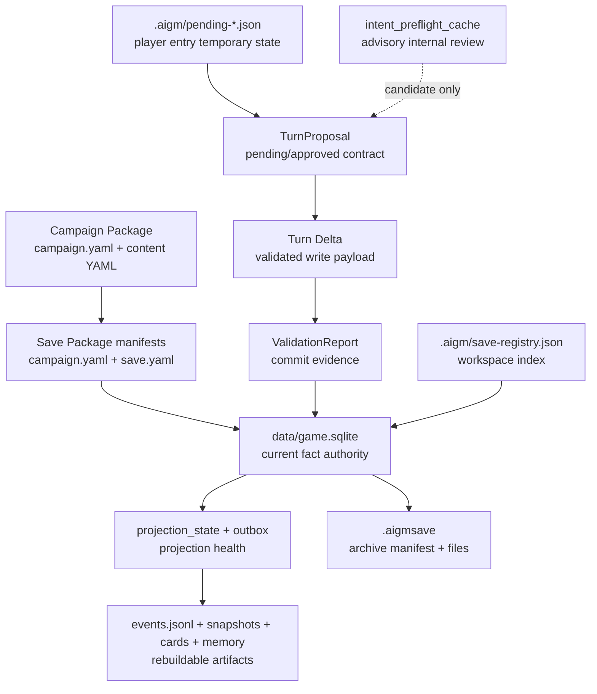

# 数据模型

文档状态：**CURRENT：BMAD canonical data model authority**

本文件是 RPG Engine 当前数据模型的 canonical 文档。它描述持久事实、运行合同、投影、
缓存和包 manifest 的边界。旧 `docs/specs/` 与 `docs/architecture/` 路径现在是
compatibility stubs，原文位于 [`archive/pre-bmad-docs-2026-07-03/`](archive/pre-bmad-docs-2026-07-03/)；
日常开发应先读本文件。

## 核心结论

RPG Engine 的数据模型分成四类。只有 Save Package 中的 SQLite 当前事实库拥有游戏事实权威。

```text
Campaign manifest/content -> 初始化或同步来源
Save SQLite -> 当前事实权威
TurnProposal / delta / reports -> 运行合同和校验证据
Projection / registry / archive / cache -> 派生物、索引或 advisory state
```

硬边界：

- `data/game.sqlite` 是当前事实权威。
- `events` 表是权威审计记录；`data/events.jsonl` 是投影。
- `projection_state` 和 `outbox` 描述投影健康，不是游戏事实。
- `.aigm/save-registry.json` 选择 active save，不保存游戏事实。
- pending action / pending clarification 是玩家入口临时状态，不是已发生事实。
- `intent_preflight_cache` 是 advisory AI intent cache，不能替代 preview、validation、confirm 或 commit。
- `.aigmsave` 是归档格式，不是另一个可写事实源。

## 数据地图



## Package Manifests

### Campaign Manifest

`campaign.yaml` 描述作者包，由 `rpg_engine.campaign.load_campaign()` 读取。

当前核心字段：

| 字段 | 说明 |
| --- | --- |
| `id` | 稳定 campaign id。 |
| `name` | 面向人类的 campaign 名称。 |
| `engine_version` | 需要的引擎版本。 |
| `package_version` | Campaign package 版本。 |
| `content_schema_version` | Campaign content schema 版本。 |
| `capabilities` | 声明支持的玩法能力。 |
| `defaults.player_entity_id` | 默认玩家实体 id。 |
| `defaults.context_budget` | 默认上下文预算。 |
| `defaults.sample_texts` | 作者提供的路由和 smoke 覆盖样例。 |
| `content.*` | 相对 YAML 内容路径。 |

Campaign manifest 和 content 是来源数据，不是当前游玩状态。Campaign validation 会报告
Campaign root 中混入的 Save/runtime artifacts，例如 `save.yaml`、`data/game.sqlite`、
`data/events.jsonl`、`snapshots/`、`cards/`、`memory/`、`backups/`、`reports/` 和
`.aigm/save-registry.json`、`.aigm/pending-*`。这些报告是 ownership warnings；validation
不会把这些 artifacts 当作作者内容导入，也不会自动修复或删除它们。

### Save Manifest

`save.yaml` 描述某个具体 Save Package。

当前核心字段：

| 字段 | 说明 |
| --- | --- |
| `save_schema_version` | Save manifest schema 版本。 |
| `campaign_id` | 来源 campaign id。 |
| `campaign_version` | 来源 campaign package 版本。 |
| `engine_version` | 当前 save 使用的引擎版本。 |
| `source_campaign_path` | 用作 trusted content root 的来源 campaign 路径。 |
| `created_at` | 创建时间戳。 |

`save.yaml` 是元数据，不覆盖 SQLite 中的当前事实。`save init` 的目标 Save Package 必须位于
source Campaign root 之外，避免运行态 manifests、SQLite 和投影产物写入作者包目录。

### Runtime Campaign Manifest In Save

Save Package 也包含运行态 `campaign.yaml`。`init_v1_save()` 会用稳定 runtime 路径写入该
manifest：

- `data/game.sqlite`
- `data/events.jsonl`
- `snapshots/current.md`
- `snapshots/current.json`
- `cards`

它的 `content.*` 路径指向已复制的本地内容，或指向声明来源 campaign root 下的内容。
绝对 content 路径不允许。

## SQLite Fact Store

`data/game.sqlite` 是当前事实库。它由 `init_database()` 初始化，并通过
`rpg_engine/resources/migrations/*.sql`.

### Current Version Meta

`db.py` 会把这些版本写入 `meta`：

| 键 | 当前值 |
| --- | --- |
| `schema_version` | `0.3` |
| `save_schema_version` | `0.3` |
| `content_schema_version` | `1` |
| `projection_schema_version` | `1` |

其他重要 `meta` 键：

- `engine_version`
- `package_version`
- `campaign_id`
- `campaign_name`
- `player_entity_id`
- `current_turn_id`
- `current_game_day`
- `current_time_block`
- `current_location_id`
- `last_saved_at`

`meta` 保存当前指针和版本标记，应保持小而标量化。

### Core Tables

| 表 | 职责 |
| --- | --- |
| `meta` | Version markers and current state pointers. |
| `turns` | One row per accepted turn or seed turn. |
| `events` | Authoritative event audit rows linked to turns. |
| `entities` | Canonical entity records and shared fields. |
| `aliases` | Entity aliases for lookup. |
| `facts` | Structured subject-predicate facts with validity window. |
| `characters` | Character-specific side table. |
| `items` | Item/equipment side table. |
| `locations` | Location-specific side table. |
| `routes` | Travel graph edges. |
| `crop_plots` | Crop plot side table retained by current schema. |
| `clocks` | Clock state and tick metadata. |
| `rules` | Rule entities and rule-specific fields. |
| `world_settings` | Stable world explanations and hidden/visible setting content. |
| `memory_summaries` | Long-term memory summaries. |
| `context_runs` | Context build audit records. |
| `context_items` | Items included or omitted in a context build. |
| `fts_index` | Full-text index for non-hidden, non-archived entities. |

`entities` 是共享锚点表。类型专属表应引用它，不应发明并行身份系统。

### Reliability Tables

| 表 | 职责 |
| --- | --- |
| `schema_migrations` | Applied migrations and checksums. |
| `outbox` | Durable projection work queue, currently used for events JSONL append. |
| `projection_state` | Projection status, version, turn pointer and last error. |

`projection_state` can report `clean`, `dirty`, `refreshing`, `failed` or `stale`. Save validation requires
required projections to be clean and aligned with `current_turn_id`.
这些表是 health/evidence 表，不是另一套 gameplay fact authority。

`inspect_save_package()` exposes this as `projection_health`, a machine-readable evidence object. Required
projection items report stored status, effective status, version, expected version, `last_turn_id`,
alignment with `current_turn_id`, `last_error`, `updated_at` and artifact paths. The outbox summary reports
`ok`/`status`, schema or availability `errors`, status counts, plus every non-`done` row id, topic, status,
attempts, last error and timestamps. Missing or malformed outbox schema is reported as unhealthy evidence,
not as an empty clean queue.

### AI And Proposal Tables

| 表 | 职责 |
| --- | --- |
| `discovery_states` | Discovered clues, palette links and confirmation evidence. |
| `proposal_queue` | Proposal queue for non-immediate proposals. |
| `archivist_suggestions` | Archivist AI suggestions and audit payloads. |
| `intent_preflight_cache` | Advisory internal intent review cache. |

`intent_preflight_cache` stores identity-bound, single-use preflight review data. It may include player text,
external candidate hashes, rule candidate hashes, internal review and helper audit. It must not become a
commit authorization model.

## Entity Model

每个持久游戏对象都应该有稳定的 `entities.id`。

核心字段：

| 字段 | 说明 |
| --- | --- |
| `id` | 稳定 entity id，通常带前缀，例如 `pc:...`、`loc:...`、`npc:...`。 |
| `type` | 实体类型。 |
| `name` | 面向人类的名称。 |
| `status` | 生命周期状态，例如 active 或 archived。 |
| `visibility` | 玩家可见性边界。 |
| `location_id` | 地点包含关系。 |
| `owner_id` | 所有者包含关系。 |
| `summary` | 简短权威描述。 |
| `details_json` | 未提升到 side table 的结构化额外字段。 |
| `updated_turn_id` | 最近更新该实体的 turn。 |
| `updated_at` | 最近更新时间戳。 |

活动实体不能同时设置 `location_id` 和 `owner_id`。

### Entity Access Contract

`rpg_engine/entity_access.py` 是当前 Entity Identity Access Contract 的命名实现。
它不拥有写入权威，只提供 common identity 读取和 runtime delta reference validation：

- `EntityRecord` 暴露稳定 common fields：`id`、`type`、`name`、`status`、`visibility`、
  `location_id`、`owner_id`、`summary`、parsed `details`、`updated_turn_id` 和 `updated_at`。
- `read_entity()` / `list_entities()` 默认排除 `status='archived'`，并按 caller view 应用
  visibility filter。player view 不能读取 player-hidden visibility label（`hidden`、`gm`、
  `gm-only`、`gm_only`、`gm only`）的 entity；GM / maintenance view 必须显式选择。
- Clock subtype 还必须检查 `clocks.visibility`。即使 `entities.visibility` 不是 hidden，
  `clocks.visibility` 是 player-hidden label 的 clock 也不能通过 player view access contract 读取。
- `validate_delta_entity_references()` 校验 runtime delta 中的 entity references；引用必须已存在，
  或属于同一 delta 的 `upsert_entities[*].id`。这覆盖 `location_before`、`location_after`、
  `meta.current_location_id`、entity `location_id` / `owner_id`、`character.species_id` 和
  `location.parent_id`、`crop_plot.crop_entity_id`。
- active entity 的 `location_id` / `owner_id` invariant 仍由 delta/content validation 执行；
  validated mutation 不能让同一个 active entity 同时位于某地又归属某 owner。

Relationship / Progress access contract 复用 `entities.id` 作为身份锚点，不新增并行
identity system，也不要求调用方直接依赖 table-specific storage 细节来读取 common fields。

### Relationship Access Contract

`rpg_engine/relationship_access.py` 是当前 Relationship Access Contract 的命名实现。
Relationship 仍以 `entities.type='relationship'` 存储，并把 `source_id`、`target_id`、
`kind`、`state`、`attitude`、`stance`、`trust` 等关系字段放在规范化 `details` 中；调用方应
使用 access contract，而不是直接解析任意 `details_json`。

- `RelationshipRecord` 暴露 stable relationship fields：`id`、`source_id`、`target_id`、
  `kind`、`state`、`attitude`、`stance`、`trust`、`visibility`、`summary`、parsed
  `details`、`updated_turn_id`、`updated_at`，以及可解析 endpoint records 和
  `endpoint_issues`。
- `read_relationship()` / `list_relationships()` 默认排除 archived relationship，并对
  player view 同时过滤 hidden relationship、hidden endpoint、archived endpoint 和缺失 endpoint。
  GM / maintenance view 必须显式选择；这类 view 可以读取 hidden endpoints，但 archived 或缺失
  endpoints 只会作为 `endpoint_issues` 报告，不会作为 normal endpoint record 返回。
- Runtime delta 中 `upsert_entities[*].type == "relationship"` 时，`details.source_id` 和
  `details.target_id` 必须存在、是合法非空 entity id，并且引用已存在 entity 或同一 delta 中创建的
  entity。该校验通过 `validate_delta_schema(..., conn)` 的 database reference gate 执行，并由
  maintenance/content delta validation 对 relationship-shaped `upsert_entities` 复用。
- Relationship suggestions from AI, maintenance assistants, package tooling, or proposal workflows are
  advisory until they enter an explicit validated mutation, proposal, or maintenance path. Relationship
  access helpers do not grant confirmation, validation bypass, proposal approval, or commit authority.

### Progress / Clock Access Contract

`rpg_engine/progress_access.py` 是当前 Progress Track / Clock Access Contract 的命名实现。
Progress v1 仍以 `entities.type='clock'` 加 `clocks` side table 存储，并继续通过
`tick_clocks` delta 推进；调用方应使用 access contract，而不是直接依赖 clock storage 细节。

- `ProgressRecord` 暴露 stable progress fields：`id`、`kind` / `clock_type`、`scope`、
  `segments_total`、`segments_filled`、`visibility`、`status`、`summary`、
  `trigger_when_full`、parsed `tick_rules`、parsed `details`、`last_ticked_turn_id`、
  `updated_turn_id` 和 `updated_at`。
- `read_progress()` / `list_progress()` 默认排除 archived clock entity，并复用
  `entity_access` 的 clock subtype visibility behavior。player view 同时过滤
  `entities.visibility` 和 `clocks.visibility` 上的 player-hidden label；GM / maintenance view
  必须显式选择。
- Runtime delta 中 `tick_clocks[*].id` 必须引用存在且未 archived 的 clock。caller view 为
  player 时，hidden clock entity 或 hidden clock side table row 会被报告为 unavailable。
  Runtime tick id 使用 `clock:[A-Za-z0-9_.:-]+` 合同，并与 Campaign clock validation、
  proposal validation 和 packaged `turn_delta.schema.json` 保持一致。`tick_clocks[*].reason`
  是必填安全可见的非空字符串，用于解释该 tick；progress change 仍需要 event audit row
  记录状态变化。
- Turn delta 不得通过 `upsert_entities` 写入 `id='clock:*'` 或 `type='clock'` 的 entity，
  也不得借伪装 type 修改 clock entity 的 summary、status、visibility 或其他 progress-facing
  字段。Campaign / package clock definitions 仍走 content type path；runtime progress mutation
  仍只走 `tick_clocks`。
- Narrative-only progress claims 不具备事实权威。event/title/summary、top-level summary、
  payload 中的 clock/progress update 声称，以及已知 clock name 加 update 动词的叙事，都必须
  对应结构化 `tick_clocks`，否则 validation 会拒绝。
- Progress / clock suggestions from AI, maintenance assistants, package tooling, or proposal workflows
  are advisory until they enter an explicit validated mutation, proposal, or maintenance path. Progress
  access helpers do not grant confirmation, validation bypass, proposal approval, or commit authority.

### Cross-Campaign Model Boundary Smoke

跨 Campaign model-boundary smoke 使用至少两个不同 capability profile 或 genre assumption 的
Campaign Package，在临时 Save Package 上验证同一套模型合同：

- Campaign validate/test、Save init/inspect、Content Type / Merge、Entity、Relationship 和
  Progress access 都走同一组 kernel APIs。
- 玩法差异通过 package data 表达：capabilities、registered content roots、rules、
  relationship details/kinds、clock/progress records、palettes、random tables 和 smoke tests。
- SQLite schema、fact authority 和 player confirmation boundary 不因 campaign 题材变化而 fork。
- 写入类 smoke 必须使用 temporary save copy，并保留 source Campaign Package no-mutation 证据。

当前 focused regression 是 `tests/test_cross_campaign_model_smoke.py`。完整 context assembly、
basic query 和 player-safe play loop 的跨 Campaign 集成 smoke 属于后续 Context Slice story，而不是
本模型边界 gate。

### Typed Side Tables

Typed side tables 增加结构化字段，但不替代 entity row：

- `characters`
- `items`
- `locations`
- `crop_plots`
- `clocks`
- `rules`
- `world_settings`

如果 side table 存储玩家可见内容，它仍必须服从 entity visibility 边界。

### Visibility

玩家可见 search、context 和派生 read model 不能包含 hidden / GM-only facts。

当前 FTS rebuild 规则：

- Include `entities` where `status != 'archived'`.
- Exclude player-hidden visibility labels（`hidden`、`gm`、`gm-only`、`gm_only`、`gm only`），并对
  clock subtype 的有效 visibility 做同样检查。
- Index name, summary, details JSON and aliases after hidden entity ref redaction.

Cards、snapshots、FTS/search、scene/query 和 onboarding 输出必须遵循同一 player-view 原则。
隐藏当前位置可以在玩家入口中渲染为安全占位，但不能把隐藏 id、名称、摘要或 alias 放进玩家产物。
GM 或 maintenance 视图必须显式选择。

### ContextBuildResult And Context Audit

`rpg_engine.context_builder.ContextBuildResult` 是当前 Context Slice 合同。`build_context()` 先产出该结构，
再由 CLI、runtime query、start-turn result、prompt/render path 消费它；不要在下游重新查询事实来拼另一套
prompt context。

当前稳定输出字段：

| 字段 | 说明 |
| --- | --- |
| `contract` | Context contract metadata：`id=ContextBuildResult`、版本、visibility mode、audit tables、pipeline steps、collector sources 和 authority note。 |
| `scope` | 本次 request scope：玩家文本、mode/submode、visibility mode、预算、event/depth 限制、AI helper 设置和来源。 |
| `request` | 路由、intent、turn contract、decision trace、visibility 和 helper trace。 |
| `budget` | 请求预算、策略 profile/reason、section token evidence 和 trimmed 状态。 |
| `completeness` | allow/confidence、missing required、missing-signal evidence、confirmation needs、clarification 和 assumptions。 |
| `loaded_items` | included item evidence；每项包含 `id`、`kind`、`source`、`provenance`、`reason`、`visibility`、`priority`、`depth` 和 budget evidence。 |
| `omitted_items` | omitted/default-forbidden evidence；每项同样包含 source/provenance/visibility/budget reason。 |
| `sections` | 已选 context sections 的 render text。 |
| `markdown` | 面向人类或 prompt 消费的渲染结果。 |

`context_runs.output_json` 保存完整 `ContextBuildResult.to_json_text()`，用于解释某次 context 为什么包含或省略内容。
`context_items` 保存 item-level audit rows；`included` 表示 included/omitted，`source` 保存真实来源
（例如 `entity_resolution`、collector source 或 `default_policy`），不是事实权威。Section evidence 使用
`section:<key>` item id，避免与真实事实 item id 冲突；token budget omission 的原因保存在 item budget
evidence 中。如果合法内容 id 与同 run 内其他 evidence 的 `(item_id, source)` 仍然相同，`context_items.item_id`
会使用 audit-only disambiguation；原始 evidence id 保留在 `context_runs.output_json`。Context audit 是
opt-in 诊断证据：默认 `build_context()`、`GMRuntime.start_turn()` 和普通 query 不写 audit rows；启用
`audit_context=True` 也不能推进 turn、event 或 gameplay facts。

新增 context source 必须声明 visibility、provenance 和 budget behavior，并通过 `ContextBuildResult`
输出和 audit 记录，不得绕过 `visibility.py`、context pipeline 或 access contracts。

Player-safe context、ordinary query、scene output 和 player-safe AI/helper prompts 必须在 collection
或 query 阶段排除 hidden / GM-only material。最终 render redaction 只能作为 defense-in-depth，不能成为
唯一防线。GM / maintenance reads 必须显式选择 `gm` 或 `maintenance` view；同一 save 上的 trusted
context、audit upsert 或 helper result 不能被复用到 player view。没有独立 visibility 字段的 event 或
memory material 不承载独立 hidden 权限；hidden / GM-only 事实必须通过 hidden 或 archived entity refs
表达。Player view collection 必须跳过包含 hidden entity refs 的 event / memory rows，且
`ContextBuildResult.contract.visibility_invariants` 必须记录 `events` / `memory_summaries` 的
`structured_visibility: not_applicable` 证据。若后续要让 event / memory summary 承载不绑定实体的
GM-only 自由文本，必须先新增结构化 visibility / sensitivity 字段和迁移，不能静默混入当前 player-safe
context 或 prompt。

## Turn And Event Model

### Turn

`turns` 记录已接受的 turns。

重要字段：

- `id`
- `session_id`
- `user_text`
- `intent`
- `game_time_before`
- `game_time_after`
- `location_before`
- `location_after`
- `summary`
- `changed`
- `command_id`
- `command_hash`
- `expected_turn_id`

`command_id`、`command_hash` 和 `expected_turn_id` 支持 write guards 与幂等。

### Event

`events` 记录权威审计事件。

重要字段：

- `id`
- `turn_id`
- `game_time`
- `type`
- `title`
- `summary`
- `payload_json`
- `source`
- `created_at`

`events` rows 是权威记录。`data/events.jsonl` 通过 projection/outbox 逻辑从这些 rows 生成。

## Turn Delta

Turn delta 是 `save_turn_delta()` 和 commit services 消费的已校验写入 payload。

允许的顶层字段：

- `turn_id`
- `session_id`
- `user_text`
- `intent`
- `changed`
- `summary`
- `game_time_before`
- `game_time_after`
- `location_before`
- `location_after`
- `events`
- `upsert_entities`
- `tick_clocks`
- `meta`
- `expected_turn_id`
- `command_id`

必填字段：

- `user_text`
- `intent`
- `summary`

写入规则：

- A changed turn must include events or state changes.
- A state-changing delta should include at least one event explaining the change.
- `meta` values must stay scalar.
- `tick_clocks` must reference existing clocks.
- Entity references must already exist or be created in the same delta.
- `command_id` and `expected_turn_id` are required for `player_turn_commit`.

## Content Type Registry

Content registry 映射 campaign YAML、delta keys、runtime tables、validation rule 和 merge policy。

当前 default registry：

| 名称 | Campaign key | YAML key | Delta key | Entity type | Table | Sync safe | Validation | Merge policy |
| --- | --- | --- | --- | --- | --- | --- | --- | --- |
| `entity` | `entities` | `entities` | `upsert_entities` |  | `entities` | no | record | author-owned name/summary/visibility; runtime-owned status/location/owner/typed side data; aliases merge; id/type/details conflict-only |
| `rule` | `rules` | `rules` | `upsert_rules` | `rule` | `rules` | no | record | author-owned statement/scope/priority/examples/exceptions; aliases merge; id conflict-only |
| `clock` | `clocks` | `clocks` |  | `clock` | `clocks` | no | record | author-owned clock definition; runtime-owned filled segments and last tick; aliases merge; id conflict-only |
| `route` | `routes` | `routes` | `upsert_routes` |  | `routes` | no | record | author-owned endpoints/travel requirements; runtime-owned verification turn; id conflict-only |
| `relationship` | `relationships` | `relationships` |  | `relationship` | `entities` | no | record | author-owned endpoints/summary/state/stance; runtime-owned trust/status; aliases merge; id/details conflict-only |
| `world_setting` | `world_settings` | `world_settings` | `upsert_world_settings` | `world_setting` | `world_settings` | yes | record + database | author-owned setting content; linked lists merge; id/status conflict-only |

Delta schema 允许的 entity `type` 多于 registry 当前作为一等 content type seed 的类型。
不要把每个允许的 entity type 都当成已注册 package content type。例如 `character`、`item`
和 `location` 是 `entities` content type 中的 entity records，不是 `campaign.yaml.content`
下的独立 `characters`、`items` 或 `locations` roots。

Package validation、diff、install 和 upgrade 必须使用 registry seed specs 检查 registered
content roots。`random_tables` 和 `palettes` 是当前合法 auxiliary author content，但不会被伪装成
registry content records。未知 `campaign.yaml.content.*` key、绝对路径或 package root escape
必须拒绝，不能在 package workflow 中静默忽略。

`python3 -m rpg_engine content inspect-type <name>` 会从 `ContentTypeSpec` 输出 lifecycle、
record/database validation、merge policy ownership buckets 和 presentation contract。该输出是
检查 schema drift 的运维入口；不要维护第二份手写 content type 真值表。未列入 merge policy
bucket 的字段默认按 `conflict-only` 处理，需要 migration 或显式维护决策。

## TurnProposal

`TurnProposal` 是 preview 与 commit 之间的桥。只有 validation 和 `player_confirm()` 成功后，
它才可能变成已提交事实。

允许字段：

- `proposal_id`
- `intent`
- `context_id`
- `preview`
- `response_text`
- `facts_used`
- `narrative_claims`
- `delta`
- `delta_source`
- `provenance`
- `human_confirmed`
- `turn_contract`

允许的 `delta_source` 值：

- `resolver_proposed`
- `ai_generated`
- `human_edited`
- `response_draft`
- `maintenance_delta`

玩家提交要求 `human_confirmed=true`，并且 `TurnContract` 匹配 player commit profile。

## Intent And Turn Contract

`ActionIntent` 表示已路由的玩家请求：

- `user_text`
- `mode`
- `submode`
- `action`
- `options`
- `confidence`
- `source`
- `alternatives`
- `missing_required`
- `needs_confirmation`
- `decision_trace`
- `kind`
- `status`
- `player_message`
- `plan`
- `repair_options`
- `clarification`

`TurnContract` 把已路由 intent 绑定到回复和 validation 期望：

- `intent`
- `required_template`
- `response_headings`
- `requires_preview`
- `must_save`
- `allowed_delta_sources`
- `validation_profile`

这些模型是合同，本身不写入事实。

## Validation Report

`ValidationReport` 记录某个 delta/proposal 是否能在指定 profile 下继续。

当前 validation profiles：

- `preview_only`
- `player_turn_commit`
- `response_acceptance`
- `maintenance_commit`
- `admin_or_legacy_save_turn`
- `import_or_migration`

当前 stages 包括：

- profile
- write guard
- proposal guard
- delta schema
- capability
- resolver request
- resolver resolution
- resolver delta contract
- response lint
- response consistency
- state audit

Validation reports 是证据。除非 commit 成功，否则它们不会变成当前事实。

## Projection Report

`ProjectionReport` 记录派生 artifacts 的刷新状态。

已知 projections：

- `events_jsonl`
- `search`
- `snapshots`
- `cards`
- `memory`
- `reports`
- `package_lock`

Projection reports 可能包含 profile、requested、refreshed、skipped、requested/global
dirty/failed/stale、outbox_status/counts/non_done/errors、artifact、item、started/finished time 和 duration
字段。`global_status` 必须纳入 outbox health；targeted projection repair 不能把未修复的 outbox failed
work 隐藏成 global clean。
这些字段描述 projection health，不改变已提交事实的含义。

`inspect_save_package()` 的 `authority_contract` 和 `projection_health` 字段把这些职责暴露为机器可读合同：

| Contract key | Authority |
| --- | --- |
| `current_fact_authority` | `data/game.sqlite`，当前事实权威。 |
| `authoritative_audit` | SQLite `events`，权威审计记录。 |
| `audit_projection` | `data/events.jsonl`，derived audit projection。 |
| `snapshots` / `cards` / `search` / `memory` | derived read models。 |
| `projection_state` / `outbox` | projection health 或 work-queue evidence。 |
| `workspace_registry` / `pending_state` | workspace/player entry state。 |
| `preflight_cache` | advisory AI intent cache。 |
| `mcp_audit_logs` / `archive_manifest` | call/archive evidence。 |

## SaveManager Registry

Workspace registry 位于：

```text
<workspace>/.aigm/save-registry.json
```

Registry 字段：

- `schema_version`
- `active_save_id`
- `campaigns`
- `saves`

Campaign records 包含 id、name、path、可选 starter save path 和 status。Save records 包含 id、
campaign path、save path、label、kind、source、current turn/time/location summary、health
以及 inspection/play metadata。

Registry paths 必须是 workspace-root relative，且不能是绝对路径，不能包含 `..`、反斜杠或 resolved
root escape。Registry state 只选择 Save Package，不拥有游玩事实。`current_save(refresh=False)`
可以返回 registry cached summary，但结果必须用 `current_save_authority` 标明 `summary_source=registry_cache`
且 `summary_authoritative=false`；需要 authoritative facts 时必须 refresh 或读取 Save SQLite。

## Pending Player State

SaveManager 在 `.aigm/` 下存储临时玩家入口状态：

```text
.aigm/pending-player-action.json
.aigm/pending-player-clarification.json
```

Pending action 绑定：

- `session_id`
- `save_id`
- `save_path`
- `user_text`
- `action`
- `delta`
- `turn_proposal`
- optional platform/session identity hash

只有 proposal ready to confirm 时，`player_turn()` 才写 pending state。`player_confirm()` 在提交前
必须匹配 pending session、save 和可选 platform/session identity。

## Archives And Schemas

`.aigmsave` archives 包含 `save-archive.json` 和清单列出的核心文件。Manifest 记录文件、大小和
checksum，让 import 能拒绝未列出或损坏的成员。
Archive member path 不能是绝对路径，不能包含 `..` 或反斜杠；manifest 未列出的成员、
缺少核心 Save 文件、size mismatch 和 checksum mismatch 都必须拒绝，且失败 import 不能替换目标目录。
缺少核心 Save 文件必须在 payload member 解包前拒绝。

Public JSON schemas 同时存在于 source-facing 和 packaged resource 位置：

- `schemas/`
- `rpg_engine/resources/schemas/`

当前 schema files 包括 campaign、smoke、capabilities、random tables、turn delta、content delta、
save patch、state audit、semantic suggestion、archivist 和 reflection drafts。Intent candidate
和 internal intent review schemas 位于 packaged resources。

Schemas 描述 interchange formats。Runtime code 仍执行额外的代码级校验、引用校验和 profile 校验。

## Development Checklist

修改数据模型前，回答这些问题：

- Does the change alter `data/game.sqlite` fact authority?
- Does it require a migration and migration checksum?
- Does it preserve `save.yaml`, `campaign.yaml` and SQLite meta compatibility?
- Does it keep hidden content out of player view, FTS, cards, snapshots and onboarding?
- Does it distinguish facts from projections, registry state, archive manifests and AI caches?
- Does it preserve `player_turn -> pending/no save` and `player_confirm -> commit`?
- Does it require updates to public JSON schemas?
- Does it require current native package tests or migration/validation tests?

## Suggested Focused Gates

数据模型行为改动应选择最小相关测试集：

```bash
python3 -m pytest -q tests/test_validation_pipeline.py tests/test_projection_service.py
python3 -m pytest -q tests/test_current_native_package.py tests/test_current_native_write_safety.py
python3 -m pytest -q tests/test_current_native_visibility.py tests/test_save_manager.py
python3 -m pytest -q tests/test_cross_campaign_model_smoke.py
python3 -m pytest -q tests/test_package_cli.py tests/test_package_merge.py tests/test_package_save_condition_coverage.py
python3 -m pytest -q tests/test_ai_intent.py tests/test_preflight_cache.py
```

文档-only 变更运行：

```bash
git add -N docs _bmad-output
git diff --check
python3 scripts/check_markdown_links.py docs _bmad-output
```
