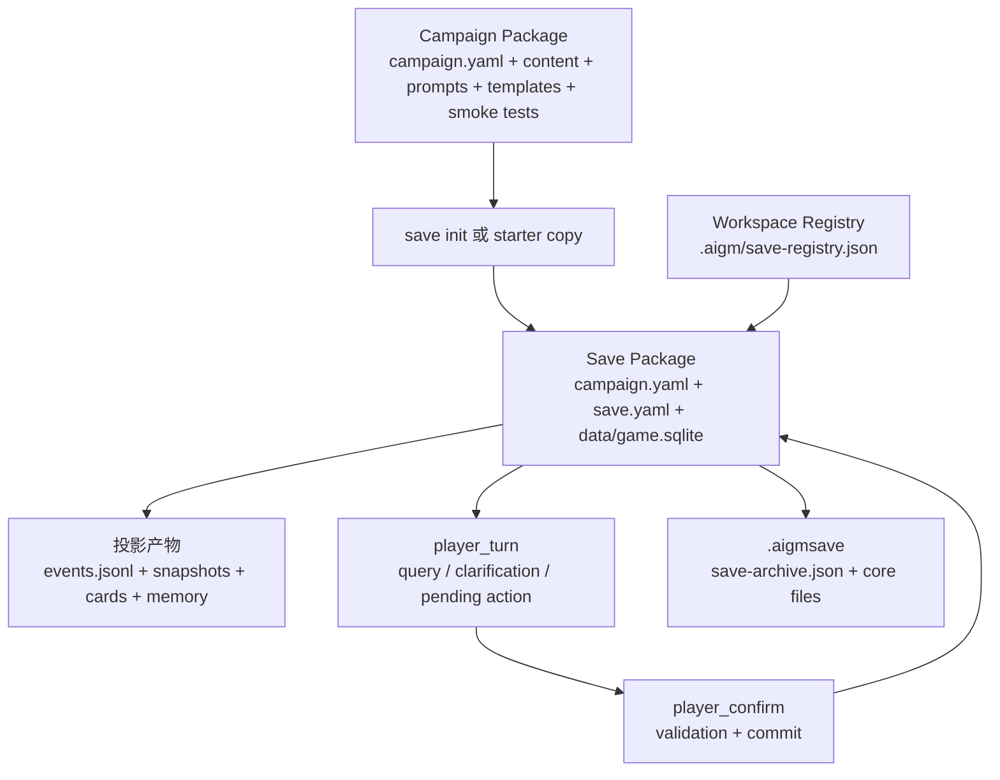

# Save 与 Campaign Package

文档状态：**CURRENT：BMAD canonical package authority**

本文件是 RPG Engine 当前 Campaign Package、Save Package、player workspace registry、
存档归档和相关玩家入口的 canonical 文档。旧 `docs/specs/` 与 `docs/architecture/`
路径现在是 compatibility stubs，原文位于 [`archive/pre-bmad-docs-2026-07-03/`](archive/pre-bmad-docs-2026-07-03/)；
日常开发应先读本文件。

## 核心结论

Campaign Package 定义可开始的一场游戏。Save Package 保存某次游玩的当前事实。
player workspace 管理玩家可理解的多存档入口。三者不能混成一个概念。

```text
Campaign Package -> save init / starter copy -> Save Package
Save Package -> player_turn -> pending action -> player_confirm -> committed facts
Workspace registry -> select / create / switch saves, not gameplay truth
```

硬边界：

- Campaign Package 是作者内容、初始世界、规则、模板和 smoke tests。
- Save Package 是一次游玩的当前事实、事件审计、投影状态和可分享归档来源。
- `data/game.sqlite` 是 Save Package 的当前事实权威。
- `data/events.jsonl`、`snapshots/`、`cards/`、`memory/` 是审计或投影产物，不是独立事实源。
- `.aigm/save-registry.json` 是玩家工作区索引，不是游戏事实。
- `.aigmsave` 是 Save Package 的归档形态，默认可能包含 GM hidden 信息。
- 正式当前 Save Package 不能被测试直接写；写测试必须复制到临时目录。

## 当前包模型



## Campaign Package

Campaign Package 面向作者。它描述可加载的世界和玩法，不保存某个玩家的进度。
作者实际创作流程见 [作者指南](authoring-guide.md)。

当前 V1 最小结构：

```text
campaign.yaml
content/
  entities.yaml
  relationships.yaml
  rules.yaml
  clocks.yaml
  random_tables.yaml
prompts/
  gm.md
templates/
  action.md
  query.md
tests/
  smoke.yaml
```

Campaign Package 可以包含：

- `campaign.yaml` 中的 `id`、`name`、`engine_version`、`package_version`、
  `content_schema_version`、`capabilities` 和 `defaults`。
- `content/` 下的实体、地点、角色、物品、关系、规则、时钟、路线、随机表和 palette。
- `prompts/gm.md`、`templates/action.md`、`templates/query.md`。
- `tests/smoke.yaml`，用于 `campaign test` 的作者级 smoke tests。

Campaign Package 不应包含：

- `data/game.sqlite`
- `data/events.jsonl`
- `snapshots/`
- `cards/`
- `memory/`
- `backups/`
- `save.yaml`
- `.aigm/save-registry.json`
- `.aigm/pending-*`
- 运行时报告、缓存或玩家当前进度

`campaign validate` 会把这些 Save/runtime artifacts 报告为 Campaign ownership warning。
这些 warning 是稳定的 ownership evidence：它们提示作者包混入了运行态材料，但不会自动删除文件、
不会初始化或修复 Save facts，也不会把这些文件导入为作者内容。

V1 普通作者包不执行代码。新作者模板不应依赖 Python 插件、脚本化规则、绝对路径或任意
本地文件引用。

## Campaign Manifest

`campaign.yaml` 是 Campaign Package 的入口。当前实现由 `rpg_engine.campaign.load_campaign()`
读取，并通过 `validate_campaign_config()` 做基础结构校验。

核心字段：

| 字段 | 说明 |
| --- | --- |
| `id` | 剧情包稳定 ID，必填。 |
| `name` | 面向人类的名称。 |
| `engine_version` | 需要的内核版本。 |
| `package_version` | 剧情包版本。 |
| `content_schema_version` | 内容 schema 版本。 |
| `capabilities` | 剧情包声明支持的玩法能力。 |
| `defaults.player_entity_id` | 默认玩家实体。 |
| `defaults.context_budget` | 默认上下文预算，当前配置必须是大于等于 500 的整数。 |
| `defaults.sample_texts` | 作者提供的样例玩家输入。 |
| `content.*` | 指向内容 YAML 的相对路径。 |

路径规则：

- `content.*` 必须是相对路径。
- Campaign 自身路径不得逃逸 campaign root。
- Save Package 可以通过 `save.yaml.source_campaign_path` 声明只读来源 Campaign root；
  这类 trusted source root 只用于读取已声明来源包内部内容。
- 绝对 content 路径仍应拒绝。
- `campaign.yaml.content.*` key 必须是已注册 content type root，或当前明确允许的 auxiliary
  author content，例如 `random_tables`、`palettes`。`characters`、`items`、`locations`
  等 allowed entity `type` 不等于独立 package content root；这些记录应放在 `entities`
  content type 下。

## Campaign Validation

作者和 CI 使用以下入口检查 Campaign Package：

```bash
python3 -m rpg_engine campaign validate ./examples/v1_minimal_adventure
python3 -m rpg_engine campaign test ./examples/v1_minimal_adventure
```

`campaign validate` 校验 manifest、内容记录、引用、capability 覆盖和 smoke 文件格式。
`campaign test` 会初始化临时 Save Package 并执行 smoke tests。

跨 Campaign model-boundary 回归使用至少两个不同 package，例如 `examples/v1_minimal_adventure`
和 `examples/small_cn_campaign`，在临时 Save 上连续跑 campaign validate/test、save init/inspect、
ContentRegistry、entity/relationship/progress access 和 `tick_clocks` validation。该 gate 证明题材、
语言、capability 和内容差异仍复用同一 Campaign/Save ownership 与模型合同，并且 source Campaign
Package 不会被写入运行态文件。当前测试入口是 `tests/test_cross_campaign_model_smoke.py`。

Context / player-safe foundation 的跨 Campaign 集成门禁是
`tests/test_cross_campaign_context_smoke.py`。它把两个 source Campaign 分别复制到独立
temporary workspace，通过同一 `SaveManager.start_or_continue()` 创建 temporary Save，再运行
player-safe context/query、preview/validation 和 `player_turn -> pending -> player_confirm` 链。Query、
preview、validation 和 pending 阶段必须保持 SQLite facts 不变，错误 session 不能提交，
正确 confirm 才可经 validation/commit 增加 turn/event。该测试同时 fingerprint 仓库 source
Campaign、temporary Campaign copy 和 configured/registered formal current Saves；即使中间阶段失败，
cleanup/finally 也必须验证只有 temporary Save 与它的 temporary `.aigm` entry state 可发生变化。

Authoring 工具可以辅助创建和检查作者包：

```bash
python3 -m rpg_engine campaign new ./campaigns/my-story --template small-cn
python3 -m rpg_engine campaign doctor ./campaigns/my-story
python3 -m rpg_engine campaign outline ./campaigns/my-story
```

这些工具不得把运行态事实写回 Campaign Package。

## Save Package

Save Package 面向运行时。它保存一次具体游玩的事实状态、事件审计、投影状态和可分享归档来源。

当前 V1 运行目录：

```text
save/
  campaign.yaml
  save.yaml
  data/
    game.sqlite
    events.jsonl
  snapshots/
    current.md
    current.json
  cards/
  memory/
```

权威关系：

| 文件或目录 | 当前职责 |
| --- | --- |
| `campaign.yaml` | Save Package 的运行 manifest，路径指向本地内容或声明的来源 Campaign 内容。 |
| `save.yaml` | 来源 campaign、版本、engine 和 `source_campaign_path` 元数据。 |
| `data/game.sqlite` | 当前事实权威、turns、events、entities、meta、projection_state 和 outbox。 |
| `data/events.jsonl` | 由 durable outbox 和 projection service 生成的外部审计投影。 |
| `snapshots/current.md` | AI 新会话启动用的玩家可见当前快照。 |
| `snapshots/current.json` | 当前状态结构化快照。 |
| `cards/` | 玩家可读实体卡片投影。 |
| `memory/` | 长期记忆投影或报告。 |

`projection_state` 和 `outbox` 在 SQLite 内，但职责是投影健康和投影工作队列证据；
它们不能改变 turns、events、entities、clocks 或 meta 的事实含义。

Save Package 不是 Campaign Package 的完整内嵌副本。它可以复制内容文件，也可以通过
`source_campaign_path` 只读引用兼容来源包。剧情推进必须走结构化玩家回合链，不能手工改
SQLite 或把作者内容覆盖当成玩家事实。

## Save Init

新游戏通常从 Campaign Package 初始化 Save Package：

```bash
python3 -m rpg_engine save init ./examples/v1_minimal_adventure ./saves/my-run
```

当前 `init_v1_save()` 会：

1. 读取来源 Campaign Package。
2. 创建目标 Save Package 目录；非空目录默认拒绝。
3. 写入运行态 `campaign.yaml`，把 runtime 路径固定为 `data/game.sqlite`、
   `data/events.jsonl`、`snapshots/current.md`、`snapshots/current.json` 和 `cards`。
4. 复制或规范化 content 路径。
5. 写入 `save.yaml`，记录 `campaign_id`、`campaign_version`、`engine_version` 和
   `source_campaign_path`。
6. 初始化 SQLite。
7. 刷新 `events_jsonl`、`search`、`snapshots` 和 `cards` 投影。

`--force` 是维护能力，不应成为普通玩家入口默认行为。

Save init 必须保留 source Campaign no-mutation 边界：初始化可以在目标 Save Package 中写入
运行态 `campaign.yaml`、`save.yaml`、SQLite 和投影产物，但不得改写来源 Campaign Package 文件。
目标 Save Package 不得位于 source Campaign root 内部；否则会把运行态文件写进作者包目录，
破坏 Campaign/Save ownership contract。
普通 play 后续产生的 facts、events、relationship/progress changes 和 projections 也只能落在
Save Package fact boundary 内。

## Save Inspect 与 Validate

```bash
python3 -m rpg_engine save inspect ./saves/my-run
python3 -m rpg_engine save validate ./saves/my-run
```

`inspect_v1_save()` 和 `inspect_save_package()` 会返回当前摘要、文件状态、计数、meta、错误、
`authority_contract` 和 `projection_health`。`authority_contract` 是稳定的机器可读职责表，用来声明
`data/game.sqlite` 是当前事实权威、SQLite `events` 是权威审计记录，而 JSONL、snapshots、
cards、search、memory、registry、pending state、preflight cache、MCP audit log 和 archive
manifest 只能作为 derived、entry、advisory 或 evidence state。

`projection_health` 是稳定的机器可读 health/evidence 字段，不是事实来源。它包含：

- `role=projection_health` 和 `authority=evidence`。
- required projection 名称、stored status、effective status、version、expected version、`last_turn_id`、
  是否对齐 `current_turn_id`、`last_error`、`updated_at` 和 artifact paths。
- outbox `ok`/`status`、schema 或 availability `errors`、status counts，以及所有非 `done` outbox row 的
  id、topic、status、attempts、last error 和时间戳。

通过标准包括：

- 核心文件存在。
- `save.yaml` 与 `campaign.yaml` 的 campaign、version、engine 元数据一致。
- SQLite 必需表存在。
- migration checksum 匹配。
- current turn、location、day 和 time meta 一致。
- `projection_state` 中 required projections 为 clean，版本足够且指向当前 turn。
- outbox 表存在且 schema 可读；没有未完成投影任务；pending/failed row 必须带足够定位信息和 last error。
- `events.jsonl` 与 SQLite `events` 双向一致。
- `snapshots/current.json` 与 SQLite meta 一致。
- `cards/` 覆盖所有非归档、玩家可读实体。
- FTS 只索引非归档且非 hidden 的实体。

这意味着 Save Package 的健康状态既包括 SQLite，也包括投影是否跟上当前 turn。当投影 artifact
与 SQLite 不一致时，inspect/validate 必须报告 drift、dirty、failed 或 stale，不能把 artifact
反向解释为新的事实。

## 投影状态

`ProjectionService` 统一刷新投影，并用 `projection_state` 记录每个投影的状态、版本和
`last_turn_id`。

当前 required projections：

- `events_jsonl`
- `search`
- `snapshots`
- `cards`

其他 projection service 能力包括：

- `memory`
- `reports`
- `package_lock`

投影可以 dirty、refreshing、clean、failed 或 stale。Save validate 要求 required projections
最终是 clean。玩家路径提交后应看到写入状态和投影状态，而不是只看到“保存成功”的文本承诺。

## Safe Patch

普通用户不直接编辑 SQLite。维护性修正使用：

```bash
python3 -m rpg_engine save patch ./saves/my-run ./patch.json
```

V1 safe patch 只允许维护事实字段，例如实体名称、摘要、visibility、alias、details 和少量角色字段。

Safe patch 明确不允许：

- 创建 turn。
- 写 event。
- tick clock。
- 改当前地点、当前时间或当前 turn。
- 移动实体位置或归属。
- 修改库存数量、资源消耗、项目进度等行动后果。

这些变化必须走玩家回合：

```text
player_turn -> pending action -> player_confirm -> validation + commit
```

## Save Archive

`.aigmsave` 是 Save Package 的归档形态：

```bash
python3 -m rpg_engine save export ./saves/my-run --output ./my-run.aigmsave
python3 -m rpg_engine save import ./my-run.aigmsave ./saves/imported-run --yes
```

归档内必须包含 `save-archive.json` manifest。当前导出会打包存在的核心文件：

- `campaign.yaml`
- `save.yaml`
- `data/game.sqlite`
- `data/events.jsonl`
- `package-lock.json`
- `snapshots/current.md`
- `snapshots/current.json`
- `cards/**`
- `memory/**`

导入会校验 manifest、文件清单、核心 Save 文件存在性、路径安全、单文件大小、总大小和 SHA256。
缺少 `campaign.yaml`、`save.yaml`、`data/game.sqlite`、`data/events.jsonl`、`snapshots/current.md`
或 `snapshots/current.json` 的归档必须在 payload member 解包前拒绝。目标目录非空时默认拒绝；
显式 force 属于维护语义。

`.aigmsave` 默认是完整存档归档，可能包含 hidden / GM-only 信息。玩家视角脱敏导出不是当前 V1
承诺。

## Player Workspace Registry

SaveManager 以本地 workspace root 为边界，管理玩家可见 Campaign 和 Save 列表。

默认 registry：

```text
<workspace>/.aigm/save-registry.json
```

默认 pending 文件：

```text
<workspace>/.aigm/pending-player-action.json
<workspace>/.aigm/pending-player-clarification.json
```

registry 记录：

- `schema_version`
- `active_save_id`
- `campaigns[]`
- `saves[]`

Save record 记录：

- stable `id`
- `campaign_path`
- Save Package `path`
- `label`
- `kind`
- `source`
- current turn、time、location、summary
- `health`
- `last_inspected_at`
- `last_played_at`

Registry 写入使用 lock 文件和 atomic write。所有 registry、campaign、save、starter 路径必须是
workspace root 相对路径，不能是绝对路径，不能包含 `..` 或反斜杠，也不能 resolve 后逃逸 root。

Registry 不拥有游戏事实。切换 active save 只改变玩家入口选择，不修改 Save Package 中的事实。

## Player Entry Flow

当前玩家入口由 `rpg_engine.save_manager.SaveManager` 实现。

```text
player start / start_or_continue
  -> current_save(refresh=True)
  -> 如果没有 active save 且允许创建：create_save
  -> query scene with player view
  -> onboarding text

player turn
  -> require active save
  -> GMRuntime.act(view="player")
  -> query result / clarification / blocked / pending action
  -> write pending action only if ready

player confirm
  -> require matching session_id
  -> mark TurnProposal human_confirmed
  -> GMRuntime.commit_turn
  -> refresh save record
```

`start_or_continue()` 可以创建或选择 Save Package，并返回 onboarding；它不能推进剧情事实。
`player_turn()` 可以写 pending action 或 pending clarification；它不能提交事实。
`player_confirm()` 是普通玩家路径的提交门。

Pending action 绑定：

- active save id
- save path
- player text
- action
- delta
- `TurnProposal`
- confirmation `session_id`
- 可选 platform/session identity hash
- 可选 actor identity hash
- `created_at` / `expires_at`

`player_confirm()` 必须匹配 pending action 的 save、session id、可选 platform/session identity 和可选
actor identity。过期 pending action 不能提交；确认时发现过期会清理 pending action，并要求玩家重新从
`player_turn()` 生成新的 preview / confirmation session。

## CLI Surface

玩家工作区 CLI：

```bash
python3 -m rpg_engine player inspect <root>
python3 -m rpg_engine player campaigns <root> --refresh
python3 -m rpg_engine player saves <root> --refresh
python3 -m rpg_engine player current <root> --refresh
python3 -m rpg_engine player start <root> --campaign <campaign>
python3 -m rpg_engine player query <root> scene
python3 -m rpg_engine player turn <root> "查看周围"
python3 -m rpg_engine player confirm <root> --session-id <session-id>
python3 -m rpg_engine player new <root> --campaign <campaign>
python3 -m rpg_engine player switch <root> <save-id>
python3 -m rpg_engine player duplicate <root> <save-id>
```

`player current` / MCP `save_current` 如果不带 refresh，可以返回 registry cached summary；输出中的
`current_save_authority` 必须把这类摘要标为非权威。带 refresh 时，summary 来自 Save SQLite
inspection，但仍不能让 registry 覆盖 Save facts。

Package 级 CLI：

```bash
python3 -m rpg_engine campaign validate <campaign>
python3 -m rpg_engine campaign test <campaign>
python3 -m rpg_engine save init <campaign> <save>
python3 -m rpg_engine save inspect <save>
python3 -m rpg_engine save validate <save>
python3 -m rpg_engine save export <save> --output <archive.aigmsave>
python3 -m rpg_engine save import <archive.aigmsave> <target> --yes
python3 -m rpg_engine save patch <save> <patch.json>
```

CLI/MCP 文档的完整契约会在 `docs/cli-contracts.md` 和 `docs/mcp-contracts.md` 中继续收敛。
本文件只记录 Save/Campaign 边界。

## MCP Surface

默认 MCP player profile 暴露玩家安全工具：

- `workspace_inspect`
- `campaign_list`
- `save_list`
- `save_current`
- `save_create`
- `save_switch`
- `start_or_continue`
- `intent_manifest`
- `player_turn`
- `player_confirm`
- `campaign_validate`
- `save_inspect`
- `health`

低层工具只在 developer、trusted GM、maintenance 或 admin profile 暴露，例如：

- `player_query`
- `player_act`
- `start_turn`
- `intent_preflight`
- `query`
- `preview_from_text`
- `preview_action`
- `validate_delta`
- `commit_turn`

默认 player profile 不能获得低层 preview、validate 或 commit 权限。普通自然语言玩法应进入
`player_turn`，普通写入应由 `player_confirm` 完成。

## Starter Save

Starter save 是可复制的新档模板，不是 Campaign Package 的运行目录。

创建新 Save 时，当前 SaveManager 的优先级是：

1. 调用参数中的 `starter_save`。
2. registry 中对应 campaign 的 `starter_save_path`。
3. SaveManager config 中的 `default_starter_save`。
4. 回退到 `init_v1_save()`。

复制 starter 后会重写运行态 `campaign.yaml` 和 `save.yaml`，并构建新的 save record。
Starter copy 不应修改剧情事实；它只是新 Save Package 的起点。

## Package 管理与 Lock

`rpg_engine.packages` 处理当前内容包的 validate、diff、adopt、install、upgrade 和 package-lock
相关维护。它服务于 Campaign/Save 的内容同步与迁移，不改变普通玩家入口边界。

重要边界：

- package-lock 描述包内容状态和 checksum。
- package install/update 属于 admin 或 maintenance 路径。
- 作者内容同步不能绕过玩家回合 commit gate。
- 运行状态和作者定义仍必须保持分层；不能把 campaign source 任意覆盖到当前事实。

## 测试边界

文档或测试涉及 Save Package 时遵守以下规则：

- 不直接写正式当前 Save Package。
- 写入测试先复制到临时目录。
- Campaign authoring 测试使用临时 campaign/save。
- SaveManager 测试断言 root 相对路径、`..` 拒绝、registry active save 和 pending session 绑定。
- Player turn 测试断言 `player_turn` 不保存事实，`player_confirm` 才保存。
- Hidden 内容测试断言 player view、FTS、scene、cards 和 onboarding 不泄露 GM-only 信息。
- Projection 测试断言 `projection_state`、outbox、events JSONL、snapshots 和 cards 一致。

建议 focused gates：

```bash
python3 -m pytest -q tests/test_save_manager.py
python3 -m pytest -q tests/test_campaign_validation.py tests/test_package_cli.py tests/test_package_save_condition_coverage.py
python3 -m pytest -q tests/test_current_native_*.py tests/test_cross_layer_regression.py
python3 -m pytest -q tests/test_projection_service.py tests/test_current_native_visibility.py tests/test_save_patch.py
```

具体测试文件名以仓库当前存在的 tests 为准。文档-only 变更不需要强制运行 pytest，但必须运行
Markdown 链接和 diff whitespace 门禁。

## 旧文档映射

| 旧来源 | 新位置 |
| --- | --- |
| `docs/specs/campaign-package.md` | 本文的 Campaign Package、manifest、validation、authoring sections。 |
| `docs/specs/save-package.md` | 本文的 Save Package、save init、validate、safe patch、archive sections。 |
| `docs/specs/player-entry-save-manager.md` | 本文的 Player Workspace Registry、Player Entry Flow、Starter Save sections。 |
| `docs/architecture/game-engine.md` | 本文的 package 分层、runtime 原则和当前实现边界。 |
| `docs/architecture/turn-flow-architecture.md` | 本文的 player turn、confirm、projection 与 profile 边界。 |

旧文档与本文冲突时，以本文和当前代码事实为准。Round 4C 后，旧路径只保留 stub；
原文位于 [pre-BMAD archive](archive/pre-bmad-docs-2026-07-03/) 并只作为历史证据。

## 开发检查清单

修改 Campaign、Save、SaveManager、projection、CLI 或 MCP 相关行为前，确认：

- 是否改变 Campaign Package 与 Save Package 的职责分离。
- 是否改变 `data/game.sqlite` 的事实权威。
- 是否把 registry 或 `.aigmsave` 误写成事实源。
- 是否让 `campaign validate` 漏报 Campaign root 中的 Save/runtime artifacts。
- 是否让 save init、starter copy、player turn/confirm 或 projection refresh 改写 source Campaign。
- 是否让 `player_turn` 绕过 pending/no-save 边界。
- 是否让 `player_confirm` 之外的默认玩家路径写入事实。
- 是否扩大默认 MCP player profile 的低层工具权限。
- 是否允许路径逃逸 workspace root 或 campaign root。
- 是否可能泄露 hidden / GM-only 信息。
- 是否需要补 CLI、MCP、SaveManager、projection 或 hidden-content focused tests。
